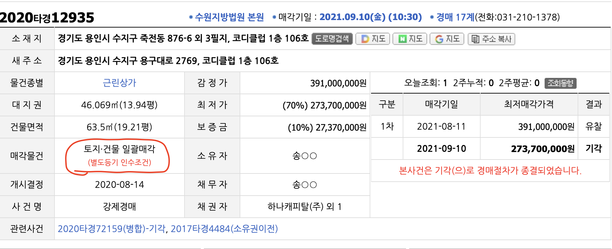
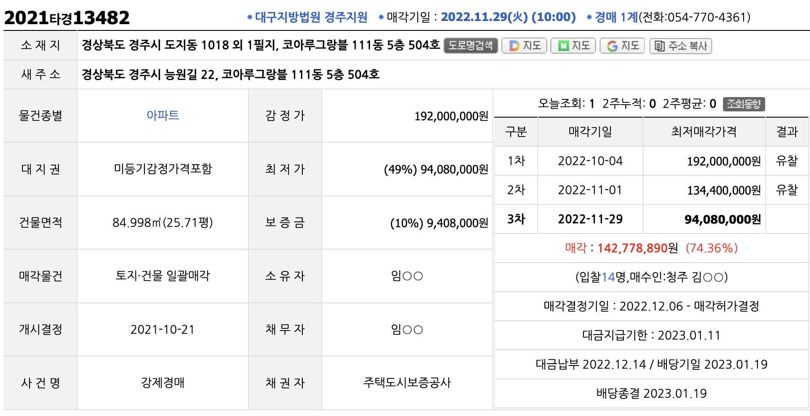
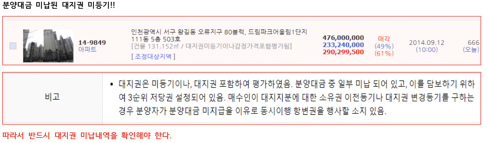

## 토지별도등기 인수조건

* 지하 철도 및 수도관, 가스관 등 주요 시설물이 지하및 지상에 있는 경우 등 이므로 신경쓸거 없음
* **기타 상가 시세는 : 월세 * 2 + 보증금**
* 지상권과 비슷함

## 대지권 미등기

> 집합건물의 소유 및 관리에 관한 법률  제20조(전유부분과 대지사용권의 일체성)

* ① 구분소유자의 대지사용권은 그가 가지는 전유부분의 처분에 따른다.
* ② 구분소유자는 그가 가지는 전유부분과 분리하여 대지사용권을 처분할 수 없다. 다만, 규약으로써 달리 정한 경우에는 그러하지 아니하다.
* ③ 제2항 본문의 분리처분금지는 그 취지를 등기하지 아니하면 선의(善意)로 물권을 취득한 제3자에게 대항하지 못한다.
* ④ 제2항 단서의 경우에는 제3조제3항을 준용한다.

> ***집합건물은 토지건물을 분리해서 처분할수 없기 때문에 대지권에 대한 대금미납이 있다 하더라도 일괄매각이 원칙이며,대지부분에대한 미납대금의 조사는 낙찰자의 몫이다.그러므로 “대지권미등기/매각포함”이라는 문구가 있더라도 대지권이 미등기인 원인을 반드시 조사해야 한다.***

* 대지권 감정가에 포함된 것으로 문제 없음. 단 반드시 확인은 필요함

> 대지권미등기/토지별도등기/토지별도등기인수조건

* 대지권 미등기 -> 집한건물 경우에 한함
  * 감정가 포함은 건설사가 토지를 담보로 건설을 하더중에 미분양(특별분양)발생하여 토지에 있는 근저당을 100%로 다 변제하지 못했기 때문에 미등기로 남아 있음.
* 토지별도등기
  * 건물과 토지등기 두 개를 다 띄어서 분석해야함(동일인이면 내것/동일인이 아니면 내것아님)
  * 매각가에 포함이라고 한다면 관계없음
