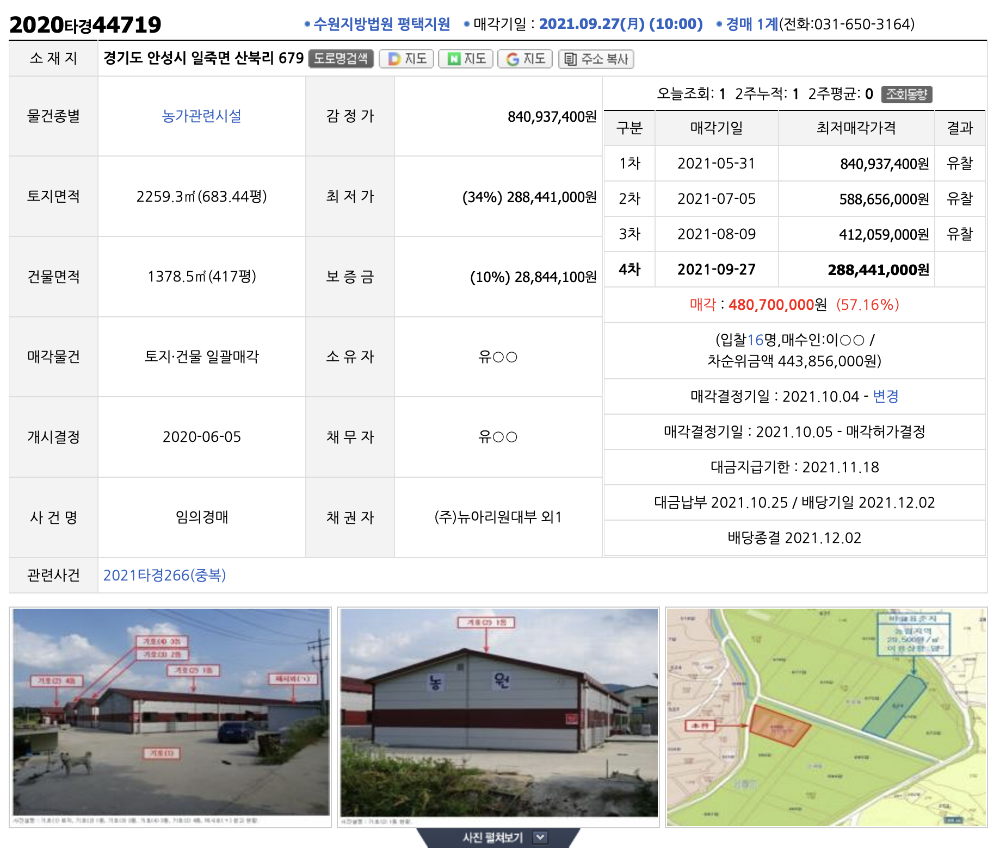
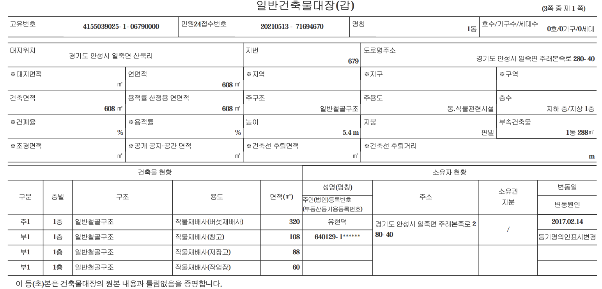

## 농업진흥지역(농업진흥구역 + 농업보호구역)

> 농업진흥지역

* 과거 절대농지라 불리었으며, 1992년 농업진흥지역으로 변경됨
* 용도지역, 용도구역, 용도지구와는 별개 개념
* 국토계획법이 아닌 농지버에 적용
* 하나의 권역을 지정하여 묶는 개념
* 규제 강도 농업진흥구역 >  농업보호구역

> 제32조 (용도구역에서의 행위제한)

* ① **농업진흥구역**에서는 농업 생산 또는 농지 개량과 직접적으로 관련된 행위로서 **대통령령으로 정하는 행위 외의 토지이용행위를 할 수 없다.** 다만, 다음 각 호의 토지이용행위는 그러하지 아니하다. **<개정 2009. 5. 27., 2012. 1. 17., 2018. 12. 24., 2020. 2. 11., 2023. 5. 16., 2023. 8. 8.>**
  1. 대통령령으로 정하는 **농수산물(농산물ㆍ임산물ㆍ축산물ㆍ수산물을 말한다. 이하 같다)의 가공ㆍ처리 시설의 설치 및 농수산업(농업ㆍ임업ㆍ축산업ㆍ수산업을 말한다. 이하 같다) 관련 시험ㆍ연구 시설의 설치**
  2. 어린이놀이터, 마을회관, 그 밖에 대통령령으로 정하는 농업인의 공동생활에 필요한 편의 시설 및 이용 시설의 설치
  3. 대통령령으로 정하는 **농업인 주택, 어업인 주택, 농업용 시설, 축산업용 시설 또는 어업용 시설의 설치**
  4. 국방ㆍ군사 시설의 설치
  5. 하천, 제방, 그 밖에 이에 준하는 국토 보존 시설의 설치
  6. 「국가유산기본법」 제3조에 따른 국가유산의 보수ㆍ복원ㆍ이전, 매장유산의 발굴, 비석이나 기념탑, 그 밖에 이와 비슷한 공작물의 설치
  7. 도로, 철도, 그 밖에 대통령령으로 정하는 공공시설의 설치
  8. 지하자원 개발을 위한 탐사 또는 지하광물 채광(採鑛)과 광석의 선별 및 적치(積置)를 위한 장소로 사용하는 행위
  9. **농어촌 소득원 개발 등 농어촌 발전에 필요한 시설**로서 대통령령으로 정하는 시설의 설치
* ② **농업보호구역**에서는 다음 각 호 외의 토지이용행위를 할 수 없다. **<개정 2020. 2. 11.>**
  1. 제1항에 따라 허용되는 토지이용행위
  2. 농업인 **소득 증대에 필요한 시설**로서 대통령령으로 정하는 건축물ㆍ공작물, 그 밖의 시설의 설치
  3. **농업인의 생활 여건을 개선하기 위하여 필요한 시설로서 대통령령으로 정하는 건축물ㆍ공작물, 그 밖의 시설의 설치**
* ③ 농업진흥지역 지정 당시 관계 법령에 따라 인가ㆍ허가 또는 승인 등을 받거나 신고하고 설치한 기존의 건축물ㆍ공작물과 그 밖의 시설에 대하여는 제1항과 제2항의 행위 제한 규정을 적용하지 아니한다.
* ④농업진흥지역 지정 당시 관계 법령에 따라 **다음 각 호의 행위에 대하여 인가ㆍ허가ㆍ승인 등을 받거나 신고하고 공사 또는 사업을 시행 중인 자**(관계 법령에 따라 인가ㆍ허가ㆍ승인 등을 받거나 신고할 필요가 없는 경우에는 시행 중인 공사 또는 사업에 착수한 자를 말한다)는 그 공사 또는 사업에 대하여만 제1항과 제2항의 행위 제한 규정을 적용하지 아니한다.
  1. **건축물의 건축**
  2. **공작물이나 그 밖의 시설의 설치**
  3. **토지의 형질변경**
  4. 그 밖에 제1호부터 제3호까지의 행위에 준하는 행위
     > * 농업용창고는 신고사항으로서 1500㎡까지 전용비 100% 면제(농업인이면 농업진흥구역이든 보호구역이든 지을 수 있다)
     > * 농업용창고는 건축법상 용도중에 2종근린생활시설로 분류되며 주로 농업인을 위한 창고나 농수산물 가공처리시설이며 극히 제한적으로 식품공장도 허용됨)
     > * 농지전용부담금은 공시지가의 30%(또는 ㎡당 50,000원=1평165,5000원)납부하지만 농업용창고는 100%면제됨
     > * 1981년 이전에 도시지역으로 들어온 농지는 농지전용부담금을 납부하지 않아도 됨.그 이후에 도시지역으로 편입된 농지는 농지전용부담금을 납부해야 됨
     > * 건폐율은 용도지역건폐율이 적용됨(논업용창고는 토목설계는 특별히 안해도 됨.그러나 일반창고는 토목설계와 지자체  건축심의 위원회 심의를 거쳐야함)
     >

> 농지법 시행령 제29조(농업진흥구역에서 할 수 있는 행위)

* ①법 제32조제1항 각 호 외의 부분 본문에서 “대통령령으로 정하는 행위”란 다음 각 호의 어느 하나에 해당하는 행위를 말한다. <개정 2008. 2. 29., 2009. 11. 26., 2012. 7. 10., 2013. 3. 23., 2013. 12. 30., 2014. 12. 30., 2020. 8. 11.>
  1. 농작물의 경작
  2. 다년생식물의 재배
  3. 고정식온실ㆍ버섯재배사 및 비닐하우스와 농림축산식품부령으로 정하는 그 부속시설의 설치
  4. 축사ㆍ곤충사육사와 농림축산식품부령으로 정하는 그 부속시설의 설치
  5. 간이퇴비장의 설치
  6. 농지개량사업 또는 농업용수개발사업의 시행
  7. 농막ㆍ간이저온저장고 및 간이액비 저장조 중에서 농림축산식품부령으로 정하는 시설의 설치
* ②법 제32조제1항제1호에서 “대통령령으로 정하는 농수산물(농산물ㆍ임산물ㆍ축산물ㆍ수산물을 말한다. 이하 같다)의 가공ㆍ처리 시설 및 농수산업(농업ㆍ임업ㆍ축산업ㆍ수산업을 말한다. 이하 같다) 관련 시험ㆍ연구 시설”이란 다음 각 호의 시설을 말한다.<개정 2007. 11. 30., 2008. 6. 5., 2013. 12. 30., 2014. 12. 30., 2015. 12. 22., 2016. 1. 19., 2016. 11. 29., 2019. 6. 25., 2022. 5. 9.>
  1. 다음 각 목의 요건을 모두 갖춘 농수산물의 가공ㆍ처리 시설(「건축법 시행령」 별표 1 제4호너목에 따른 제조업소 또는 같은 표 제17호에 따른 공장에 해당하는 시설을 말하며, 그 시설에서 생산된 제품을 판매하는 시설을 포함한다)
     * 가. 국내에서 생산된 농수산물(「농업ㆍ농촌 및 식품산업 기본법 시행령」 제5조제1항 및 제2항에 따른 농수산물을 말하며, 임산물 중 목재와 그 가공품 및 토석은 제외한다. 이하 이 조에서 같다) 및 농림축산식품부장관이 정하여 고시하는 농수산가공품을 주된 원료로 하여 가공하거나 건조ㆍ절단 등 처리를 거쳐 식품을 생산하기 위한 시설일 것
     * 나. 농업진흥구역 안의 부지 면적이 1만5천제곱미터[미곡의 건조ㆍ선별ㆍ보관 및 가공시설(이하 “미곡종합처리장”이라 한다)의 경우에는 3만제곱미터] 미만인 시설(판매시설이 포함된 시설의 경우에는 그 판매시설의 면적이 전체 시설 면적의 100분의 20 미만인 시설에 한정한다)일 것
  2. 「양곡관리법」 제2조제5호에 따른 양곡가공업자가 농림축산식품부장관 또는 지방자치단체의 장과 계약을 체결해 같은 법 제2조제2호에 따른 정부관리양곡을 가공ㆍ처리하는 시설로서 그 부지 면적이 1만5천제곱미터 미만인 시설
  3. 농수산업 관련 시험ㆍ연구 시설: 육종연구를 위한 농수산업에 관한 시험ㆍ연구 시설로서 그 부지의 총면적이 3천제곱미터 미만인 시설
* ③법 제32조제1항제2호에서 “그 밖에 대통령령으로 정하는 농업인의 공동생활에 필요한 편의 시설 및 이용 시설”이란 다음 각 호의 시설을 말한다.<개정 2008. 6. 5., 2011. 12. 8., 2012. 7. 10., 2014. 12. 30., 2016. 11. 29.>
  1. 농업인이 공동으로 운영하고 사용하는 창고ㆍ작업장ㆍ농기계수리시설ㆍ퇴비장
  2. 경로당, 어린이집, 유치원, 정자, 보건지소, 보건진료소, 「응급의료에 관한 법률」 제2조제6호에 따른 응급의료 목적에 이용되는 항공기의 이착륙장 및 「민방위기본법」 제15조제1항제1호에 따른 비상대피시설
  3. 농업인이 공동으로 운영하고 사용하는 일반목욕장ㆍ화장실ㆍ구판장ㆍ운동시설ㆍ마을공동주차장 및 마을공동취수장
  4. 국가ㆍ지방자치단체 또는 농업생산자단체가 농업인으로 하여금 사용하게 할 목적으로 설치하는 일반목욕장, 화장실, 운동시설, 구판장, 농기계 보관시설 및 농업인 복지회관
* ④법 제32조제1항제3호에서 “대통령령으로 정하는 농업인 주택, 어업인 주택”이란 다음 각 호의 요건을 모두 갖춘 건축물 및 시설물을 말한다. 다만, 제2호에 따른 부지면적을 적용함에 있어서 농지를 전용하여 농업인 주택 및 어업인 주택(이하 이 항에서 “농어업인 주택”이라 한다)을 설치하는 경우에는 그 전용하려는 면적에 해당 세대주가 그 전용허가신청일 또는 협의신청일 이전 5년간 농어업인 주택의 설치를 위하여 부지로 전용한 농지면적을 합산한 면적(공공사업으로 인하여 철거된 농어업인 주택의 설치를 위하여 전용하였거나 전용하려는 농지면적을 제외한다)을 해당 농어업인 주택의 부지면적으로 본다.<개정 2010. 9. 20., 2012. 7. 10., 2016. 11. 29., 2019. 6. 25., 2024. 7. 2.>
  1. 농업인 또는 어업인(「수산업ㆍ어촌 발전 기본법」 제3조제3호에 따른 어업인을 말한다. 이하 같다) 1명 이상으로 구성되는 농업ㆍ임업ㆍ축산업 또는 어업을 영위하는 세대로서 다음 각 목의 어느 하나에 해당하는 세대의 세대주가 설치하는 것일 것
     * 가. 해당 세대의 농업ㆍ임업ㆍ축산업 또는 어업에 따른 수입액이 연간 총수입액의 2분의 1을 초과하는 세대
     * 나. 해당 세대원의 노동력의 2분의 1 이상으로 농업ㆍ임업ㆍ축산업 또는 어업을 영위하는 세대
  2. 제1호 각 목의 어느 하나에 해당하는 세대의 세대원이 장기간 독립된 주거생활을 영위할 수 있는 구조로 된 건축물(「지방세법 시행령」 제28조에 따른 별장 또는 고급주택을 제외한다) 및 해당 건축물에 부속한 창고ㆍ축사 등 농업ㆍ임업ㆍ축산업 또는 어업을 영위하는데 필요한 시설로서 그 부지의 총면적이 1세대 당 660제곱미터 이하일 것. 다만, 제1호 각 목의 어느 하나에 해당하는 세대의 세대원이 자기가 경영하는 농업ㆍ임업ㆍ축산업 또는 어업을 영위하기 위해 다음 각 목의 어느 하나에 해당하는 사람을 고용하여 거주하게 할 목적인 경우에는 1천제곱미터 이하로 한다.
     * 가. 내국인 근로자
     * 나. 「출입국관리법」 제18조제1항에 따라 취업활동을 할 수 있는 체류자격을 받은 외국인 근로자
  3. 제1호 각 목의 어느 하나에 해당하는 세대의 농업ㆍ임업ㆍ축산업 또는 어업의 경영의 근거가 되는 농지ㆍ산림ㆍ축사 또는 어장 등이 있는 시(구를 두지 아니한 시를 말하며, 도농복합형태의 시에 있어서는 동지역에 한한다)ㆍ구(도농복합형태의 시의 구에 있어서는 동지역에 한한다)ㆍ읍ㆍ면(이하 “시ㆍ구ㆍ읍ㆍ면”이라 한다) 또는 이에 연접한 시ㆍ구ㆍ읍ㆍ면 지역에 설치하는 것일 것
* ⑤법 제32조제1항제3호에서 “대통령령으로 정하는 농업용 시설, 축산업용 시설 또는 어업용 시설”이란 다음 각 호의 시설을 말한다. 다만, 제1호 및 제4호의 시설은 자기의 농업 또는 축산업의 경영의 근거가 되는 농지ㆍ축사 등이 있는 시ㆍ구ㆍ읍ㆍ면 또는 이에 연접한 시ㆍ구ㆍ읍ㆍ면 지역에 설치하는 경우로 한정한다.<개정 2008. 2. 29., 2012. 7. 10., 2013. 3. 23., 2013. 12. 30., 2016. 11. 29., 2019. 6. 25.>
  1. 농업인 또는 농업법인이 자기가 생산한 농산물을 건조ㆍ보관하기 위하여 설치하는 시설
  2. 야생동물의 인공사육시설. 다만, 다음 각 목의 어느 하나에 해당하는 야생동물의 인공사육시설은 제외한다.
     * 가. 「야생생물 보호 및 관리에 관한 법률」 제14조제1항 각 호 외의 부분 본문에 따라 포획 등이 금지된 야생동물(같은 항 각 호 외의 부분 단서에 따라 허가를 받은 경우는 제외한다)
     * 나. 「야생생물 보호 및 관리에 관한 법률」 제19조제1항 각 호 외의 부분 본문에 따라 포획이 금지된 야생동물(같은 항 각 호 외의 부분 단서에 따라 허가를 받은 경우는 제외한다)
     * 다. 「생물다양성 보전 및 이용에 관한 법률」 제24조제1항 각 호 외의 부분 본문에 따라 수입등이 금지된 생태계교란 생물(같은 항 각 호 외의 부분 단서에 따라 허가를 받은 경우는 제외한다)
  3. 「건축법」에 따른 건축허가 또는 건축신고의 대상 시설이 아닌 간이양축시설
  4. 농업인 또는 농업법인이 농업 또는 축산업을 영위하거나 자기가 생산한 농산물을 처리하는데 필요한 농업용 또는 축산업용시설로서 농림축산식품부령으로 정하는 시설
  5. 부지의 총면적이 3만제곱미터 미만인 양어장ㆍ양식장, 그 밖에 농림축산식품부령으로 정하는 어업용 시설
  6. 「가축분뇨의 관리 및 이용에 관한 법률」 제2조제8호의 처리시설
  7. 시ㆍ도지사, 시장ㆍ군수ㆍ구청장 또는 「농업협동조합법」 제2조제1호에 따른 조합이 설치하는 가축 방역을 위한 소독시설
* ⑥법 제32조제1항제7호에서 “대통령령으로 정하는 공공시설”이란 다음 각 호의 시설을 말한다.<개정 2009. 11. 26., 2012. 7. 10.>
  1. 상하수도(하수종말처리시설 및 정수시설을 포함한다), 운하, 공동구(共同溝), 가스공급설비, 전주(유ㆍ무선송신탑을 포함한다), 통신선로, 전선로(電線路), 변전소, 소수력(小水力)ㆍ풍력발전설비, 송유설비, 방수설비, 유수지(遊水池)시설, 하천부속물 및 기상관측을 위한 무인(無人)의 관측시설
  2. 「사도법」 제4조에 따른 사도(私道)
* ⑦법 제32조제1항제9호에서 “농어촌 발전에 필요한 시설로서 대통령령으로 정하는 시설”이란 다음 각 호의 시설을 말한다.<개정 2008. 2. 29., 2013. 12. 30., 2014. 12. 30., 2016. 1. 19., 2016. 11. 29., 2018. 4. 30., 2019. 6. 25., 2022. 5. 9.
  1. 삭제<2012. 7. 10.>
  2. 국내에서 생산되는 농수산물을 집하ㆍ예냉(豫冷)ㆍ저장ㆍ선별 또는 포장하는 산지유통시설(농수산물을 저장만 하는 시설은 제외한다)로서 그 부지의 총면적이 3만제곱미터 미만인 시설
  3. 부지의 총면적이 3천제곱미터 미만인 농업기계수리시설
  4. 부지의 총면적이 3천제곱미터(지방자치단체 또는 농업생산자단체가 설치하는 경우에는 1만제곱미터) 미만인 남은 음식물이나 농수산물의 부산물을 이용한 유기질비료 제조시설
     * 4의2. 부지의 총면적이 3천제곱미터(지방자치단체 또는 농업생산자단체가 설치하는 경우에는 3만제곱미터) 미만인 사료 제조시설(해당 시설에서 생산된 제품을 유통ㆍ판매하는 시설로서 그 유통ㆍ판매시설의 면적이 전체 시설 면적의 100분의 20 미만인 시설을 포함한다)
  5. 법 제36조 및 법 제36조의2에 따른 농지의 타용도 일시사용 및 이에 필요한 시설
  6. 국내에서 생산된 농수산물과 제2항제1호에 해당하는 시설에서 생산한 농수산물의 가공품을 판매하는 시설(공산품 판매시설 및 「건축법 시행령」 별표 1 제3호자목에 따른 금융업소를 포함하며, 공산품 판매시설 및 금융업소가 포함된 시설의 경우에는 공산품 판매시설 및 금융업소의 면적이 전체 시설 면적의 100분의 30 미만인 시설에 한정한다)로서 농업생산자단체 또는 「수산업ㆍ어촌 발전 기본법」 제3조제5호에 따른 생산자단체가 설치하여 운영하는 시설 중 그 부지의 총면적이 1만제곱미터 미만인 시설
  7. 「전기사업법」 제2조제1호의 전기사업을 영위하기 위한 목적으로 설치하는「신에너지 및 재생에너지 개발ㆍ이용ㆍ보급 촉진법」 제2조제2호가목에 따른 태양에너지를 이용하는 발전설비(이하 “태양에너지 발전설비”라 한다)로서 다음 각 목의 어느 하나에 해당하는 발전설비
     * 가. 건축물(「건축법」 제11조 또는 같은 법 제14조에 따라 건축허가를 받거나 건축신고를 한 건축물만 해당한다) 지붕에 설치하는 태양에너지 발전설비(해당 설비에서 생산한 전기를 처리하기 위하여 인근 부지에 설치하는 부속설비를 포함한다. 이하 같다)
     * 나. 국가, 지방자치단체 또는 「공공기관의 운영에 관한 법률」 제4조에 따른 공공기관이 소유한 건축물 지붕 또는 시설물에 설치하는 태양에너지 발전설비
     * 다. 삭제<2016. 1. 19.>
  8. 다음 각 목의 어느 하나에 해당하는 농산어촌 체험시설
     * 가. 「도시와 농어촌 간의 교류촉진에 관한 법률」 제2조제5호에 따른 농어촌체험ㆍ휴양마을사업의 시설로서 다음 요건에 모두 적합하고 그 부지의 총면적이 1만제곱미터 미만인 시설
       * 1)숙박서비스시설을 운영하는 경우에는 「도시와 농어촌 간의 교류촉진에 관한 법률」 제8조에 따른 규모 이하일 것
       * 2)승마장을 운영하는 경우에는 「도시와 농어촌 간의 교류촉진에 관한 법률」 제9조에 따른 규모 이하일 것
       * 3)음식을 제공하거나 즉석식품을 제조ㆍ판매ㆍ가공하는 경우에는 「도시와 농어촌 간의 교류촉진에 관한 법률」 제10조에 따른 영업시설기준을 준수한 시설일 것
     * 나. 농업인ㆍ어업인 또는 농업법인ㆍ어업법인(「농어업경영체 육성 및 지원에 관한 법률」 제2조제5호에 따른 어업법인을 말한다)이 자기가 경영하는 농지ㆍ산림ㆍ축사ㆍ어장 또는 농수산물 가공ㆍ처리시설을 체험하려는 자를 대상으로 설치하는 교육ㆍ홍보시설 또는 자기가 생산한 농수산물과 그 가공품을 판매하는 시설로서 그 부지의 총면적이 1천제곱미터 미만인 시설
  9. 농기자재(농기구, 농기계, 농기계 부품, 농약, 미생물제제, 비료, 사료, 비닐 및 파이프 등 농업생산에 필요한 기자재를 말한다) 제조시설로서 다음 각 목의 어느 하나에 해당하지 아니하는 시설(2006년 6월 30일 이전에 지목이 공장용지로 변경된 부지에 설치하는 경우에 한정한다)
     * 가. 제44조제1항 각 호의 시설
     * 나. 제44조제2항 각 호의 시설
  10. 제1항제1호부터 제4호까지의 토지이용행위와 정보통신기술을 결합한 농업을 육성하기 위한 시설로서 다음 각 목의 요건을 모두 갖춘 시설
      * 가. 농림축산식품부장관이 고시한 지역에 설치하는 시설일 것
      * 나. 시ㆍ도지사가 농림축산식품부장관과 협의한 사업계획에 따라 설치하는 시설일 것
      * 다. 제44조제3항제1호에 해당하는 시설(「건축법 시행령」 별표 1 제10호다목 및 제14호에 해당하는 시설은 제외한다)이 아닐 것

> 농업보호구역

> 제30조(농업보호구역에서 할 수 있는 행위)

* ①법 제32조제2항제2호에서 “농업인 소득 증대에 필요한 시설로서 대통령령으로 정하는 건축물ㆍ공작물, 그 밖의 시설”이란 다음 각 호의 시설을 말한다. <개정 2008. 6. 5., 2009. 12. 15., 2013. 12. 30., 2016. 1. 19., 2016. 11. 29., 2018. 4. 30.>
  1. 「농어촌정비법」 제2조제16호나목에 따른 관광농원사업으로 설치하는 시설로서 농업보호구역 안의 부지 면적이 2만제곱미터 미만인 것
  2. 「농어촌정비법」 제2조제16호다목에 따른 주말농원사업으로 설치하는 시설로서 농업보호구역 안의 부지 면적이 3천제곱미터 미만인 것
  3. 태양에너지 발전설비로서 농업보호구역 안의 부지 면적이 1만제곱미터 미만인 것
  4. 그 밖에 농촌지역 경제활성화를 통하여 농업인 소득증대에 기여하는 농수산업 관련 시설로서 농림축산식품부령으로 정하는 시설
* ②법 제32조제2항제3호에서 “대통령령으로 정하는 건축물ㆍ공작물, 그 밖의 시설”이란 다음 각 호의 시설을 말한다.<개정 2009. 11. 26., 2014. 3. 24., 2016. 1. 19., 2024. 7. 2.>
  1. 다음 각 목에 해당하는 시설로서 농업보호구역 안의 부지 면적이 1천제곱미터 미만인 것
     * 가.「건축법 시행령」 별표 1 제1호가목에 해당하는 시설
     * 나. 「건축법 시행령」 별표 1 제3호가목, 라목부터 바목까지, 사목(공중화장실 및 대피소는 제외한다) 및 자목에 해당하는 시설
     * 다. 「건축법 시행령」 별표 1 제4호가목, 나목, 라목부터 사목까지, 차목부터 타목까지, 파목(골프연습장은 제외한다) 및 하목에 해당하는 시설
  2. 「건축법 시행령」 별표 1 제3호사목(공중화장실, 대피소, 그 밖에 이와 비슷한 것만 해당한다) 및 아목(변전소 및 도시가스배관시설은 제외한다)에 해당하는 시설로서 농업보호구역 안의 부지 면적이 3천제곱미터 미만인 것

---

### 사례

* 신고나 허가된 농업용창고는 당초 신고된 목적으로만 사용해야 되는데,만약 **공장이나 판매시설 등으로 임대하면** 혜택받았던 **모든권리(=농지전용부담금)를 반환해야하며 과태료도 부가됨.**
  * **농업용창고는 타용도(즉,공장등)으로 임대하면 안된다.**
  * 임차인에게도 불측의 피해가 갈수도 있다
* 불법건축물로 분류되면 추가적인 이행강제금도 나올 수 있음
* **농업진흥지역의 창고는 원칙적으로 안된다.그러나 농업인이라면 농업용창고로 가능하다**

* 건축법상으로는 일반과 농업의 구분이 없이그냥 창고로 만 되어 있고 **건축물대장을 발급받아 보면 오로지 창고로만 표시되어 있다.**
* 도시계획 조례에서는 창고를 일반용과 농업용으로 엄격히 구분하고 있다.
* **농업용 창고는 용도 지역을 불문하고 건폐율을 시 군 조례 의하여 50% 또는 60%로 허용되기 때문에 건폐율을 보고 판단하기도 한다.**
  * 농업용 창고로 건축 시 **농지전용 부담금은 면제되며 농업인으로 한정**되어 농지 원부가 있어야 가능하다.
  * 일반창고용으로 농지전용을 한다면 공시지가에 30%를 농지전용 부담금으로 납부해야 한다.
  * 농업용 창고의 용도 변경은 용도 지역 또는 용도지구 그리고 농지법 저촉 여부를 검토하여 변경 당시 충족 조건을 만족해야 용도 변경이 가능하다.
  * **용도 변경은 농지법 제32조에 따라,농업용 창고는 진흥 구역에서도 가능하며 일반 창고는 불가하다.**
* 농업용 창고를 일반창고로 전환할 수 있는 지역인지부터 확인하여야 한다
* 일반창고로 전환되면,용도가 변경된 만큼 취득세가 추가되며 건축물 관리 대장의 용도란도 변경되며  등기부등본도 변경 등기를 행하여야 한다.
* 용도 변경 없이 일반창고로 사용할 경우에는 5년 이하의 징역 혹은 2,000만원 이하의 벌금에 처해질 수도 있다.

---

> 생산녹지에 창고가 있고 지목은 답이다!!!

* 건축물대장에 농업용창고라고 안나옴/등기부도 마찬가지임.
* 생산녹지-국토계획법 시행령 별표 또는 도시계획조례로 위임된 것은 도시계획조례 참조
* 지목:답-농지전용 ☞창고-50㎠이상의 성토/절토는 개발행위허가 필요
* 농업진흥지역의 창고는 원칙적으로 안된다.그러나 농업인이라면 농업용창고로 가능하다
* 농업용창고는 5년이 지나면 일반인들한테 거래를 할 수 있다!!!그런데 농업진흥구역과 생산녹지지역의 행위제한도 같이 받아야 함.

> 농업진흥구역에서 해제되면 좋다???

* 꼭 그런것은 아님
* 우량농지인 경우에는 지자체장이 판다하허고 위임되어 있으므로 오히려 좋은것만은 아님.
* 농지법 제37조(농지전용허가 등의 제한)

  * ①농림축산식품부장관은 제34조제1항에 따른 농지전용허가를 결정할 경우 다음 각 호의 어느 하나에 해당하는 시설의 부지로 사용하려는 농지는 전용을 허가할 수 없다. 다만, 「국토의 계획 및 이용에 관한 법률」에 따른 도시지역ㆍ계획관리지역 및 개발진흥지구에 있는 농지는 다음 각 호의 어느 하나에 해당하는 시설의 부지로 사용하더라도 전용을 허가할 수 있다. **<개정 2007. 5. 17., 2008. 2. 29., 2013. 3. 23., 2017. 1. 17., 2024. 1. 2.>**
    1. 「대기환경보전법」 제2조제11호에 따른 대기오염물질배출시설로서 대통령령으로 정하는 시설
    2. 「물환경보전법」 제2조제10호에 따른 폐수배출시설로서 대통령령으로 정하는 시설
    3. 농업의 진흥이나 농지의 보전을 해칠 우려가 있는 시설로서 대통령령으로 정하는 시설
  * ②농림축산식품부장관, 시장ㆍ군수 또는 자치구구청장은 제34조제1항에 따른 농지전용허가 및 같은 조 제2항에 따른 협의를 하거나 제36조에 따른 농지의 타용도 일시사용허가 및 협의를 할 때 그 농지가 다음 각 호의 어느 하나에 해당하면 전용을 제한하거나 타용도 일시사용을 제한할 수 있다. **<개정 2008. 2. 29., 2013. 3. 23., 2023. 8. 16.>**
    1. 전용하려는 농지가 농업생산기반이 정비되어 있거나 농업생산기반 정비사업 시행예정 지역으로 편입되어 우량농지로 보전할 필요가 있는 경우
    2. 해당 농지를 전용하거나 다른 용도로 일시사용하면 일조ㆍ통풍ㆍ통작(通作)에 매우 크게 지장을 주거나 농지개량시설의 폐지를 수반하여 인근 농지의 농업경영에 매우 큰 영향을 미치는 경우
    3. 해당 농지를 전용하거나 타용도로 일시 사용하면 토사가 유출되는 등 인근 농지 또는 농지개량시설을 훼손할 우려가 있는 경우
    4. 전용 목적을 실현하기 위한 사업계획 및 자금 조달계획이 불확실한 경우
    5. 전용하려는 농지의 면적이 전용 목적 실현에 필요한 면적보다 지나치게 넓은 경우

> 농가관련시설(농업인/농업인자격/농업인창고/농가주택/절대농지에서의 경매취득/농지연금/농업인의 세금감면혜택)

* 농가주택 매매 시 주의사항
  * 구입하려는 주택이 농어업인 주택에 해당하는지 확인할 것(농지법 시행령 제3조(농업인), 제29조(농어업인 주택) 참조)
    건축물대장에는 단독주택으로 표시되어 있으므로 농어업인 주택인지 구별이 쉽지 않으니 해당 **지방자치단체 농지과에 확인해 볼 것**
  * 농어업인 주택이 농지전용신고, 농지전용허가를 받아서 건축한 것인가, 건축한지 5년 경과했는가 여부 확인
    농업인이 농지전용허가를 받아 농지를 전용하여 농업인 주택을 건축한 후** 5년 이내에 다른 목적으로 사용하는 경우에는 용도변경 승인을 시장 군수 구청장으로부터 받아야 한다**.
  * 농업인 주택이 농업진흥지역 안에 있는지, 밖에 있는지 그리고 매수인이 농어업인 인지, 비농업인 인지를 확인 요망
    업인의 주택(부지)이 농업진흥지역 안에 있는 경우:농지법 제40조(용도변경의 승인)
  * 양수인이 농업인인 경우: 양도 가능, 양수인도 농지보전부담금을 납부하지 않는다.
  * 양수인 농업인이 아닌 경우: 비농업인은 농업진흥지역에서 농지를 농업인 주택용지로 전용할 수 없기에 건축 후 5년 이내에는 양도할 수 없으며 건축 후 5년이 경과되어도 농업진흥구역 안의 토지는 일반주택으로 전용이 불안의하기에 농업인 주택을 취득할 수 없다.
  * 농업인의 주택(부지)이 농업진흥지역 밖에 있는 경우(농지법 제40조)
    농업진흥 지역 밖의 농지를 농지전용허가 또는 신고를 한 후 농업인 주택을 건축한 농업인은 전용된 날부터 5년 이내에 다른 목적으로 사용하는 때에는 용도변경 승인을 받아야 한다.
  * 양수인이 농업인인 경우: 양도 가능, 양수인은 농지전용부담금을 납부X
  * 양수인이 농업인이 아닌 경우
    * 1)**5년 이내 양도하는 경우**에는 농업인 주택이 일반주택으로 용도변경이 되므로 **용도변경의 승인을 받아야 하며 이때 비농업인은 농지보전부담금을 면제받지 못하므로 양도인이 감면받았던 농지전용부담금 전액을 양수인이 납부**하여야 한다.
    * 2)5년 이후 양도하는 경우에는 농지를 농업인 주택부지로 전용하고 5년이 지났으므로 용도변경의 승인 대상이 아니며, 농지보전부담금을 납부할 의무도 없기에 비농업인에게 자유롭게 양도할 수 있다.
