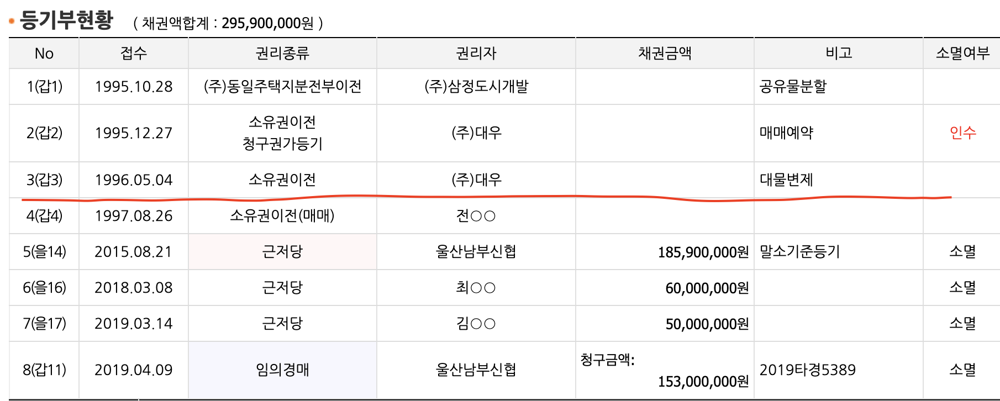
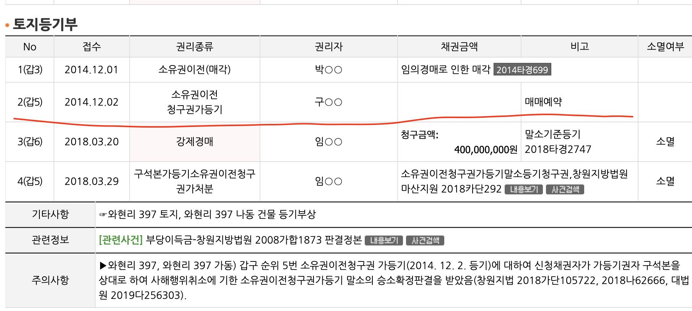
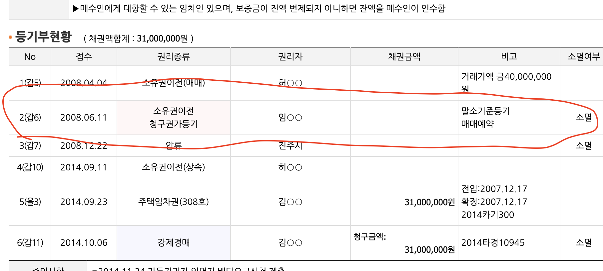
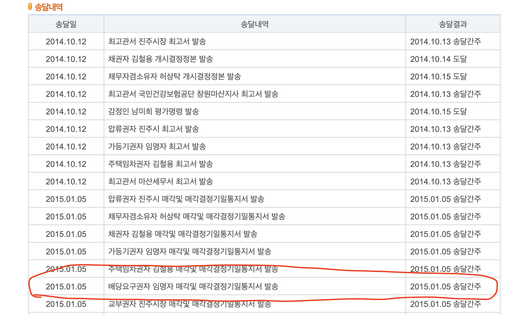

# 가등기

* 장래에 행해질 본등기의 순위를 보전하기 위하여 예비적으로 하는 등기
* 본등기 전까지 물권변동 효력이 없고, 가등기 의무자의 처분권을 제한하는 효력 없음
* 본등기를 위해 임시로 해놓은 등기
* 담보 가등기

  * 가등기담보 등에 관한 법률
  * **채권자가 채무자에게 돈을 빌려주면서 채무자의 부동산에 근저당권을 설정하는 대신 가등기를 경료하는 방법을 활용하게 되는데 이를 ****“****담보가등기****”****라 함(저당권과 비슷한 효력)
  * 채권 -> 물건송달 내용에 채권 계산서 등 내용 확인
* 소유권청구권가등기

  * 부동산 등기법
  * 가등기에 의한 본등기를 한 경우 본등기의 순위는 가등기 순위에 따름
  * `가등기 후 10년이 경과하더라도 가등기에 기한 본등기를 할 수 있음`
  * `매매예약을 하고 매매예약완결권을 행사해야 비로서 상대방에게 소유권이전을 청구`
  * `매매예약 완결권은 10년이 지나면 소멸하는 것이므로 10년이 지나면 매매예약완결권을 행사할 수 없다`
    * 즉, 가등기 10년 + 매매예약완결권 10년 = 20년 기간
  * 매매예약완결권을 행사하지 않더라도 행사한걸로 간주한다라는 조항이 있을 수 있다
  * 매매예약 완결권 이후에도 10년이 도과되면 매매예약 완결권도 소멸 -> 점유를 하고 있다면 소멸하지 않는다

> 경매에서 가등기(후순위 소멸)

* 담보가등기

  * 담보물권, 배당참가, 말소기준권리 -> 인수 X
* 소유권청구권가등기

  * 선순위 가등기 -> 인수 0

> 어떻게 확인?

* 물건송달내역 0 -> 채권계산서 제출하고 배당요구 시 담보가등기
* 물건송달내역 X -> 소유권청구권가등기
* 매매계약에 기한 순위보전가등기
  * 일반채권으로 10년의 소멸시효 -> 단, 시효중단 사유 여부 체크
* 매매예약에 기한 순위보전가등기
  * 소멸시호10년 + 매매예약완결권 10년

> 주의사항

* 시효 중단시키는 사유가 있으면 안됨
  * 청구, 압류, 가압류, 가처분 등 등기부에서 확인
* 채권자가 점유하고 있다면 시효 진행 자체가 안됨  -> 채권이 살아 있다는 얘기
  * 누가 점유하고 있는지 중요, 간접점유도 확인 -> 가등기권자와 계약한 세입자 일수도
* 총 20년 이후 소멸

---

> 경매 사례

* 선순위 가등기라도 가등기권자가 소유권을 이전받은 경우**(19타경 5389)**
* 
* 선순위 가등기인데 소송 패소함 (가등기 문제없음) **(18타경 2747)**
  * 소유권이전청구권 가등기 구oo 대상으로 소송을 하여 승소하였기 때문에 가등기는 소멸
* 
* 선순위 가등기이지만 배당을 요구하면 담보가등기
  * 송달내역 : 배당요구권자 임명자
  * 배당요구를 했기 때문에 말소기준권리가 됨
* 
* 소유권의 이전에 관한 가등기권리자는 강제경매등 절차의 이해관계인으로 본다
* ※가등기 담보권자는 반드시 배당종기이전에 배당신청과 채권계산를 경매계에 제출해야 한다
* 채권계산서가 법원에 제출되면 담보가등기(=근저당으로 본다)
