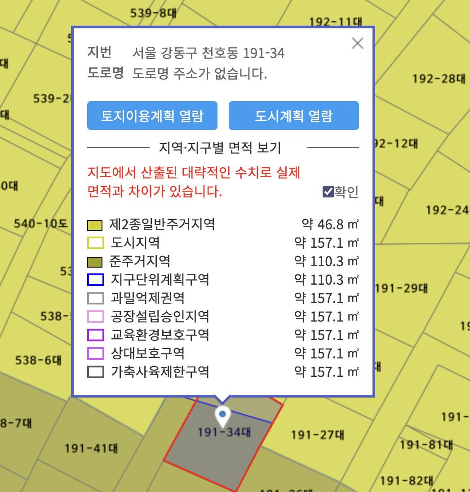

> ## 건축법 제14조(건축신고)

1. 제11조에 해당하는 허가 대상 건축물이라 하더라도 다음 각 호의 어느 하나에 해당하는 경우에는 미리 특별자치시장ㆍ특별자치도지사 또는 시장ㆍ군수ㆍ구청장에게 국토교통부령으로 정하는 바에 따라 *신고를 하면 건축허가를 받은 것으로 본다.* <개정 2009. 2. 6., 2011. 4. 14., 2013. 3. 23., 2014. 1. 14., 2014. 5. 28.>
   1. *바닥면적의 합계가 85제곱미터 이내의 증축ㆍ개축 또는 재축.* 다만, 3층 이상 건축물인 경우에는 증축ㆍ개축 또는 재축하려는 부분의 바닥면적의 합계가 건축물 연면적의 10분의 1 이내인 경우로 한정한다.
   2. 「국토의 계획 및 이용에 관한 법률」에 따른 *관리지역, 농림지역 또는  자연환경보전지역에서 연면적이 200제곱미터 미만이고 3층 미만인 건축물의 건축.* 다만, 다음 각 목의 어느 하나에 해당하는 구역에서의 건축은 제외한다.

      * 가. 지구단위계획구역
      * 나. 방재지구 등 재해취약지역으로서 대통령령으로 정하는 구역
   3. 연면적이 200제곱미터 미만이고 3층 미만인 건축물의 대수선
   4. 주요구조부의 해체가 없는 등 대통령령으로 정하는 대수선
   5. 그 밖에 소규모 건축물로서 대통령령으로 정하는 건축물의 건축

      * 건축법 시행령
        * *법 제14조제1항제5호*에서 “대통령령으로 정하는 건축물”
          1. 연면적의 합계가 100제곱미터 이하인 건축물연명적의
          2. 건축물의 높이를 3미터 이하의 범위에서 증축하는 건축물
          3. 법 제23조제4항에 따른 표준설계도서(이하 “표준설계도서”라 한다)에 따라 건축하는 건축물로서 그 용도 및 규모가 주위환경이나 미관에 지장이 없다고 인정하여 건축조례로 정하는 건축물
          4. 국토의 계획 및 이용에 관한 법률」 제36조제1항제1호다목에 따른 공업지역, 같은 법 제51조제3항에 따른 지구단위계획구역(같은 법 시행령 제48조제10호에  따른 산업ㆍ유통형만 해당한다) 및 「산업입지 및 개발에 관한 법률」에 따른 산업단지에서 건축하는 2층 이하인 건축물로서 연면적 합계 500제곱미터 이하인 공장(별표 1 제4호너목에 따른 제조업소 등 물품의 제조ㆍ가공을 위한 시설을 포함한다)
          5. 농업이나 수산업을 경영하기 위하여 읍ㆍ면지역(특별자치시장ㆍ특별자치도지사ㆍ시장ㆍ군수가 지역계획 또는 도시ㆍ군계획에 지장이 있다고 지정ㆍ공고한 구역은 제외한다)에서 건축하는 연면적 200제곱미터 이하의 창고 및 연면적 400제곱미터 이하의 축사, 작물재배사(作物栽培舍), 종묘배양시설, 화초 및 분재 등의 온실
2. 제1항에 따른 건축신고에 관하여는 [제11조]( "팝업으로 이동")[제5항]( "팝업으로 이동") 및 [제6항]( "팝업으로 이동")을 준용한다. **<개정 2014. 5. 28.>**
3. 특별자치시장ㆍ특별자치도지사 또는 시장ㆍ군수ㆍ구청장은 제1항에 따른 신고를 받은 날부터 5일 이내에 신고수리 여부 또는 민원 처리 관련 법령에 따른 처리기간의 연장 여부를 신고인에게 통지하여야 한다. 다만, 이 법 또는 다른 법령에 따라 심의, 동의, 협의, 확인 등이 필요한 경우에는 20일 이내에 통지하여야 한다.<신설 2017. 4. 18.>
4. 특별자치시장ㆍ특별자치도지사 또는 시장ㆍ군수ㆍ구청장은 제1항에 따른 신고가 제3항 단서에 해당하는 경우에는 신고를 받은 날부터 5일 이내에 신고인에게 그 내용을 통지하여야 한다.<신설 2017. 4. 18.>
5. 제1항에 따라 신고를 한 자가 신고일부터 1년 이내에 공사에 착수하지 아니하면 그 신고의 효력은 없어진다. 다만, 건축주의 요청에 따라 허가권자가 정당한 사유가 있다고 인정하면 1년의 범위에서 착수기한을 연장할 수 있다.<개정 2016. 1. 19., 2017. 4. 18.>

> ## 용도지역이 둘 이상에 걸칠 때 적용법규

* 2종일반주거지역-->>46.9 ㎡
* 준주거지역-->>110.3 ㎡
* 2종일반주거/준주거 모두 건폐율 60% 임
* 2종일반주거 : 200%/준주거 400%임

> 가중평균한 건폐율 : (49.6*60 + 110.3*60) ÷ 172 = 약 55.78%
>
> 가중평균한 용적률 : (49.6*200 + 110.3*400) ÷ 172 = 약 314.2%

> 제84조(둘 이상의 용도지역ㆍ용도지구ㆍ용도구역에 걸치는 대지에 대한 적용 기준)

1. 하나의 대지가 둘 이상의 용도지역ㆍ용도지구 또는 용도구역(이하 이 항에서 “용도지역등”이라 한다)에 걸치는 경우로서 각 용도지역등에 걸치는 부분 중 *가장 작은 부분의 규모가 [대통령령]으로 정하는 규모 이하인 경우에는 전체 대지의 건폐율 및 용적률은 각 부분이 전체 대지 면적에서 차지하는 비율을 고려하여 다음 각 호의 구분에 따라 각 용도지역등별 건폐율 및 용적률을 가중평균한 값을 적용*하고, 그 밖의 건축 제한 등에 관한 사항은 그 대지 중 가장 넓은 면적이 속하는 용도지역등에 관한 규정을 적용한다. 다만, 건축물이 고도지구에 걸쳐 있는 경우에는 그 건축물 및 대지의 전부에 대하여 *고도지구의 건축물 및 대지에 관한 규정을 적용한다*. **<개정 2012. 2. 1., 2017. 4. 18.>**

   * 국계법 시행령 제94조 2항

     * 법 제84조제1항 각 호 외의 부분 본문 및 같은 조 제3항 본문에서 “대통령령으로 정하는 규모”라 함은 330제곱미터를 말한다. 다만, 도로변에 띠 모양으로 지정된 상업지역에 걸쳐 있는 토지의 경우에는 660제곱미터를 말한다. <개정 2004. 1. 20., 2012. 4. 10., 2017. 12. 29.>

   > 1. 가중평균한 건폐율 = (f1x1 + f2x2 + … + fnxn) / 전체 대지 면적. 이 경우 f1부터 fn까지는 각 용도지역등에 속하는 토지 부분의 면적을 말하고, x1부터 xn까지는 해당 토지 부분이 속하는 각 용도지역등의 건폐율을 말하며, n은 용도지역등에 걸치는 각 토지 부분의 총 개수를 말한다.
   > 2. 가중평균한 용적률 = (f1x1 + f2x2 + … + fnxn) / 전체 대지 면적. 이 경우 f1부터 fn까지는 각 용도지역등에 속하는 토지 부분의 면적을 말하고, x1부터 xn까지는 해당 토지 부분이 속하는 각 용도지역등의 용적률을 말하며, n은 용도지역등에 걸치는 각 토지 부분의 총 개수를 말한다.
   >
2. *하나의 건축물이 방화지구와* 그 밖의 용도지역ㆍ용도지구 또는 용도구역에 걸쳐 있는 경우에는 제1항에도 불구하고 *그 전부에 대하여 방화지구의 건축물에 관한 규정을 적용한다.* 다만, 그 건축물이 있는 방화지구와 그 밖의 용도지역ㆍ용도지구 또는 용도구역의 경계가 [「건축법」]( "팝업으로 이동") [제50조]( "팝업으로 이동")[제2항]( "팝업으로 이동")에 따른 방화벽으로 구획되는 경우 그 밖의 용도지역ㆍ용도지구 또는 용도구역에 있는 부분에 대하여는 그러하지 아니하다.
3. 하나의 대지가 녹지지역과 그 밖의 용도지역ㆍ용도지구 또는 용도구역에 걸쳐 있는 경우(규모가 가장 작은 부분이 녹지지역으로서 해당 녹지지역이 제1항에 따라 [대통령령]( "팝업으로 이동")으로 정하는 규모 이하인 경우는 제외한다)에는 제1항에도 불구하고 각각의 용도지역ㆍ용도지구 또는 용도구역의 건축물 및 토지에 관한 규정을 적용한다. 다만, 녹지지역의 건축물이 고도지구 또는 방화지구에 걸쳐 있는 경우에는 제1항 단서나 제2항에 따른다. **<개정 2017. 4. 18.>**

   * 국계법 제79조(용도지역 미지정 또는 미세분 지역에서의 행위 제한 등)

     1. 도시지역, 관리지역, 농림지역 또는 자연환경보전지역으로 용도가 지정되지 아니한 지역에 대하여는 [제76조부터 제78조]( "팝업으로 이동")까지의 규정을 적용할 때에 자연환경보전지역에 관한 규정을 적용한다.
     2. [제36조]( "팝업으로 이동")에 따른 도시지역 또는 관리지역이 [같은 조]( "팝업으로 이동") [제1항]( "팝업으로 이동") 각 호 각 목의 세부 용도지역으로 지정되지 아니한 경우에는 [제76조부터 제78조]( "팝업으로 이동")까지의 규정을 적용할 때에 해당 용도지역이 도시지역인 경우에는 녹지지역 중 [대통령령]( "팝업으로 이동")으로 정하는 지역에 관한 규정을 적용하고, 관리지역인 경우에는 보전관리지역에 관한 규정을 적용한다.**[전문개정 2009. 2. 6.]**

> 결론

* **건폐율/용적률은 둘중 하나의 필지(여러필지) 330㎡이하면 가중평균***
* 그 외의 건축제한(용도등) 행위규제는 가장 넓은면적에 속하는 용도지역등의 규정 적용
  * 건폐율과 용적률-->>가장 작은 규모가 대통령령으로 정하는 규모(330㎡) 이하인 경우 건폐율과 용적률은 용도지역별  건폐율과 용적률을 가중평균한값을 적용하라고 되어있음,
  * 건축제한등-->>건축제한등에 관한 사항은 그 대지중에 가장 넓은 면적에 속하는 용도지역등에 관한 규정을 적용함
  * 건축제한등에 관한 사항 규정-->>과반이상 속하는 지역의 규정을 따른다

> 건축법 제54조(건축물의 대지가 지역ㆍ지구 또는 구역에 걸치는 경우의 조치)

1. 대지가 이 법이나 다른 법률에 따른 지역ㆍ지구(녹지지역과 방화지구는 제외한다. 이하 이 조에서 같다) 또는 구역에 걸치는 경우에는 [대통령령]으로 정하는 바에 따라 그 건축물과 대지의 전부에 대하여 대지의 과반(過半)이 속하는 지역ㆍ지구 또는 구역 안의 건축물 및 대지 등에 관한 이 법의 규정을 적용한다. **<개정 2014. 1. 14., 2017. 4. 18.>**
2. 하나의 건축물이 방화지구와 그 밖의 구역에 걸치는 경우에는 그 전부에 대하여 방화지구 안의 건축물에 관한 이 법의 규정을 적용한다. 다만, 건축물의 방화지구에 속한 부분과 그 밖의 구역에 속한 부분의 경계가 방화벽으로 구획되는 경우 그 밖의 구역에 있는 부분에 대하여는 그러하지 아니하다.
3. 대지가 녹지지역과 그 밖의 지역ㆍ지구 또는 구역에 걸치는 경우에는 각 지역ㆍ지구 또는 구역 안의 건축물과 대지에 관한 이 법의 규정을 적용한다. 다만, 녹지지역 안의 건축물이 방화지구에 걸치는 경우에는 제2항에 따른다. **<개정 2017. 4. 18.>**
4. 제1항에도 불구하고 해당 대지의 규모와 그 대지가 속한 용도지역ㆍ지구 또는 구역의 성격 등 그 대지에 관한 주변여건상 필요하다고 인정하여 해당 지방자치단체의  조례로 적용방법을 따로 정하는 경우에는 그에 따른다.
