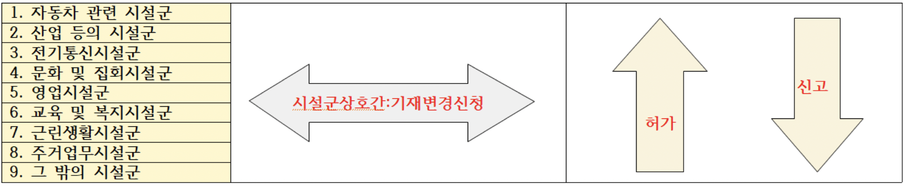

> ## 제 19조(용도변경)

1. *건축물의 용도변경은 변경하려는 용도의 건축기준에 맞게 하여야 한다.*
2. [제22조] 에 따라 사용승인을 받은 건축물의 용도를 변경하려는 자 는 다음 각 호의 구분에 따라 [국토교통부령]( "팝업으로 이동")으로 정하는 바에 따라 특별자치시장ㆍ특별자치도지사 또는 시장ㆍ군수ㆍ구청장의 허가를 받거나 신고를 하여야 한다. **<개정 2013. 3. 23., 2014. 1. 14.>**

   1. *허가 대상*: 제4항 각 호의 어느 하나에 해당하는 시설군(施設群)에 속하는 건축물의 용도를 상위군(제4항 각 호의 번호가 용도변경하려는 건축물이 속하는 시설군보다 작은 시설군을 말한다)에 해당하는 용도로 변경하는 경우
   2. *신고 대상*: 제4항 각 호의 어느 하나에 해당하는 시설군에 속하는 건축물의 용도를 하위군(제4항 각 호의 번호가 용도변경하려는 건축물이 속하는 시설군보다 큰 시설군을 말한다)에 해당하는 용도로 변경하는 경우
3. 제4항에 따른 시설군 중 *같은 시설군 안에서 용도를 변경*하려는 자는 [국토교통부령] 으로 정하는 바에 따라 특별자치시장ㆍ특별자치도지사 또는 시장ㆍ군수ㆍ구청장에게 *건축물대장 기재내용의 변경을 신청하여야 한다*. 다만, [대통령령](으로 정하는 변경의 경우에는 그러하지 아니하다. **<개정 2013. 3. 23., 2014. 1. 14.>**
4. 시설군은 다음 각 호와 같고 각 시설군에 속하는 건축물의 세부 용도는 대통령령으로 정한다.

   
5. 제2항에 따른 *허가나 신고 대상인 경우*로서 용도변경하려는 부분의 바닥면적의 합계가 *100제곱미터 이상인 경우의 사용승인*에 관하여는 *제22조를 준용*한다. 다만, 용도변경하려는 부분의 바닥면적의 합계가 500제곱미터 미만으로서 *대수선에 해당되는 공사를 수반하지 아니하는 경우에는 그러하지 아니하다.*<개정 2016. 1. 19.>
6. 제2항에 따른 허가 대상인 경우로서 용도변경하려는 부분의 바닥면적의 합계가 500제곱미터 이상인 용도변경(대통령령으로 정하는 경우는 제외한다)의 설계에 관하여는* 제23조를 준용한다*.
7. 제1항과 제2항에 따른 건축물의 용도변경에 관하여는 제3조, 제5조, 제6조, 제7조, 제11조제2항부터 제9항까지, 제12조, 제14조부터 제16조까지, 제18조, 제20조, 제27조, 제29조, 제38조, 제42조부터 제44조까지, 제48조부터 제50조까지, 제50조의2, 제51조부터 제56조까지, 제58조, 제60조부터 제64조까지, 제67조, 제68조, 제78조부터 제87조까지의 규정과 「녹색건축물 조성 지원법」 제15조 및 「국토의 계획 및 이용에 관한 법률」 제54조를 준용한다.<개정 2011. 5. 30., 2014. 1. 14., 2014. 5. 28., 2019. 4. 30.>

   > 건축물의 용도변경은 변경하려는 용도의 건축기준에 맞게 하여야 한다.-->>건축법/주차장법 등 기타 관련법률에 적합해야 한다
   >

   * 제3조(적용 제외) 제5조(적용의 완화)  제6조(기존의 건축물 등에 관한 특례) 제7조(통일성을 유지하기 위한 도의 조례)
   * 제11조(건축허가) 제12조(건축복합민원 일괄협의회)
   * 제14조(건축신고) 제15조(건축주와의 계약 등)  제16조(허가와 신고사항의 변경) 제17조(건축허가 등의 수수료) 제18조(건축허가 제한 등) 제20조(가설건축물)
   * 제27조(현장조사ㆍ검사 및 확인업무의 대행) 제29조(공용건축물에 대한 특례)
   * 제38조(건축물대장)
   * 제42조(대지의 조경) 제43조(공개 공지 등의 확보)
   * 제48조(구조내력 등) 제48조의2(건축물 내진등급의 설정) 제48조의3(건축물의 내진능력 공개) 제48조의4(부속구조물의 설치 및 관리)
   * 제49조(건축물의 피난시설 및 용도제한 등) 제49조의2(피난시설 등의 유지ㆍ관리에 대한 기술지원)
   * 제50조(건축물의 내화구조와 방화벽) 제50조의2(고층건축물의 피난 및 안전관리)
   * 제51조(방화지구 안의 건축물)
   * 제52조(건축물의 마감재료 등) 제52조의2(실내건축) 제52조의3(건축자재의 제조 및 유통 관리) 제52조의4(건축자재의 품질관리 등) 제52조의5(건축자재등의 품질인정)
   * 제52조의6(건축자재등 품질인정기관의 지정ㆍ운영 등)
   * 제53조(지하층) 제53조의2(건축물의 범죄예방)
   * 제54조(건축물의 대지가 지역ㆍ지구 또는 구역에 걸치는 경우의 조치)
   * 제55조(건축물의 건폐율) 제56조(건축물의 용적률) 제58조(대지 안의 공지)
   * 제60조(건축물의 높이 제한)  제61조(일조 등의 확보를 위한 건축물의 높이 제한) 제62조(건축설비기준 등) 제63조 삭제  제64조(승강기)
   * 제67조(관계전문기술자) 제68조(기술적 기준)
   * 제77조(특별건축구역 건축물의 검사 등)
     * 제77조의2(특별가로구역의 지정)
     * 제77조의3(특별가로구역의 관리 및 건축물의 건축기준 적용 특례 등)
     * 제77조의4(건축협정의 체결)
     * 제77조의5(건축협정운영회의 설립)
     * 제77조의6(건축협정의 인가)
     * 제77조의7(건축협정의 변경)
     * 제77조의8(건축협정의 관리)
     * 제77조의9(건축협정의 폐지)
       제77조의10(건축협정의 효력 및 승계)
     * 제77조의11(건축협정에 관한 계획 수립 및 지원)
     * 제77조의12(경관협정과의 관계)
     * 제77조의13(건축협정에 따른 특례)
     * 제77조의14(건축협정 집중구역 지정 등)
     * 제77조의15(결합건축 대상지)
     * 제77조의16(결합건축의 절차)
     * 제77조의17(결합건축의 관리)
   * 제78조(감독) 제79조(위반 건축물 등에 대한 조치 등)
   * 제80조(이행강제금) 제80조의2(이행강제금 부과에 관한 특례) 제81조 삭제 <2019. 4. 30.>
   * 제82조(권한의 위임과 위탁) 제83조(옹벽 등의 공작물에의 준용)
   * 제84조(면적ㆍ높이 및 제85조(「행정대집행법」 적용의 특례)  층수의 산정)
   * 제86조(청문) 제87조(보고와 검사 등)
   * 제87조의2(지역건축안전센터 설립), 제87조의3(건축안전특별회계의 설치)
   * 국토계획법 제54조(지구단위계획구역에서의 건축 등)
