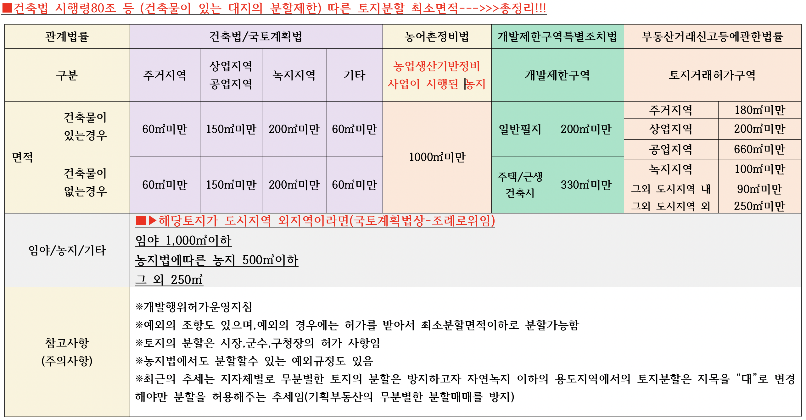

> ## 가설건축물

> 제20조(가설건축물)

1. 도시ㆍ군계획시설 및 도시ㆍ군계획시설예정지에서 가설건축물을 건축하려는 자는 특별자치시장ㆍ특별자치도지사 또는 시장ㆍ군수ㆍ구청장의 허가를 받아야 한다. <개정 2011. 4. 14., 2014. 1. 14.>
2. 특별자치시장ㆍ특별자치도지사 또는 시장ㆍ군수ㆍ구청장은 해당 가설건축물의 건축이 *다음 각 호의 어느 하나에 해당하는 경우가 아니면 제1항에 따른 허가를 하여야 한다.*<신설 2014. 1. 14.>
   1. 「국토의 계획 및 이용에 관한 법률」 제64조에 위배되는 경우
   2. 4층 이상인 경우
   3. *구조, 존치기간, 설치목적 및 다른 시설 설치 필요성 등에 관하여* 대통령령으로 *정하는 기준의 범위*에서 *조례로 정하는 바에 따르지 아니한 경우*
   4. 그 밖에 이 법 또는 다른 법령에 따른 제한규정을 위반하는 경우
3. 제1항에도 불구하고 재해복구, 흥행, 전람회, 공사용 가설건축물 등 *대통령령으로 정하는 용도의 가설건축물*을 축조하려는 자는 *대통령령으로 정하는 존치 기간, 설치 기준 및 절차*에 따라 특별자치시장ㆍ특별자치도지사 또는 시장ㆍ군수ㆍ구청장에게 *신고한 후 착공*하여야 한다.<개정 2014. 1. 14.>
   * 건축법 시행령 제15조(가설건축물) -> 존치 기간, 설치 기준 및 절차
     1. 법 제20조제2항제3호 에서 “대통령령으로 정하는 기준”이란 다음 각 호의 기준을 말한다.
        1. 철근콘크리트조 또는 철골철근콘크리트조가 아닐 것
        2. *존치기간은 3년 이내일 것*. 다만, 도시ㆍ군계획사업이 시행될 때까지 그 기간을 연장할 수 있다.
        3. 전기ㆍ수도ㆍ가스 등 새로운 간선 공급설비의 설치를 필요로 하지 아니할 것 -> 그린밸트에서 건축하기위한 조건과 같음
        4. 공동주택ㆍ판매시설ㆍ운수시설 등으로서 분양을 목적으로 건축하는 건축물이 아닐 것
     2. 제1항에 따른 가설건축물에 대하여는 *법 제38조(건축물대장) 를 적용하지 아니한다.* -> 건축물대장이 없음
     3. 제1항에 따른 가설건축물 중 시장의 공지 또는 도로에 설치하는 차양시설에 대하여는 *법 제46조(건축선의 지정) 및 법 제55조(건축물의 건폐율) *를 적용하지 아니한다.
     4. 제1항에 따른 가설건축물을 도시ㆍ군계획 예정 도로에 건축하는 경우에는 법 제45조부터 제 47조를 적용하지 아니한다. **<개정 2012. 4. 10.>**
        * 제45조(도로의 지정 폐지 또는 변경)
        * 제 46조(건축선의 지정)
        * 제 47조(건축선에 따른 건축제한)
4. 제3항에 따른 신고에 관하여는 제14조제3항 및 제4항을 준용한다.<신설 2017. 4. 18.>
5. ***제1항과 제3항에 따른 가설건축물을 건축하거나 축조할 때에는 대통령령으로 정하는 바에 따라 제25조, 제38조부터 제42조까지, 제44조부터 제50조까지, 제50조의2, 제51조부터 제64조까지, 제67조, 제68조와 「녹색건축물 조성 지원법」 제15조 및 「국토의 계획 및 이용에 관한 법률」 제76조 중 일부 규정을 적용하지 아니한다.<개정 2014. 1. 14., 2017. 4. 18.>***
6. 특별자치시장ㆍ특별자치도지사 또는 시장ㆍ군수ㆍ구청장은 제1항부터 제3항까지의 규정에 따라 가설건축물의 건축을 허가하거나 축조신고를 받은 경우 국토교통부령으로 정하는 바에 따라 *가설건축물대장에 이를 기재하여 관리하여야 한다.*<개정 2013. 3. 23., 2014. 1. 14., 2017. 4. 18.>

---

## 판례

> 대법원 2021. 10. 28 선고 2020다224821 판결 [토지인도]

* 가설건축물인 창고에 대해서도 법정지상권이 성립하는지 쟁점이 된 사건
* 가설건축물에 관하여 민법 제366조의 법정지상권이 성립하는지 여부(원칙적 소극)
* 민법 제366조의 법정지상권은 저당권 설정 당시 동일인의 소유에 속하던 토지와 건물이 경매로 인하여 양자의 소유자가 다르게 된 때에 건물의 소유자를 위하여 발생하는 것으로서, 법정지상권이 성립하려면 경매절차에서 매수인이 매각대금을 다 낸 때까지 해당 건물이 독립된 부동산으로서 건물의 요건을 갖추고 있어야 한다.
  독립된 부동산으로서 건물은 토지에 정착되어 있어야 하는데(민법 제99조 제1항), 가설건축물은 일시 사용을 위해 건축되는 구조물로서 설치 당시부터 일정한 존치기간이 지난 후 철거가 예정되어 있어 일반적으로 토지에 정착되어 있다고 볼 수 없다.
  민법상 건물에 대한 법정지상권의 최단 존속기간은 견고한 건물이 30년, 그 밖의 건물이 15년인 데 비하여, 건축법령상 가설건축물의 존치기간은 통상 3년 이내로 정해져 있다.
* ***따라서 가설건축물은 특별한 사정이 없는 한 독립된 부동산으로서 건물의 요건을 갖추지 못하여 법정지상권이 성립하지 않는다.***

> 대법원 1990. 10. 30 선고 90다카26003 판결 [건물철거]

* 토지소유자의 *승낙을 받아 건물을 신축한(가설건축물) *자의 관습에 의한 법정지상권 유무(소극)
* *토지의 소유자로부터 토지사용 승낙을 받아 건물을 신축하고 그에 대한 경작료를 납부하여 온 경우에는 관습에 의한 법정지상권이 성립할 여지가 없고 따라서 그에 기한 건물의 매수청구권도 발생하지 아니한다.*

> 창원지방법원 2019. 4. 24. 선고 2018구합560 판결 이행강제금부과처분취소

* *이러한 법리에 비추어 보면, 원고가 임의경매 절차에서 이 사건 무허가 건축물을 낙찰받아 소유권을 취득할 당시 그것이 허가 없이 건축된 사실을 알지 못하였다고 하더라도, 그러한 사정만으로는 이 사건 처분이 위법하다고 볼 수 없다.*
* **-> 가설건축물이고 가설건축물로 신고 했다면 이야기가 달라 진다**

> 존치기간이 만료된 가설건축물에 대한  일반건축물로 전환하여 등기가 가능한지

* *가설건축물이 일반건축물과 같은 조건으로 건축되고, 건축법과 관련법령에 저촉되는 것이 없다면 신축시와 동일한 절차(추인)를 거쳐 일반건축물로도 사용할 수 있는 것임*

---

> 건축법 제57조(대지의 분할 제한)

* 건축법/국토계획법/농지법/농어촌정비법/산지법/개특법/부동산거래신고등에관한 법률

1. *건축물이 있는 대지는* 대통령령으로 정하는 범위에서 해당 지방자치단체의 조례로 정하는 면적에 못 미치게 분할할 수 없다. ->***조례위임***
2. *건축물이 있는 대지는* 제44조(대지와 도로의 관계), 제55조(건축물의 건폐율), 제56조(건축물의 용적률), 제58조(대지 안의 공지), 제60조(건축물의 높이제한) 및 제61조(일조 등의 확보를 위한 건축물의 높에제한)에 따른 기준에 못 미치게 분할할 수 없다.
   * 개발행위허가기준(제 56조관련) - 국계법 시행령 [별표 1의2]
     * 라. 토지분할
       * (가) 「건축법」 제57조제1항에 따른 분할제한면적(이하 이 칸에서 "분할제한면적"이라 한다) 이상으로서 *도시·군계획조례가 정하는 면적 이상으로 분할할 것*
3. 제1항과 제2항에도 불구하고 제77조의6에 따라 건축협정이 인가된 경우 그 건축협정의 대상이 되는 대지는 분할할 수 있다.<신설 2014. 1. 14.>

> 농지법 제 22조(농지 소유의 세분화 방지)

1. 국가와 지방자치단체는 농업인이나 농업법인의* 농지 소유가 세분화되는 것을 막기 위하여* 농지를 어느 한 농업인 또는 하나의 농업법인이 일괄적으로 상속ㆍ증여 또는 양도받도록 필요한 지원을 할 수 있다.
2. [*「농어촌정비법」]에 따른 농업생산기반정비사업이 시행된 농지*는 다음 각 호의 어느 하나에 해당하는 경우 외에는 분할할 수 없다. **<개정 2009. 5. 27., 2011. 4. 14.>** -> 절대농지/경지정리
   1. [「국토의 계획 및 이용에 관한 법률」에 따른 도시지역의 주거지역ㆍ상업지역ㆍ공업지역 또는 도시ㆍ군계획시설부지에 포함되어 있는 농지를 분할하는 경우
   2. 제34조제1항에 따라 농지전용허가(다른 법률에 따라 농지전용허가가 의제되는 인가ㆍ허가ㆍ승인 등을 포함한다)를 받거나 제35조나 제43조에 따른 농지전용신고를 하고 전용한 농지를 분할하는 경우
   3. 분할 후의 각 필지의 면적이 2천제곱미터를 넘도록 분할하는 경우
   4. 농지의 개량, 농지의 교환ㆍ분합 등 [대통령령]( "팝업으로 이동")으로 정하는 사유로 분할하는 경우
      * 농지법 시행령 제23조(농지를 분할 할 수 있는 사유)
      * 법 제22조제2항제4호에서 “대통령령으로 정하는 사유”란 다음 각 호의 어느 하나에 해당하는 경우를 말한다.
        * 농지를 개량하는 경우
        * 인접 농지와 분합(分合)하는 경우
        * 농지의 효율적인 이용을 저해하는 인접 토지와의 불합리한 경계를 시정하는 경우
        * 「농어촌정비법」에 따른 농업생산기반 정비사업을 시행하는 경우
        * 「농어촌정비법」 제43조에 따른 농지의 교환ㆍ분합을 시행하는 경우
          * 농어촌정빕법 제43조(교환, 분할, 합병의 시행)
            1. 시장ㆍ군수ㆍ구청장 또는 한국농어촌공사는 농지 소유자 2명 이상이 신청하거나 농지 소유자가 신청하지 아니하더라도 토지 소유자가 동의를 한 경우에는 농지에 관한 권리, 그 농지의 이용에 필요한 토지에 관한 권리 및 농업생산기반시설과 농어촌용수의 사용에 관한 권리의 교환ㆍ분할ㆍ합병(이하 “교환ㆍ분할ㆍ합병”이라 한다)을 시행할 수 있다.-->>2인이상의 공유토지 소유자가 신청하는경우
            2. 시장ㆍ군수ㆍ구청장 또는 한국농어촌공사가 제1항에 따라 교환ㆍ분할ㆍ합병을 시행하는 때에는 교환ㆍ분할ㆍ합병계획을 세워 시ㆍ도지사의 인가를 받아 그 개요를 고시하고 시장ㆍ군수ㆍ구청장과 등기소에 알려야 한다.
            3. 시ㆍ도지사가 제2항에 따른 교환ㆍ분할ㆍ합병계획의 인가를 하려는 경우에는 제9조를 준용한다.
            4. 2명 이상의 토지 소유자는 농지의 집단화를 위하여 필요한 경우 상호 협의에 의하여 교환ㆍ분할ㆍ합병을 시행할 수 있다.
          * 법 제15조에 따른 농지이용증진사업을 시행하는 경우
3. 시장ㆍ군수 또는 구청장은 농지를 효율적으로 이용하고 농업생산성을 높이기 위하여 통상적인 영농 관행 등을 감안하여 농지 1필지를 공유로 소유(제6조제2항제4호의 경우는 제외한다)하려는 자의 최대인원수를 7인 이하의 범위에서 시ㆍ군ㆍ구의 [조례]로 정하는 바에 따라 제한할 수 있다. **<신설 2021. 8. 17.>**
