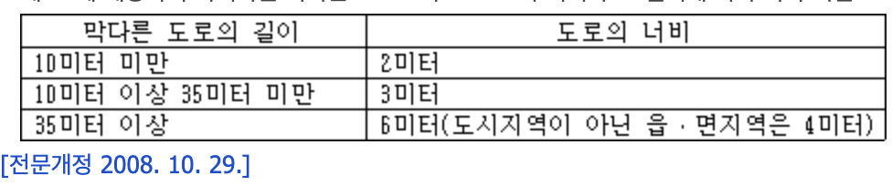
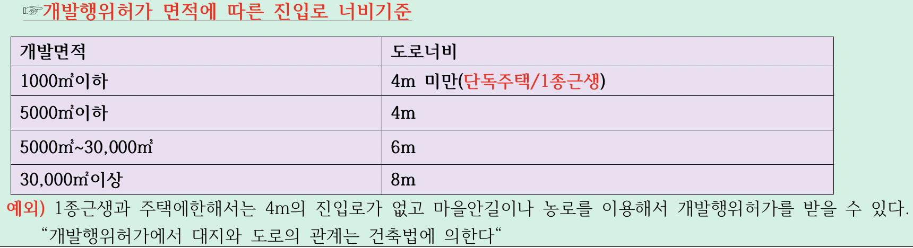
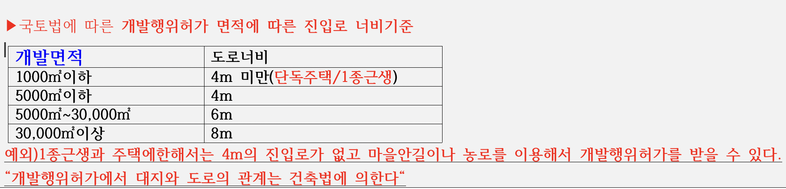

## 건축법 제44(대지와 도로의관계) ~ 제46조(건축선의 지정)

> 제44조(대지와 도로의 관계)

1. *건축물의 대지는 2미터 이상이 도로*(자동차만의 통행에 사용되는 도로는 제외한다)에 접하여야 한다. 다만, 다음 각 호의 어느 하나에 해당하면 그러하지 아니하다. <개정 2016. 1. 19.>

   1. 해당 건축물의 출입에 지장이 없다고 인정되는 경우
   2. 건축물의 주변에 대통령령으로 정하는 공지가 있는 경우

      > * 건축법 시행령 제28조(대지와 도로의 관계
      >   1. 법 제44조제1항제2호에서 “대통령령으로 정하는 공지”란 광장, 공원, 유원지, 그 밖에 관계 법령에 따라 건축이 금지되고 공중의 통행에 지장이 없는 공지로서 허가권자가 인정한 것을 말한다.
      >   2. 법 제44조제2항에 따라 *연면적의 합계가 2천 제곱미터*(공장인 경우에는 3천 제곱미터) 이상인 건축물(축사, 작물 재배사, 그 밖에 이와 비슷한 건축물로서 건축조례로 정하는 규모의 건축물은 제외한다)의 대지는 *너비 6미터 이상의 도로에 4미터 이상 접하여야 한다.*
      >
   3. 「농지법」 제2조제1호나목에 따른 농막을 건축하는 경우
2. 건축물의 대지가 접하는 도로의 너비, 대지가 도로에 접하는 부분의 길이, 그 밖에 대지와 도로의 관계에 관하여 필요한 사항은 대통령령으로 정하는 바에 따른다.

   * 건축법제2조1항11목
     * “도로”란 보행과 자동차 통행이 가능한 *너비 4미터 이상의 도로*(지형적으로 자동차 통행이 불가능한 경우와 막다른 도로의 경우에는 대통령령으로 정하는 구조와 너비의 도로)로서 다음 각 목의 어느 하나에 해당하는 도로나 그 예정도로를 말한다.

       * 가. 「국토의 계획 및 이용에 관한 법률」, 「도로법」, 「사도법」, 그 밖의 관계 법령에 따라 신설 또는 변경에 관한 고시가 된 도로
       * 나. 건축허가 또는 신고 시에 특별시장ㆍ광역시장ㆍ특별자치시장ㆍ도지사ㆍ특별자치도지사(이하 “시ㆍ도지사”라 한다) 또는 시장ㆍ군수ㆍ구청장(자치구의 구청장을 말한다. 이하 같다)이 위치를 지정하여 공고한 도로
     * 건축법시행령 제3조의3 (지형적 조건 등에 따른 도로의 구조와 너비)

       * 법 제2조제1항제11호 각 목 외의 부분에서 “대통령령으로 정하는 구조와 너비의 도로”란 다음 각 호의 어느 하나에 해당하는 도로를 말한다. **<개정 2014. 10. 14.>**
         1. 특별자치시장ㆍ특별자치도지사 또는 시장ㆍ군수ㆍ구청장이 지형적 조건으로 인하여 차량 통행을 위한 도로의 설치가 곤란하다고 인정하여 그 위치를 지정ㆍ공고하는 구간의 너비 3미터 이상(길이가 10미터 미만인 막다른 도로인 경우에는 너비 2미터 이상)인 도로
         2. 제1호에 해당하지 아니하는 막다른 도로로서 그 도로의 너비가 그 길이에 따라 각각 다음 표에 정하는 기준 이상인 도로

            
     * 국계법 54조 개발행위 허가 도로
     * 

> 제45조(도로의 지정, 폐지 또는 변경) -> 비도시 면 지역 면제

1. 허가권자는 제2조제1항제11호나목에 따라 *도로의 위치를 지정ㆍ공고하려면 국토교통부령으로 정하는 바에 따라 그 도로에 대한 이해관계인의 동의를 받아야 한다.* 다만, 다음 각 호의 어느 하나에 해당하면 이해관계인의 동의를 받지 아니하고 건축위원회의 심의를 거쳐 도로를 지정할 수 있다. <개정 2013. 3. 23.>

   1. 허가권자가 이해관계인이 해외에 거주하는 등의 사유로 이해관계인의 동의를 받기가 곤란하다고 인정하는 경우
   2. *주민이 오랫 동안 통행로로 이용하고 있는 사실상의 통로로서 해당 지방자치단체의 조례로 정하는 것인 경우*
2. *허가권자는 제1항에 따라 지정한 도로를 폐지하거나 변경하려면 그 도로에 대한 이해관계인의 동의를 받아야 한다. 그 도로에 편입된 토지의 소유자, 건축주 등이 허가권자에게 제1항에 따라 지정된 도로의 폐지나 변경을 신청하는 경우에도 또한 같다.*

   * 건축법 제3조(적용제외)
     * 다음 각 호의 어느 하나에 해당하는 건축물에는 이 법을 적용하지 아니한다. <개정 2016. 1. 19., 2019. 11. 26., 2023. 3. 21., 2023. 8. 8., 2024. 2. 6.>
       1. 「문화유산의 보존 및 활용에 관한 법률」에 따른 지정문화유산이나 임시지정문화유산 또는 「자연유산의 보존 및 활용에 관한 법률」에 따라 지정된 천연기념물등이나 임시지정천연기념물, 임시지정명승, 임시지정시ㆍ도자연유산, 임시자연유산자료
       2. 철도나 궤도의 선로 부지(敷地)에 있는 다음 각 목의 시설

          * 가. 운전보안시설
          * 나. 철도 선로의 위나 아래를 가로지르는 보행시설
          * 다. 플랫폼
          * 라. 해당 철도 또는 궤도사업용 급수(給水)ㆍ급탄(給炭) 및 급유(給油) 시설
       3. 고속도로 통행료 징수시설
       4. 컨테이너를 이용한 간이창고(「산업집적활성화 및 공장설립에 관한 법률」 제2조제1호에 따른 공장의 용도로만 사용되는 건축물의 대지에 설치하는 것으로서 이동이 쉬운 것만 해당된다)
       5. 「하천법」에 따른 하천구역 내의 수문조작실
     * *「국토의 계획 및 이용에 관한 법률」에 따른 도시지역 및 같은 법 제51조제3항에 따른 지구단위계획구역(이하 “지구단위계획구역”이라 한다) 외의 지역으로서 동이나 읍(동이나 읍에 속하는 섬의 경우에는 인구가 500명 이상인 경우만 해당된다)이 아닌 지역은 제44조부터 제47조까지, 제51조 및 제57조를 적용하지 아니한다.<개정 2011. 4. 14., 2014. 1. 14.>*
     * 「국토의 계획 및 이용에 관한 법률」 제47조제7항에 따른 건축물이나 공작물을 도시ㆍ군계획시설로 결정된 도로의 예정지에 건축하는 경우에는 제45조부터 제47조까지의 규정을 적용하지 아니한다.<개정 2011. 4. 14.>
       * 제44조(대지와 도로의 관계)
       * 제45조(도로의 지정 폐지 또는 변경)
       * 제46조(건축선의 지정)
       * 제47조(건축선에 따른 건축제한)
       * 제51조(방화지구 안의 건축물)
       * 제57조(대지의 분할 제한)
3. 허가권자는 제1항과 제2항에 따라 도로를 지정하거나 변경하면 국토교통부령으로 정하는 바에 따라 도로관리대장에 이를 적어서 관리하여야 한다.<개정 2011. 5. 30., 2013. 3. 23.>

> 제46조(건축선의 지정)

* ①도로와 접한 부분에 건축물을 건축할 수 있는 선[이하 “건축선(建築線)”이라 한다]은 대지와 도로의 경계선으로 한다. 다만, 제2조제1항제11호에 따른 소요 너비에 못 미치는 너비의 도로인 경우에는 그 중심선으로부터 그 *소요 너비의 2분의 1의 수평거리만큼 물러난 선을 건축선으로 하되, 그 도로의 반대쪽에 경사지, 하천, 철도, 선로부지, 그 밖에 이와 유사한 것이 있는 경우에는 그 경사지 등이 있는 쪽의 도로경계선에서 소요 너비에 해당하는 수평거리의 선을 건축선으로 하며, 도로의 모퉁이에서는 대통령령으로 정하는 선을 건축선*으로 한다.
* ② 특별자치시장ㆍ특별자치도지사 또는 시장ㆍ군수ㆍ구청장은 시가지 안에서 건축물의 위치나 환경을 정비하기 위하여 필요하다고 인정하면 제1항에도 불구하고 대통령령으로 정하는 범위에서 건축선을 따로 지정할 수 있다.<개정 2014. 1. 14.>
* ③ 특별자치시장ㆍ특별자치도지사 또는 시장ㆍ군수ㆍ구청장은 제2항에 따라 건축선을 지정하면 지체 없이 이를 고시하여야 한다.<개정 2014. 1. 14.>
  * 건축법시행령 제31조(건축선)
    * ①법 제46조제1항에 따라 너비 8미터 미만인 도로의 모퉁이에 위치한 대지의 도로모퉁이 부분의 건축선은 그 대지에 접한 도로경계선의 교차점으로부터 도로경계선에 따라 다음의 표에 따른 거리를 각각 후퇴한 두 점을 연결한 선으로 한다.

> 제47조 (건축선에 따른 건축제한)

* ① 건축물과 담장은 건축선의 수직면(垂直面)을 넘어서는 아니 된다. *다만, 지표(地表) 아래 부분은 그러하지 아니하다.*
* ② 도로면으로부터 높이 4.5미터 이하에 있는 출입구, 창문, 그 밖에 이와 유사한 구조물은 열고 닫을 때 건축선의 수직면을 넘지 아니하는 구조로 하여야 한다.

> 건축법시행령 제28조(대지와 도로의 관계)

* ① 법 제44조제1항제2호에서 “대통령령으로 정하는 공지”란 다음 각 호의 어느 하나에 해당하는 공지로서 허가권자가 인정한 것을 말한다. **<개정 2024. 7. 30.>
  1. 광장
  2. 공원
  3. 유원지
  4. 그 밖에 관계 법령에 따라 건축이 금지되고 공중의 통행에 지장이 없는 공지
* ② 법 제44조제2항에 따라 *연면적의 합계가 2천 제곱미터*(공장인 경우에는 3천 제곱미터) 이상인 건축물(축사, 작물 재배사, 그 밖에 이와 비슷한 건축물로서 건축조례로 정하는 규모의 건축물은 제외한다)의 대지는 *너비 6미터 이상의 도로에 4미터 이상 접하여야 한다. ***<개정 2009. 6. 30., 2009. 7. 16.>****[전문개정 2008. 10. 29.]**
*

