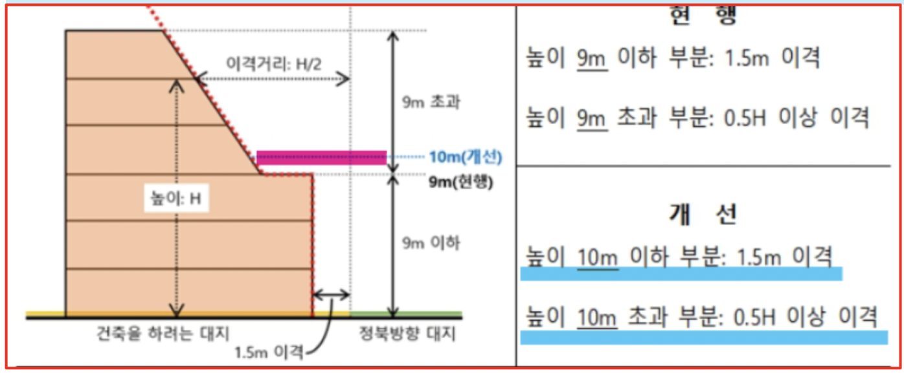

## 제55조(건축물의 건폐율)

* 대지면적에 대한 건축면적(대지에 건축물이 둘 이상 있는 경우에는 이들 건축면적의 합계로 한다)의 비율(이하 “건폐율”이라 한다)의 최대한도는 「국토의 계획 및 이용에 관한 법률」 제77조에 따른 건폐율의 기준에 따른다.
* 다만, 이 법에서 기준을 완화하거나 강화하여 적용하도록 규정한 경우에는 그에 따른다.
  * 국계법
    * 제77조(용도지역의 건폐율)
    * 제78조(용도지역에서의 용적률)
    * 제79조(용도지역 미지정 또는 미세분 지역에서의 행위 제한 등)
    * 제80조(개발제한구역에서의 행위 제한 등)
    * 제80조의 2(도시자연공원구역에서의 행위 제한 등)
    * 제80조의 3(입지규제최소구역에서의 행위 제한)
    * 제81조(시가화조정구역에서의 행위 제한 등)

> 제56조(건축물의 용적률)

* 대지면적에 대한 연면적(대지에 건축물이 둘 이상 있는 경우에는 이들 연면적의 합계로 한다)의 비율(이하 “용적률”이라 한다)의 최대한도는 「국토의 계획 및 이용에 관한 법률」 제78조에 따른 용적률의 기준에 따른다.
* 다만, 이 법에서 기준을 완화하거나 강화하여 적용하도록 규정한 경우에는 그에 따른다.
  * 국계법 제77조(용도지역의 건폐율)

    * ① 제36조에 따라 지정된 용도지역에서 건폐율의 최대한도는 관할 구역의 면적과 인구 규모, 용도지역의 특성 등을 고려하여 다음 각 호의 범위에서 대통령령으로 정하는 기준에 따라 특별시ㆍ광역시ㆍ특별자치시ㆍ특별자치도ㆍ시 또는 군의 조례로 정한다. <개정 2011. 4. 14., 2013. 7. 16., 2015. 8. 11.>
    * 도시지역
      * 가. 주거지역: 70퍼센트 이하
      * 나. 상업지역: 90퍼센트 이하
      * 다. 공업지역: 70퍼센트 이하
      * 라. 녹지지역: 20퍼센트 이하
    * 관리지역
      * 가. 보전관리지역: 20퍼센트 이하
      * 나. 생산관리지역: 20퍼센트 이하
      * 다. 계획관리지역: 40퍼센트 이하
    * 농림지역: 20퍼센트 이하
    * 자연환경보전지역: 20퍼센트 이하
      ② 제36조제2항에 따라 세분된 용도지역에서의 건폐율에 관한 기준은 제1항 각 호의 범위에서 대통령령으로 따로 정한다.
      ③ 다음 각 호의 어느 하나에 해당하는 지역에서의 건폐율에 관한 기준은 제1항과 제2항에도 불구하고 80퍼센트 이하의 범위에서 대통령령으로 정하는 기준에 따라 특별시ㆍ광역시ㆍ특별자치시ㆍ특별자치도ㆍ시 또는 군의 조례로 따로 정한다. <개정 2011. 4. 14., 2011. 8. 4., 2015. 8. 11., 2017. 4. 18.>

> 제60조(건축물의 높이 제한)

* ① 허가권자는 *가로구역[(街路區域): 도로로 둘러싸인 일단(一團)의 지역을 말한다.* 이하 같다]을 단위로 하여 대통령령으로 정하는 기준과 절차에 따라 건축물의 높이를 지정ㆍ공고할 수 있다. 다만, 특별자치시장ㆍ특별자치도지사 또는 시장ㆍ군수ㆍ구청장은 가로구역의 높이를 완화하여 적용할 필요가 있다고 판단되는 대지에 대하여는 대통령령으로 정하는 바에 따라 건축위원회의 심의를 거쳐 높이를 완화하여 적용할 수 있다. <개정 2014. 1. 14.>
* ② 특별시장이나 광역시장은 도시의 관리를 위하여 필요하면 제1항에 따른 가로구역별 건축물의 높이를 특별시나 광역시의 조례로 정할 수 있다.<개정 2014. 1. 14.>
* ③ 삭제<2015. 5. 18.>
* ④ 허가권자는 제1항 및 제2항에도 불구하고 일조(日照)ㆍ통풍 등 주변 환경 및 도시미관에 미치는 영향이 크지 않다고 인정하는 경우에는 건축위원회의 심의를 거쳐 이 법 및 다른 법률에 따른 가로구역의 높이 완화에 관한 규정을 중첩하여 적용할 수 있다.<신설 2022. 2. 3.>
  * 건축법 시행령 제82조(건축물의 높이 제한)
    * ① 허가권자는 법 제60조제1항에 따라 가로구역별로 건축물의 높이를 지정ㆍ공고할 때에는 다음 각 호의 사항을 고려하여야 한다. <개정 2012. 4. 10., 2014. 10. 14.>
      1. 도시ㆍ군관리계획 등의 토지이용계획
      2. 해당 가로구역이 접하는 도로의 너비
      3. 해당 가로구역의 상ㆍ하수도 등 간선시설의 수용능력
      4. 도시미관 및 경관계획
      5. 해당 도시의 장래 발전계획
    * ② 허가권자는 제1항에 따라 가로구역별 건축물의 높이를 지정하려면 지방건축위원회의 심의를 거쳐야 한다. 이 경우 주민의 의견청취 절차 등은 「토지이용규제 기본법」 제8조에 따른다. <개정 2011. 6. 29., 2014. 10. 14.>
    * ③ 허가권자는 같은 가로구역에서 건축물의 용도 및 형태에 따라 건축물의 높이를 다르게 정할 수 있다.
    * ④ 법 제60조제1항 단서에 따라 가로구역의 높이를 완화하여 적용하는 경우에 대한 구체적인 완화기준은 제1항 각 호의 사항을 고려하여 건축조례로 정한다.

> 제61조(일조 등의 확보를 위한 건축물의 높이 제한)

* ① *전용주거지역과 일반주거지역 안에서 건축하는 건축물의 높이는 일조 등의 확보를 위하여 정북방향(正北方向)의 인접 대지경계선으로부터의 거리에 따라 대통령령으로 정하는 높이 이하로 하여야 한다. <개정 2022. 2. 3.>*
* ② 다음 각 호의 어느 하나에 해당하는 공동주택(일반상업지역과 중심상업지역에 건축하는 것은 제외한다)은 채광(採光) 등의 확보를 위하여 대통령령으로 정하는 높이 이하로 하여야 한다.<개정 2013. 5. 10.>
  1. 인접 대지경계선 등의 방향으로 채광을 위한 창문 등을 두는 경우
  2. 하나의 대지에 두 동(棟) 이상을 건축하는 경우
* ③ 다음 각 호의 어느 하나에 해당하면 제1항에도 불구하고 건축물의 높이를 정남(正南)방향의 인접 대지경계선으로부터의 거리에 따라 대통령령으로 정하는 높이 이하로 할 수 있다.<개정 2011. 5. 30., 2014. 1. 14., 2014. 6. 3., 2016. 1. 19., 2017. 2. 8.>
  1. 「택지개발촉진법」 제3조에 따른 택지개발지구인 경우
  2. 「주택법」 제15조에 따른 대지조성사업지구인 경우
  3. 「지역 개발 및 지원에 관한 법률」 제11조에 따른 지역개발사업구역인 경우
  4. 「산업입지 및 개발에 관한 법률」 제6조, 제7조, 제7조의2 및 제8조에 따른 국가산업단지, 일반산업단지, 도시첨단산업단지 및 농공단지인 경우
  5. 「도시개발법」 제2조제1항제1호에 따른 도시개발구역인 경우
  6. 「도시 및 주거환경정비법」 제8조에 따른 정비구역인 경우
  7. 정북방향으로 도로, 공원, 하천 등 건축이 금지된 공지에 접하는 대지인 경우
  8. 정북방향으로 접하고 있는 대지의 소유자와 합의한 경우나 그 밖에 대통령령으로 정하는 경우
* ④ 2층 이하로서 높이가 8미터 이하인 건축물에는 해당 지방자치단체의 조례로 정하는 바에 따라 제1항부터 제3항까지의 규정을 적용하지 아니할 수 있다.

> 건축법 시행령 제86조(일조 등의 확보를 위한건축물의 폰이 제한)

* ① 전용주거지역이나 일반주거지역에서 건축물을 건축하는 경우에는 법 제61조제1항에 따라 건축물의 각 부분을 정북(正北) 방향으로의 인접 대지경계선으로부터 다음 각 호의 범위에서 건축조례로 정하는 거리 이상을 띄어 건축하여야 한다. <개정 2015. 7. 6., 2023. 9. 12.>---->>완화 적용
  1. *높이 10미터 이하인 부분: 인접 대지경계선으로부터 1.5미터 이상*
  2. *높이 10미터를 초과하는 부분: 인접 대지경계선으로부터 해당 건축물 각 부분 높이의 2분의 1 이상*
*

> 제31조 , 제46조 , 제47조 , 제53조 , 제55조 , 제56조 , 제60조 , 제61조 , 제82조 , 제86조

■ 건폐율 · 용적률
① 건폐율은 대지면적에 대한 면적에 대한(대지에 건축물이 2 이상 있는 경우에는 이들 건축면적의 합계)의 비율이다.
② 용적률은 대지면적에 대한 연면적(대지에 건축물이 2 이상 있는 경우에는 이들 연면적의 합계)의 비율이다.
③ 건폐율과 용적률의 최대한도는 「국토의 계획 및 이용에 관한 법률」의 기준에 따르지만, 「건축법」에서 이 기준을 완화하거나 강화하여 적용할 수 있다.

■ 용적률을 산정할 때에는 다음에 해당하는 면적은 제외한다.
① 지하층의 면적
② 지상층의 주차용으로 쓰는 면적
③ 초고층 건축물과 준 초고층 건축물에 설치하는 피난안전 구역의 면적
④ 건축물의 경사지붕 아래에 설치하는 대피공간의 면적

■ 층수 · 층고
① 층수 산정 시 층의 구분이 명확하지 아니한 건축물은 그 건축물의 높이 4m 마다 하나의 층으로 보고 그 층수를 산정한다.
② 건축물이 부분에 따라 그 층수가 다른 경우에는 그중 가장 많은 층수를 그 건축물의 층수로 본다.
③ 층고는 방의 바닥구조체 뒷면으로부터 위층 바닥구조체의 윗면까지의 높이로 한다.

■ 건축물의 높이제한 규정을 적용할 때, 건축물의 1층 전체에 필로티가 설치되어 있는 경우 건축물의 높이는 필로티의 층고를 제외하고 산정한다.

■ 가로구역 단위의 높이제한: 허가권자가 가로구역별 건축물의 높이를 지정할 경우 지방건축위원회 심의를 거쳐야 하며, 허가권자는 같은 가로구역에서 건축물의 용도 및 형태에 따라 건축물의 높이를 다르게 정할 수 있다. 특별시장이나 광역시장은 도시의 관리를 위하여 필요하면 가로구역별 건축물의 높이를 특별시나 광역시의 조례로 정할 수 있다.

■ 일조 등의 확보를 위한 높이제한: 전용주거 지역과 일반주거지역 안에서 건축하는 건축물의 높이는 일조 등의 확보를 위하여 정북방향의 인접 대지경계선으로부터 다음과 같이 정하는 거리 이상을 띄어 건축하여야 한다.
① 높이 9m 이하인 부분: 인접 대지경계선으로부터 1.5m 이상 -->>2023. 9. 12.>---->>완화 적용

1. 높이 10미터 이하인 부분: 인접 대지경계선으로부터 1.5미터 이상 -->>2023. 9. 12.>---->>완화 적용
   ② 높이 9m를 초과하는 부분: 인접 대지경계선으로부터 해당 건축물 각 부분 높이의 1/2 이상  -->>2023. 9. 12.>---->>완화 적용

■ 바닥면적에 산입하는 경우
① 벽·기둥의 구획이 없는 건축물은 그 지붕 끝부분으로부터 수평거리 1m를 후퇴한 선으로 둘러싸인 수평 투영 면적
② 건축물의 노대 등의 바닥은 난간 등의 설치 여부에 관계없이 노대 등의 면적에서 노대 등이 접한 가장 긴 외벽에 접한 길이에 1.5 m를 곱한 값을 땐 면적

■ 바닥면적에 산입하지 않는 경우
① 필로티나 그 밖에 이와 비슷한 구조의 부분은 그 부분이 공중의 통행이나 차량의 통행 또는 주차에 전용되는 경우와 공동주택의 경우
② 공동주택으로서 지상층에 설치한 어린이 놀이터, 전기실, 기계실, 조경시설 및 생활폐기물 보관시설의 면적
③ 건축물을 리모델링하는 경우로서 미관 향상, 열의 손실 방지 등을 위하여 외벽에 부가하여 마감재 등을 설치하는 부분
④ 승강기탑, 계단탑, 장식탑, 층고가 1.5m 이하인 다락(경사진 형태의 지붕인 경 우에는 1.8m
