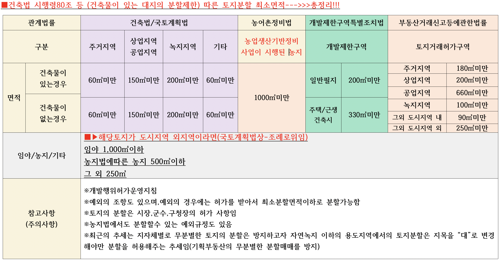

> ## 건축허가 & 건축신고 & 건축허가취소

* 건축허가시 22개 법률의 의제관련 법조문
* 착공신고
* 건축허가취소 관련 법조문
* 착공후 취소의 규정은 없다~~~~????--->>>건축관계자 명의변경
* 허가없이 신고만하고 지을 수 있는 규정
* 건축허가 : 2년내 착수 // 건축신고 : 1년내 착수
* 농가주택???(건축법에서의 정의~~~)
* 가설건축물 연구

> ## 건축법 제11조(건축허가)

1. *건축물을 건축하거나 대수선하려는 자는* 특별자치시장ㆍ특별자치도지사 또는 시장ㆍ군수ㆍ구청장의 허가를 받아야 한다. 다만, 21층 이상의 건축물 등 대통령령으로 정하는 용도 및 규모의 건축물을 특별시나 광역시에 건축하려면 특별시장이나 광역시장의 *허가를 받아야 한다.* <개정 2014. 1. 14.>
2. 시장ㆍ군수는 제1항에 따라 다음 각 호의 어느 하나에 해당하는 건축물의 건축을 허가하려면 미리 *건축계획서와 국토교통부령으로 정하는 건축물의 용도, 규모 및 형태가 표시된 기본설계도서를 첨부*하여 도지사의 *승인을 받아야 한다*.<개정 2013. 3. 23., 2014. 5. 28.>

   > 1. 제1항 단서에 해당하는 건축물. 다만, 도시환경, 광역교통 등을 고려하여 해당 도의 조례로 정하는 건축물은 제외한다
   > 2. *자연환경이나 수질을 보호*하기 위하여 도지사가 지정ㆍ공고한 구역에 건축하는 *3층 이상 또는 연면적의 합계가 1천제곱미터 이상인 건축물로서 위락시설과 숙박시설 등 대통령령으로 정하는 용도에 해당하는 건축물*
   >    * 건축법 시행령 -> 승인대상건축물(3층이상/1천제곱미터 이상 건축물로서 위락시설과 숙박시설 등
   >    * 제 8조(건축허가)
   >      * 법 제11조제2항제2호에서 “위락시설과 숙박시설 등 대통령령으로 정하는 용도에 해당하는 건축물”이란 다음 각 호의 건축물
   >      * `1. 공동주택, 2, 제2종 근린생활시설(일반음식점) 3, 업무시설(일반업무시설), 4. 숙박시설, 5. 위락시설`
   > 3. 주거환경이나 교육환경 등 주변 환경을 보호하기 위하여 필요하다고 인정하여 도지사가 지정ㆍ공고한 구역에 건축하는 위락시설 및 숙박시설에 해당하는 건축물
   >
3. 제1항에 따라 허가를 받으려는 자는 허가신청서에 국토교통부령으로 정하는 설계도서와 제5항 각 호에 따른 허가 등을 받거나 신고를 하기 위하여 관계 법령에서 제출하도록 의무화하고 있는 신청서 및 구비서류를 첨부하여 허가권자에게 제출하여야 한다. 다만, 국토교통부장관이 관계 행정기관의 장과 협의하여 국토교통부령으로 정하는 신청서 및 구비서류는 제21조에 따른 착공신고 전까지 제출할 수 있다.<개정 2013. 3. 23., 2015. 5. 18.>
4. 허가권자는 제1항에 따른 건축허가를 하고자 하는 때에 「건축기본법」 제25조에 따른 한국건축규정의 준수 여부를 확인하여야 한다. 다만, 다음 각 호의 어느 하나에 해당하는 경우에는 이 법이나 다른 법률에도 불구하고 *건축위원회의 심의를 거쳐 건축허가를 하지 아니할 수 있다*.<개정 2012. 1. 17., 2012. 10. 22., 2014. 1. 14., 2015. 5. 18., 2015. 8. 11., 2017. 4. 18., 2023. 12. 26.>

   > 1. 위락시설이나 숙박시설에 해당하는 건축물의 건축을 허가하는 경우 해당 대지에 건축하려는 건축물의 용도ㆍ규모 또는 형태가 주거환경이나 교육환경 등 주변 환경을 고려할 때 부적합하다고 인정되는 경우
   > 2. 「국토의 계획 및 이용에 관한 법률」 제37조제1항제4호에 따른 방재지구(이하 “방재지구”라 한다) 및 「자연재해대책법」 제12조제1항에 따른 자연재해위험개선지구 등 상습적으로 침수되거나 침수가 우려되는 대통령령으로 정하는 지역에 건축하려는 건축물에 대하여 일부 공간에 거실을 설치하는 것이 부적합하다고 인정되는 경우
   >
5. *제1항에 따른 건축허가를 받으면 다음 각 호의 허가 등을 받거나 신고를 한 것으로 보며,* 공장건축물의 경우에는 「산업집적활성화 및 공장설립에 관한 법률」 제13조의2와 제14조에 따라 관련 법률의 인ㆍ허가등이나 허가등을 받은 것으로 본다 -> ***의제사항***

   > 1. 제20조제3항에 따른 공사용 가설건축물의 축조신고
   > 2. 제83조에 따른 공작물의 축조신고
   > 3. 「국토의 계획 및 이용에 관한 법률」 제56조에 따른 *개발행위허가*
   > 4. 「국토의 계획 및 이용에 관한 법률」 제86조제5항에 따른 시행자의 지정과 같은 법 제88조제2항에 따른 실시계획의 인가
   > 5. 「*산지관리법*」 제14조와 제15조에 따른 산지전용허가와 산지전용신고, 같은 법 제15조의2에 따른 산지일시사용허가ㆍ신고. 다만, 보전산지인 경우에는 도시지역만 해당된다.
   > 6. 「*사도법*」 제4조에 따른 사도(私道)개설허가
   > 7. 「*농지법*」 제34조, 제35조 및 제43조에 따른 농지전용허가ㆍ신고 및 협의
   > 8. 「*도로법*」 제36조에 따른 도로관리청이 아닌 자에 대한 도로공사 시행의 허가, 같은 법 제52조제1항에 따른 도로와 다른 시설의 연결 허가
   > 9. 「*도로법*」 제61조에 따른 *도로의 점용 허가*
   > 10. 「*하천법*」 제33조에 따른 *하천점용 등의 허가*
   > 11. 「*하수도법*」 제27조에 따른 배수설비(配水設備)의 설치신고
   > 12. 「하수도법」 제34조제2항에 따른 개인하수처리시설의 설치신고
   > 13. 「*수도법*」 제38조에 따라 수도사업자가 지방자치단체인 경우 그 지방자치단체가 정한 조례에 따른 상수도 공급신청
   > 14. 「전기안전관리법」 제8조에 따른 자가용전기설비 공사계획의 인가 또는 신고
   > 15. 「물환경보전법」 제33조에 따른 수질오염물질 배출시설 설치의 허가나 신고
   > 16. 「대기환경보전법」 제23조에 따른 대기오염물질 배출시설설치의 허가나 신고
   > 17. 「소음ㆍ진동관리법」 제8조에 따른 소음ㆍ진동 배출시설 설치의 허가나 신고
   > 18. 「가축분뇨의 관리 및 이용에 관한 법률」 제11조에 따른 배출시설 설치허가나 신고
   > 19. 「자연공원법」 제23조에 따른 행위허가
   > 20. 「도시공원 및 녹지 등에 관한 법률」 제24조에 따른 도시공원의 점용허가
   > 21. 「토양환경보전법」 제12조에 따른 특정토양오염관리대상시설의 신고
   > 22. 「수산자원관리법」 제52조제2항에 따른 행위의 허가
   > 23. 「초지법」 제23조에 따른 초지전용의 허가 및 신고
   >
6. 허가권자는 제5항 각 호의 어느 하나에 해당하는 사항이 *다른 행정기관의 권한에 속하면 그 행정기관의 장과 미리 협의하여야 하며*, 협의 요청을 받은 관계 행정기관의 장은 요청을 받은 날부터 *15일 이내에 의견을 제출*하여야 한다. 이 경우 관계 행정기관의 장은 제8항에 따른 처리기준이 아닌 사유를 이유로 협의를 거부할 수 없고, 협의 요청을 받은 날부터 15일 이내에 의견을 제출하지 아니하면 협의가 이루어진 것으로 본다.<개정 2017. 1. 17.>
7. 허가권자는 제1항에 따른 허가를 받은 자가 다음 각 호의 어느 하나에 해당하면 ***허가를 취소하여야 한다***. 다만, 제1호에 해당하는 경우로서 정당한 사유가 있다고 인정되면 ***1년의 범위에서 공사의 착수기간을 연장할 수 있다***.<개정 2014. 1. 14., 2017. 1. 17., 2020. 6. 9.>

   > 1. ***허가를 받은 날부터 2년***(「산업집적활성화 및 공장설립에 관한 법률」 제13조에 따라 공장의 신설ㆍ증설 또는 업종변경의 승인을 받은 공장은 3년) ***이내에 공사에 착수하지 아니한 경우***
   > 2. 제1호의 기간 이내에 공사에 착수하였으나 ***공사의 완료가 불가능하다고 인정되는 경우***
   > 3. 제21조에 따른 ***착공신고 전에 경매 또는 공매 등으로 건축주가 대지의 소유권을 상실한 때부터 6개월이 지난 이후 공사의 착수가 불가능하다고 판단되는 경우***
   >
8. 제5항 각 호의 어느 하나에 해당하는 사항과 제12조제1항의 관계 법령을 관장하는 중앙행정기관의 장은 그 처리기준을 국토교통부장관에게 통보하여야 한다. 처리기준을 변경한 경우에도 또한 같다.<개정 2013. 3. 23.>
9. 국토교통부장관은 제8항에 따라 처리기준을 통보받은 때에는 이를 통합하여 고시하여야 한다.<개정 2013. 3. 23.>
10. 제4조제1항에 따른 *건축위원회의 심의를 받은 자가 심의 결과를 통지 받은 날부터 2년 이내에 건축허가를 신청하지 아니하면* 건축위원회 심의의 효력이 상실된다.<신설 2011. 5. 30.> -> **사전심의**
11. 제1항에 따라 건축허가를 받으려는 자는 해당 *대지의 소유권을 확보하여야 한다*. 다만, 다음 각 호의 어느 하나에 해당하는 경우에는 그러하지 아니하다.<신설 2016. 1. 19., 2017. 1. 17., 2021. 8. 10.>

    > 1. 건축주가 대지의 소유권을 확보하지 못하였으나 그 대지를 사용할 수 있는 권원을 확보한 경우. 다만, 분양을 목적으로 하는 공동주택은 제외한다.
    > 2. 건축주가 건축물의 노후화 또는 구조안전 문제 등 대통령령으로 정하는 사유로 건축물을 신축ㆍ개축ㆍ재축 및 리모델링을 하기 위하여 건축물 및 해당 대지의 공유자 수의 100분의 80 이상의 동의를 얻고 동의한 공유자의 지분 합계가 전체 지분의 100분의 80 이상인 경우
    > 3. 건축주가 제1항에 따른 건축허가를 받아 주택과 주택 외의 시설을 동일 건축물로 건축하기 위하여 「주택법」 제21조를 준용한 대지 소유 등의 권리 관계를 증명한 경우. 다만, 「주택법」 제15조제1항 각 호 외의 부분 본문에 따른 대통령령으로 정하는 호수 이상으로 건설ㆍ공급하는 경우에 한정한다.
    > 4. 건축하려는 대지에 포함된 국유지 또는 공유지에 대하여 허가권자가 해당 토지의 관리청이 해당 토지를 건축주에게 매각하거나 양여할 것을 확인한 경우
    > 5. 건축주가 집합건물의 공용부분을 변경하기 위하여 「집합건물의 소유 및 관리에 관한 법률」 제15조제1항에 따른 결의가 있었음을 증명한 경우
    > 6. 건축주가 집합건물을 재건축하기 위하여 「집합건물의 소유 및 관리에 관한 법률」 제47조에 따른 결의가 있었음을 증명한 경우
    >

> ## 건축법 제14조(건축신고)

1. 제11조에 해당하는 허가 대상 건축물이라 하더라도 다음 각 호의 어느 하나에 해당하는 경우에는 미리 특별자치시장ㆍ특별자치도지사 또는 시장ㆍ군수ㆍ구청장에게 국토교통부령으로 정하는 바에 따라 *신고를 하면 건축허가를 받은 것으로 본다.* <개정 2009. 2. 6., 2011. 4. 14., 2013. 3. 23., 2014. 1. 14., 2014. 5. 28.>
   1. *바닥면적의 합계가 85제곱미터 이내의 증축ㆍ개축 또는 재축.* 다만, 3층 이상 건축물인 경우에는 증축ㆍ개축 또는 재축하려는 부분의 바닥면적의 합계가 건축물 연면적의 10분의 1 이내인 경우로 한정한다.
   2. 「국토의 계획 및 이용에 관한 법률」에 따른 *관리지역, 농림지역 또는  자연환경보전지역에서 연면적이 200제곱미터 미만이고 3층 미만인 건축물의 건축.* 다만, 다음 각 목의 어느 하나에 해당하는 구역에서의 건축은 제외한다.

      * 가. 지구단위계획구역
      * 나. 방재지구 등 재해취약지역으로서 대통령령으로 정하는 구역
   3. 연면적이 200제곱미터 미만이고 3층 미만인 건축물의 대수선
   4. 주요구조부의 해체가 없는 등 대통령령으로 정하는 대수선
   5. 그 밖에 소규모 건축물로서 대통령령으로 정하는 건축물의 건축

      * 건축법 시행령
        * *법 제14조제1항제5호*에서 “대통령령으로 정하는 건축물”
          1. 연면적의 합계가 100제곱미터 이하인 건축물연명적의
          2. 건축물의 높이를 3미터 이하의 범위에서 증축하는 건축물
          3. 법 제23조제4항에 따른 표준설계도서(이하 “표준설계도서”라 한다)에 따라 건축하는 건축물로서 그 용도 및 규모가 주위환경이나 미관에 지장이 없다고 인정하여 건축조례로 정하는 건축물
          4. 국토의 계획 및 이용에 관한 법률」 제36조제1항제1호다목에 따른 공업지역, 같은 법 제51조제3항에 따른 지구단위계획구역(같은 법 시행령 제48조제10호에  따른 산업ㆍ유통형만 해당한다) 및 「산업입지 및 개발에 관한 법률」에 따른 산업단지에서 건축하는 2층 이하인 건축물로서 연면적 합계 500제곱미터 이하인 공장(별표 1 제4호너목에 따른 제조업소 등 물품의 제조ㆍ가공을 위한 시설을 포함한다)
          5. 농업이나 수산업을 경영하기 위하여 읍ㆍ면지역(특별자치시장ㆍ특별자치도지사ㆍ시장ㆍ군수가 지역계획 또는 도시ㆍ군계획에 지장이 있다고 지정ㆍ공고한 구역은 제외한다)에서 건축하는 연면적 200제곱미터 이하의 창고 및 연면적 400제곱미터 이하의 축사, 작물재배사(作物栽培舍), 종묘배양시설, 화초 및 분재 등의 온실
2. 제1항에 따른 건축신고에 관하여는 [제11조]( "팝업으로 이동")[제5항]( "팝업으로 이동") 및 [제6항]( "팝업으로 이동")을 준용한다. **<개정 2014. 5. 28.>**
3. 특별자치시장ㆍ특별자치도지사 또는 시장ㆍ군수ㆍ구청장은 제1항에 따른 신고를 받은 날부터 5일 이내에 신고수리 여부 또는 민원 처리 관련 법령에 따른 처리기간의 연장 여부를 신고인에게 통지하여야 한다. 다만, 이 법 또는 다른 법령에 따라 심의, 동의, 협의, 확인 등이 필요한 경우에는 20일 이내에 통지하여야 한다.<신설 2017. 4. 18.>
4. 특별자치시장ㆍ특별자치도지사 또는 시장ㆍ군수ㆍ구청장은 제1항에 따른 신고가 제3항 단서에 해당하는 경우에는 신고를 받은 날부터 5일 이내에 신고인에게 그 내용을 통지하여야 한다.<신설 2017. 4. 18.>
5. 제1항에 따라 신고를 한 자가 신고일부터 1년 이내에 공사에 착수하지 아니하면 그 신고의 효력은 없어진다. 다만, 건축주의 요청에 따라 허가권자가 정당한 사유가 있다고 인정하면 1년의 범위에서 착수기한을 연장할 수 있다.<개정 2016. 1. 19., 2017. 4. 18.>

> ## 용도지역이 둘 이상에 걸칠 때 적용법규

* 2종일반주거지역-->>46.9 ㎡
* 준주거지역-->>110.3 ㎡
* 2종일반주거/준주거 모두 건폐율 60% 임
* 2종일반주거 : 200%/준주거 400%임

> 가중평균한 건폐율 : (49.6*60 + 110.3*60) ÷ 172 = 약 55.78%
>
> 가중평균한 용적률 : (49.6*200 + 110.3*400) ÷ 172 = 약 314.2%

> 제84조(둘 이상의 용도지역ㆍ용도지구ㆍ용도구역에 걸치는 대지에 대한 적용 기준)

1. 하나의 대지가 둘 이상의 용도지역ㆍ용도지구 또는 용도구역(이하 이 항에서 “용도지역등”이라 한다)에 걸치는 경우로서 각 용도지역등에 걸치는 부분 중 *가장 작은 부분의 규모가 [대통령령]으로 정하는 규모 이하인 경우에는 전체 대지의 건폐율 및 용적률은 각 부분이 전체 대지 면적에서 차지하는 비율을 고려하여 다음 각 호의 구분에 따라 각 용도지역등별 건폐율 및 용적률을 가중평균한 값을 적용*하고, 그 밖의 건축 제한 등에 관한 사항은 그 대지 중 가장 넓은 면적이 속하는 용도지역등에 관한 규정을 적용한다. 다만, 건축물이 고도지구에 걸쳐 있는 경우에는 그 건축물 및 대지의 전부에 대하여 *고도지구의 건축물 및 대지에 관한 규정을 적용한다*. **<개정 2012. 2. 1., 2017. 4. 18.>**

   * 국계법 시행령 제94조 2항

     * 법 제84조제1항 각 호 외의 부분 본문 및 같은 조 제3항 본문에서 “대통령령으로 정하는 규모”라 함은 330제곱미터를 말한다. 다만, 도로변에 띠 모양으로 지정된 상업지역에 걸쳐 있는 토지의 경우에는 660제곱미터를 말한다. <개정 2004. 1. 20., 2012. 4. 10., 2017. 12. 29.>

   > 1. 가중평균한 건폐율 = (f1x1 + f2x2 + … + fnxn) / 전체 대지 면적. 이 경우 f1부터 fn까지는 각 용도지역등에 속하는 토지 부분의 면적을 말하고, x1부터 xn까지는 해당 토지 부분이 속하는 각 용도지역등의 건폐율을 말하며, n은 용도지역등에 걸치는 각 토지 부분의 총 개수를 말한다.
   > 2. 가중평균한 용적률 = (f1x1 + f2x2 + … + fnxn) / 전체 대지 면적. 이 경우 f1부터 fn까지는 각 용도지역등에 속하는 토지 부분의 면적을 말하고, x1부터 xn까지는 해당 토지 부분이 속하는 각 용도지역등의 용적률을 말하며, n은 용도지역등에 걸치는 각 토지 부분의 총 개수를 말한다.
   >
2. *하나의 건축물이 방화지구와* 그 밖의 용도지역ㆍ용도지구 또는 용도구역에 걸쳐 있는 경우에는 제1항에도 불구하고 *그 전부에 대하여 방화지구의 건축물에 관한 규정을 적용한다.* 다만, 그 건축물이 있는 방화지구와 그 밖의 용도지역ㆍ용도지구 또는 용도구역의 경계가 [「건축법」]( "팝업으로 이동") [제50조]( "팝업으로 이동")[제2항]( "팝업으로 이동")에 따른 방화벽으로 구획되는 경우 그 밖의 용도지역ㆍ용도지구 또는 용도구역에 있는 부분에 대하여는 그러하지 아니하다.
3. 하나의 대지가 녹지지역과 그 밖의 용도지역ㆍ용도지구 또는 용도구역에 걸쳐 있는 경우(규모가 가장 작은 부분이 녹지지역으로서 해당 녹지지역이 제1항에 따라 [대통령령]( "팝업으로 이동")으로 정하는 규모 이하인 경우는 제외한다)에는 제1항에도 불구하고 각각의 용도지역ㆍ용도지구 또는 용도구역의 건축물 및 토지에 관한 규정을 적용한다. 다만, 녹지지역의 건축물이 고도지구 또는 방화지구에 걸쳐 있는 경우에는 제1항 단서나 제2항에 따른다. **<개정 2017. 4. 18.>**

   * 국계법 제79조(용도지역 미지정 또는 미세분 지역에서의 행위 제한 등)

     1. 도시지역, 관리지역, 농림지역 또는 자연환경보전지역으로 용도가 지정되지 아니한 지역에 대하여는 [제76조부터 제78조]( "팝업으로 이동")까지의 규정을 적용할 때에 자연환경보전지역에 관한 규정을 적용한다.
     2. [제36조]( "팝업으로 이동")에 따른 도시지역 또는 관리지역이 [같은 조]( "팝업으로 이동") [제1항]( "팝업으로 이동") 각 호 각 목의 세부 용도지역으로 지정되지 아니한 경우에는 [제76조부터 제78조]( "팝업으로 이동")까지의 규정을 적용할 때에 해당 용도지역이 도시지역인 경우에는 녹지지역 중 [대통령령]( "팝업으로 이동")으로 정하는 지역에 관한 규정을 적용하고, 관리지역인 경우에는 보전관리지역에 관한 규정을 적용한다.**[전문개정 2009. 2. 6.]**

> 결론

* **건폐율/용적률은 둘중 하나의 필지(여러필지) 330㎡이하면 가중평균***
* 그 외의 건축제한(용도등) 행위규제는 가장 넓은면적에 속하는 용도지역등의 규정 적용
  * 건폐율과 용적률-->>가장 작은 규모가 대통령령으로 정하는 규모(330㎡) 이하인 경우 건폐율과 용적률은 용도지역별  건폐율과 용적률을 가중평균한값을 적용하라고 되어있음,
  * 건축제한등-->>건축제한등에 관한 사항은 그 대지중에 가장 넓은 면적에 속하는 용도지역등에 관한 규정을 적용함
  * 건축제한등에 관한 사항 규정-->>과반이상 속하는 지역의 규정을 따른다

> 건축법 제54조(건축물의 대지가 지역ㆍ지구 또는 구역에 걸치는 경우의 조치)

1. 대지가 이 법이나 다른 법률에 따른 지역ㆍ지구(녹지지역과 방화지구는 제외한다. 이하 이 조에서 같다) 또는 구역에 걸치는 경우에는 [대통령령]으로 정하는 바에 따라 그 건축물과 대지의 전부에 대하여 대지의 과반(過半)이 속하는 지역ㆍ지구 또는 구역 안의 건축물 및 대지 등에 관한 이 법의 규정을 적용한다. **<개정 2014. 1. 14., 2017. 4. 18.>**
2. 하나의 건축물이 방화지구와 그 밖의 구역에 걸치는 경우에는 그 전부에 대하여 방화지구 안의 건축물에 관한 이 법의 규정을 적용한다. 다만, 건축물의 방화지구에 속한 부분과 그 밖의 구역에 속한 부분의 경계가 방화벽으로 구획되는 경우 그 밖의 구역에 있는 부분에 대하여는 그러하지 아니하다.
3. 대지가 녹지지역과 그 밖의 지역ㆍ지구 또는 구역에 걸치는 경우에는 각 지역ㆍ지구 또는 구역 안의 건축물과 대지에 관한 이 법의 규정을 적용한다. 다만, 녹지지역 안의 건축물이 방화지구에 걸치는 경우에는 제2항에 따른다. **<개정 2017. 4. 18.>**
4. 제1항에도 불구하고 해당 대지의 규모와 그 대지가 속한 용도지역ㆍ지구 또는 구역의 성격 등 그 대지에 관한 주변여건상 필요하다고 인정하여 해당 지방자치단체의  조례로 적용방법을 따로 정하는 경우에는 그에 따른다.

> ## 건축법 용도변경

> 제 19조(용도변경)

1. *건축물의 용도변경은 변경하려는 용도의 건축기준에 맞게 하여야 한다.*
2. [제22조] 에 따라 사용승인을 받은 건축물의 용도를 변경하려는 자 는 다음 각 호의 구분에 따라 [국토교통부령]( "팝업으로 이동")으로 정하는 바에 따라 특별자치시장ㆍ특별자치도지사 또는 시장ㆍ군수ㆍ구청장의 허가를 받거나 신고를 하여야 한다. **<개정 2013. 3. 23., 2014. 1. 14.>**

   1. *허가 대상*: 제4항 각 호의 어느 하나에 해당하는 시설군(施設群)에 속하는 건축물의 용도를 상위군(제4항 각 호의 번호가 용도변경하려는 건축물이 속하는 시설군보다 작은 시설군을 말한다)에 해당하는 용도로 변경하는 경우
   2. *신고 대상*: 제4항 각 호의 어느 하나에 해당하는 시설군에 속하는 건축물의 용도를 하위군(제4항 각 호의 번호가 용도변경하려는 건축물이 속하는 시설군보다 큰 시설군을 말한다)에 해당하는 용도로 변경하는 경우
3. 제4항에 따른 시설군 중 *같은 시설군 안에서 용도를 변경*하려는 자는 [국토교통부령] 으로 정하는 바에 따라 특별자치시장ㆍ특별자치도지사 또는 시장ㆍ군수ㆍ구청장에게 *건축물대장 기재내용의 변경을 신청하여야 한다*. 다만, [대통령령](으로 정하는 변경의 경우에는 그러하지 아니하다. **<개정 2013. 3. 23., 2014. 1. 14.>**
4. 시설군은 다음 각 호와 같고 각 시설군에 속하는 건축물의 세부 용도는 대통령령으로 정한다.

   
5. 제2항에 따른 *허가나 신고 대상인 경우*로서 용도변경하려는 부분의 바닥면적의 합계가 *100제곱미터 이상인 경우의 사용승인*에 관하여는 *제22조를 준용*한다. 다만, 용도변경하려는 부분의 바닥면적의 합계가 500제곱미터 미만으로서 *대수선에 해당되는 공사를 수반하지 아니하는 경우에는 그러하지 아니하다.*<개정 2016. 1. 19.>
6. 제2항에 따른 허가 대상인 경우로서 용도변경하려는 부분의 바닥면적의 합계가 500제곱미터 이상인 용도변경(대통령령으로 정하는 경우는 제외한다)의 설계에 관하여는* 제23조를 준용한다*.
7. 제1항과 제2항에 따른 건축물의 용도변경에 관하여는 제3조, 제5조, 제6조, 제7조, 제11조제2항부터 제9항까지, 제12조, 제14조부터 제16조까지, 제18조, 제20조, 제27조, 제29조, 제38조, 제42조부터 제44조까지, 제48조부터 제50조까지, 제50조의2, 제51조부터 제56조까지, 제58조, 제60조부터 제64조까지, 제67조, 제68조, 제78조부터 제87조까지의 규정과 「녹색건축물 조성 지원법」 제15조 및 「국토의 계획 및 이용에 관한 법률」 제54조를 준용한다.<개정 2011. 5. 30., 2014. 1. 14., 2014. 5. 28., 2019. 4. 30.>

   > 건축물의 용도변경은 변경하려는 용도의 건축기준에 맞게 하여야 한다.-->>건축법/주차장법 등 기타 관련법률에 적합해야 한다
   >

   * 제3조(적용 제외) 제5조(적용의 완화)  제6조(기존의 건축물 등에 관한 특례) 제7조(통일성을 유지하기 위한 도의 조례)
   * 제11조(건축허가) 제12조(건축복합민원 일괄협의회)
   * 제14조(건축신고) 제15조(건축주와의 계약 등)  제16조(허가와 신고사항의 변경) 제17조(건축허가 등의 수수료) 제18조(건축허가 제한 등) 제20조(가설건축물)
   * 제27조(현장조사ㆍ검사 및 확인업무의 대행) 제29조(공용건축물에 대한 특례)
   * 제38조(건축물대장)
   * 제42조(대지의 조경) 제43조(공개 공지 등의 확보)
   * 제48조(구조내력 등) 제48조의2(건축물 내진등급의 설정) 제48조의3(건축물의 내진능력 공개) 제48조의4(부속구조물의 설치 및 관리)
   * 제49조(건축물의 피난시설 및 용도제한 등) 제49조의2(피난시설 등의 유지ㆍ관리에 대한 기술지원)
   * 제50조(건축물의 내화구조와 방화벽) 제50조의2(고층건축물의 피난 및 안전관리)
   * 제51조(방화지구 안의 건축물)
   * 제52조(건축물의 마감재료 등) 제52조의2(실내건축) 제52조의3(건축자재의 제조 및 유통 관리) 제52조의4(건축자재의 품질관리 등) 제52조의5(건축자재등의 품질인정)
   * 제52조의6(건축자재등 품질인정기관의 지정ㆍ운영 등)
   * 제53조(지하층) 제53조의2(건축물의 범죄예방)
   * 제54조(건축물의 대지가 지역ㆍ지구 또는 구역에 걸치는 경우의 조치)
   * 제55조(건축물의 건폐율) 제56조(건축물의 용적률) 제58조(대지 안의 공지)
   * 제60조(건축물의 높이 제한)  제61조(일조 등의 확보를 위한 건축물의 높이 제한) 제62조(건축설비기준 등) 제63조 삭제  제64조(승강기)
   * 제67조(관계전문기술자) 제68조(기술적 기준)
   * 제77조(특별건축구역 건축물의 검사 등)
     * 제77조의2(특별가로구역의 지정)
     * 제77조의3(특별가로구역의 관리 및 건축물의 건축기준 적용 특례 등)
     * 제77조의4(건축협정의 체결)
     * 제77조의5(건축협정운영회의 설립)
     * 제77조의6(건축협정의 인가)
     * 제77조의7(건축협정의 변경)
     * 제77조의8(건축협정의 관리)
     * 제77조의9(건축협정의 폐지)
       제77조의10(건축협정의 효력 및 승계)
     * 제77조의11(건축협정에 관한 계획 수립 및 지원)
     * 제77조의12(경관협정과의 관계)
     * 제77조의13(건축협정에 따른 특례)
     * 제77조의14(건축협정 집중구역 지정 등)
     * 제77조의15(결합건축 대상지)
     * 제77조의16(결합건축의 절차)
     * 제77조의17(결합건축의 관리)
   * 제78조(감독) 제79조(위반 건축물 등에 대한 조치 등)
   * 제80조(이행강제금) 제80조의2(이행강제금 부과에 관한 특례) 제81조 삭제 <2019. 4. 30.>
   * 제82조(권한의 위임과 위탁) 제83조(옹벽 등의 공작물에의 준용)
   * 제84조(면적ㆍ높이 및 제85조(「행정대집행법」 적용의 특례)  층수의 산정)
   * 제86조(청문) 제87조(보고와 검사 등)
   * 제87조의2(지역건축안전센터 설립), 제87조의3(건축안전특별회계의 설치)
   * 국토계획법 제54조(지구단위계획구역에서의 건축 등)

> ## 가설건축물

> 제20조(가설건축물)

1. 도시ㆍ군계획시설 및 도시ㆍ군계획시설예정지에서 가설건축물을 건축하려는 자는 특별자치시장ㆍ특별자치도지사 또는 시장ㆍ군수ㆍ구청장의 허가를 받아야 한다. <개정 2011. 4. 14., 2014. 1. 14.>
2. 특별자치시장ㆍ특별자치도지사 또는 시장ㆍ군수ㆍ구청장은 해당 가설건축물의 건축이 *다음 각 호의 어느 하나에 해당하는 경우가 아니면 제1항에 따른 허가를 하여야 한다.*<신설 2014. 1. 14.>
   1. 「국토의 계획 및 이용에 관한 법률」 제64조에 위배되는 경우
   2. 4층 이상인 경우
   3. *구조, 존치기간, 설치목적 및 다른 시설 설치 필요성 등에 관하여* 대통령령으로 *정하는 기준의 범위*에서 *조례로 정하는 바에 따르지 아니한 경우*
   4. 그 밖에 이 법 또는 다른 법령에 따른 제한규정을 위반하는 경우
3. 제1항에도 불구하고 재해복구, 흥행, 전람회, 공사용 가설건축물 등 *대통령령으로 정하는 용도의 가설건축물*을 축조하려는 자는 *대통령령으로 정하는 존치 기간, 설치 기준 및 절차*에 따라 특별자치시장ㆍ특별자치도지사 또는 시장ㆍ군수ㆍ구청장에게 *신고한 후 착공*하여야 한다.<개정 2014. 1. 14.>
   * 건축법 시행령 제15조(가설건축물) -> 존치 기간, 설치 기준 및 절차
     1. 법 제20조제2항제3호 에서 “대통령령으로 정하는 기준”이란 다음 각 호의 기준을 말한다.
        1. 철근콘크리트조 또는 철골철근콘크리트조가 아닐 것
        2. *존치기간은 3년 이내일 것*. 다만, 도시ㆍ군계획사업이 시행될 때까지 그 기간을 연장할 수 있다.
        3. 전기ㆍ수도ㆍ가스 등 새로운 간선 공급설비의 설치를 필요로 하지 아니할 것 -> 그린밸트에서 건축하기위한 조건과 같음
        4. 공동주택ㆍ판매시설ㆍ운수시설 등으로서 분양을 목적으로 건축하는 건축물이 아닐 것
     2. 제1항에 따른 가설건축물에 대하여는 *법 제38조(건축물대장) 를 적용하지 아니한다.* -> 건축물대장이 없음
     3. 제1항에 따른 가설건축물 중 시장의 공지 또는 도로에 설치하는 차양시설에 대하여는 *법 제46조(건축선의 지정) 및 법 제55조(건축물의 건폐율) *를 적용하지 아니한다.
     4. 제1항에 따른 가설건축물을 도시ㆍ군계획 예정 도로에 건축하는 경우에는 법 제45조부터 제 47조를 적용하지 아니한다. **<개정 2012. 4. 10.>**
        * 제45조(도로의 지정 폐지 또는 변경)
        * 제 46조(건축선의 지정)
        * 제 47조(건축선에 따른 건축제한)
4. 제3항에 따른 신고에 관하여는 제14조제3항 및 제4항을 준용한다.<신설 2017. 4. 18.>
5. ***제1항과 제3항에 따른 가설건축물을 건축하거나 축조할 때에는 대통령령으로 정하는 바에 따라 제25조, 제38조부터 제42조까지, 제44조부터 제50조까지, 제50조의2, 제51조부터 제64조까지, 제67조, 제68조와 「녹색건축물 조성 지원법」 제15조 및 「국토의 계획 및 이용에 관한 법률」 제76조 중 일부 규정을 적용하지 아니한다.<개정 2014. 1. 14., 2017. 4. 18.>***
6. 특별자치시장ㆍ특별자치도지사 또는 시장ㆍ군수ㆍ구청장은 제1항부터 제3항까지의 규정에 따라 가설건축물의 건축을 허가하거나 축조신고를 받은 경우 국토교통부령으로 정하는 바에 따라 *가설건축물대장에 이를 기재하여 관리하여야 한다.*<개정 2013. 3. 23., 2014. 1. 14., 2017. 4. 18.>

---

## 판례

> 대법원 2021. 10. 28 선고 2020다224821 판결 [토지인도]

* 가설건축물인 창고에 대해서도 법정지상권이 성립하는지 쟁점이 된 사건
* 가설건축물에 관하여 민법 제366조의 법정지상권이 성립하는지 여부(원칙적 소극)
* 민법 제366조의 법정지상권은 저당권 설정 당시 동일인의 소유에 속하던 토지와 건물이 경매로 인하여 양자의 소유자가 다르게 된 때에 건물의 소유자를 위하여 발생하는 것으로서, 법정지상권이 성립하려면 경매절차에서 매수인이 매각대금을 다 낸 때까지 해당 건물이 독립된 부동산으로서 건물의 요건을 갖추고 있어야 한다.
  독립된 부동산으로서 건물은 토지에 정착되어 있어야 하는데(민법 제99조 제1항), 가설건축물은 일시 사용을 위해 건축되는 구조물로서 설치 당시부터 일정한 존치기간이 지난 후 철거가 예정되어 있어 일반적으로 토지에 정착되어 있다고 볼 수 없다.
  민법상 건물에 대한 법정지상권의 최단 존속기간은 견고한 건물이 30년, 그 밖의 건물이 15년인 데 비하여, 건축법령상 가설건축물의 존치기간은 통상 3년 이내로 정해져 있다.
* ***따라서 가설건축물은 특별한 사정이 없는 한 독립된 부동산으로서 건물의 요건을 갖추지 못하여 법정지상권이 성립하지 않는다.***

> 대법원 1990. 10. 30 선고 90다카26003 판결 [건물철거]

* 토지소유자의 *승낙을 받아 건물을 신축한(가설건축물) *자의 관습에 의한 법정지상권 유무(소극)
* *토지의 소유자로부터 토지사용 승낙을 받아 건물을 신축하고 그에 대한 경작료를 납부하여 온 경우에는 관습에 의한 법정지상권이 성립할 여지가 없고 따라서 그에 기한 건물의 매수청구권도 발생하지 아니한다.*

> 창원지방법원 2019. 4. 24. 선고 2018구합560 판결 이행강제금부과처분취소

* *이러한 법리에 비추어 보면, 원고가 임의경매 절차에서 이 사건 무허가 건축물을 낙찰받아 소유권을 취득할 당시 그것이 허가 없이 건축된 사실을 알지 못하였다고 하더라도, 그러한 사정만으로는 이 사건 처분이 위법하다고 볼 수 없다.*
* **-> 가설건축물이고 가설건축물로 신고 했다면 이야기가 달라 진다**

> 존치기간이 만료된 가설건축물에 대한  일반건축물로 전환하여 등기가 가능한지

* *가설건축물이 일반건축물과 같은 조건으로 건축되고, 건축법과 관련법령에 저촉되는 것이 없다면 신축시와 동일한 절차(추인)를 거쳐 일반건축물로도 사용할 수 있는 것임*

---

> 건축법 제57조(대지의 분할 제한)

* 건축법/국토계획법/농지법/농어촌정비법/산지법/개특법/부동산거래신고등에관한 법률

1. *건축물이 있는 대지는* 대통령령으로 정하는 범위에서 해당 지방자치단체의 조례로 정하는 면적에 못 미치게 분할할 수 없다. ->***조례위임***
2. *건축물이 있는 대지는* 제44조(대지와 도로의 관계), 제55조(건축물의 건폐율), 제56조(건축물의 용적률), 제58조(대지 안의 공지), 제60조(건축물의 높이제한) 및 제61조(일조 등의 확보를 위한 건축물의 높에제한)에 따른 기준에 못 미치게 분할할 수 없다.
   * 개발행위허가기준(제 56조관련) - 국계법 시행령 [별표 1의2]
     * 라. 토지분할
       * (가) 「건축법」 제57조제1항에 따른 분할제한면적(이하 이 칸에서 "분할제한면적"이라 한다) 이상으로서 *도시·군계획조례가 정하는 면적 이상으로 분할할 것*
3. 제1항과 제2항에도 불구하고 제77조의6에 따라 건축협정이 인가된 경우 그 건축협정의 대상이 되는 대지는 분할할 수 있다.<신설 2014. 1. 14.>

> 농지법 제 22조(농지 소유의 세분화 방지)

1. 국가와 지방자치단체는 농업인이나 농업법인의* 농지 소유가 세분화되는 것을 막기 위하여* 농지를 어느 한 농업인 또는 하나의 농업법인이 일괄적으로 상속ㆍ증여 또는 양도받도록 필요한 지원을 할 수 있다.
2. [*「농어촌정비법」]에 따른 농업생산기반정비사업이 시행된 농지*는 다음 각 호의 어느 하나에 해당하는 경우 외에는 분할할 수 없다. **<개정 2009. 5. 27., 2011. 4. 14.>** -> 절대농지/경지정리
   1. [「국토의 계획 및 이용에 관한 법률」에 따른 도시지역의 주거지역ㆍ상업지역ㆍ공업지역 또는 도시ㆍ군계획시설부지에 포함되어 있는 농지를 분할하는 경우
   2. 제34조제1항에 따라 농지전용허가(다른 법률에 따라 농지전용허가가 의제되는 인가ㆍ허가ㆍ승인 등을 포함한다)를 받거나 제35조나 제43조에 따른 농지전용신고를 하고 전용한 농지를 분할하는 경우
   3. 분할 후의 각 필지의 면적이 2천제곱미터를 넘도록 분할하는 경우
   4. 농지의 개량, 농지의 교환ㆍ분합 등 [대통령령]( "팝업으로 이동")으로 정하는 사유로 분할하는 경우
      * 농지법 시행령 제23조(농지를 분할 할 수 있는 사유)
      * 법 제22조제2항제4호에서 “대통령령으로 정하는 사유”란 다음 각 호의 어느 하나에 해당하는 경우를 말한다.
        * 농지를 개량하는 경우
        * 인접 농지와 분합(分合)하는 경우
        * 농지의 효율적인 이용을 저해하는 인접 토지와의 불합리한 경계를 시정하는 경우
        * 「농어촌정비법」에 따른 농업생산기반 정비사업을 시행하는 경우
        * 「농어촌정비법」 제43조에 따른 농지의 교환ㆍ분합을 시행하는 경우
          * 농어촌정빕법 제43조(교환, 분할, 합병의 시행)
            1. 시장ㆍ군수ㆍ구청장 또는 한국농어촌공사는 농지 소유자 2명 이상이 신청하거나 농지 소유자가 신청하지 아니하더라도 토지 소유자가 동의를 한 경우에는 농지에 관한 권리, 그 농지의 이용에 필요한 토지에 관한 권리 및 농업생산기반시설과 농어촌용수의 사용에 관한 권리의 교환ㆍ분할ㆍ합병(이하 “교환ㆍ분할ㆍ합병”이라 한다)을 시행할 수 있다.-->>2인이상의 공유토지 소유자가 신청하는경우
            2. 시장ㆍ군수ㆍ구청장 또는 한국농어촌공사가 제1항에 따라 교환ㆍ분할ㆍ합병을 시행하는 때에는 교환ㆍ분할ㆍ합병계획을 세워 시ㆍ도지사의 인가를 받아 그 개요를 고시하고 시장ㆍ군수ㆍ구청장과 등기소에 알려야 한다.
            3. 시ㆍ도지사가 제2항에 따른 교환ㆍ분할ㆍ합병계획의 인가를 하려는 경우에는 제9조를 준용한다.
            4. 2명 이상의 토지 소유자는 농지의 집단화를 위하여 필요한 경우 상호 협의에 의하여 교환ㆍ분할ㆍ합병을 시행할 수 있다.
          * 법 제15조에 따른 농지이용증진사업을 시행하는 경우
3. 시장ㆍ군수 또는 구청장은 농지를 효율적으로 이용하고 농업생산성을 높이기 위하여 통상적인 영농 관행 등을 감안하여 농지 1필지를 공유로 소유(제6조제2항제4호의 경우는 제외한다)하려는 자의 최대인원수를 7인 이하의 범위에서 시ㆍ군ㆍ구의 [조례]로 정하는 바에 따라 제한할 수 있다. **<신설 2021. 8. 17.>**
