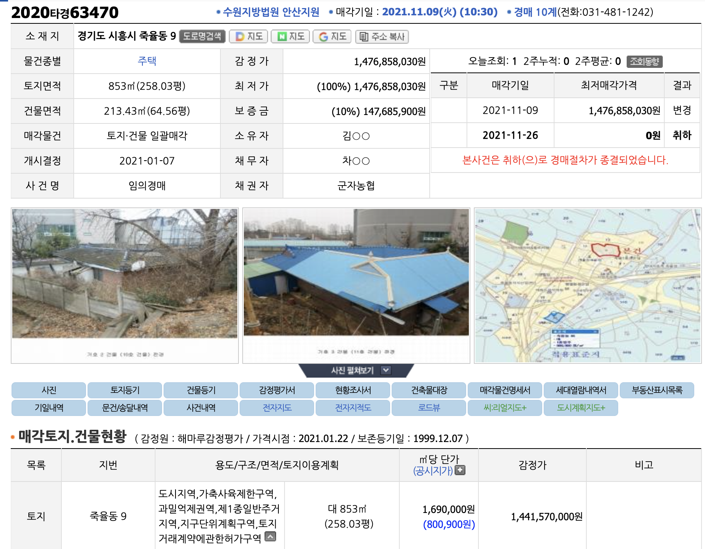
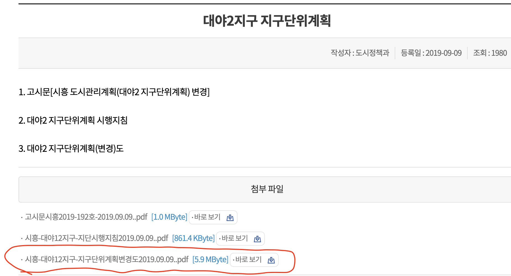

* 지구단위계획구역 지정
  * 3년 이내 실시계획, 도면 X 으면 3년 다음날 실효(단 민간인경우 5년)
  * 언제 지정되었는지 반드시 확인
* 수용될 경우 보통 120 ~ 150% 보상가 책정
* 필지명 명세서 나왔는지 체크 -> 실시계획 확인

* 계획변경도 -> 도면임.

> 도면 체크 사항

* 두 필지 이상으로 같이 개밸해야 하는 경우 존재
  * 내 토지가 작은경우는 유리할 수 있음. 싸게 필수 있으니
*
