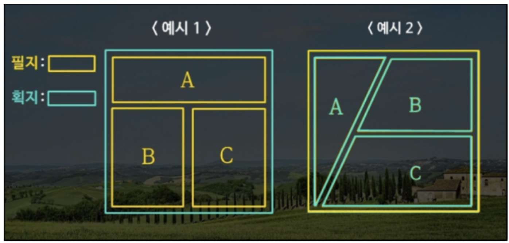
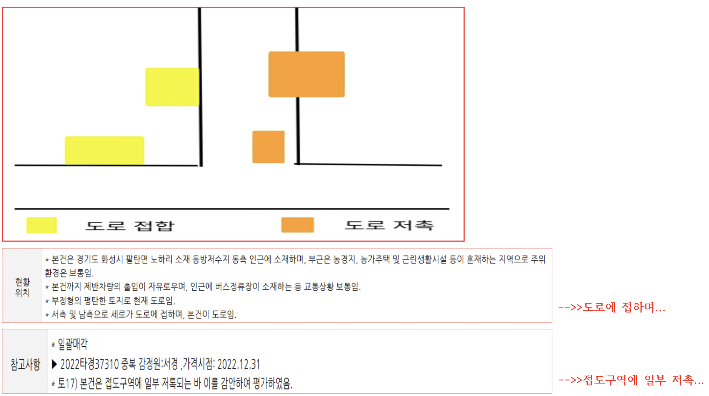
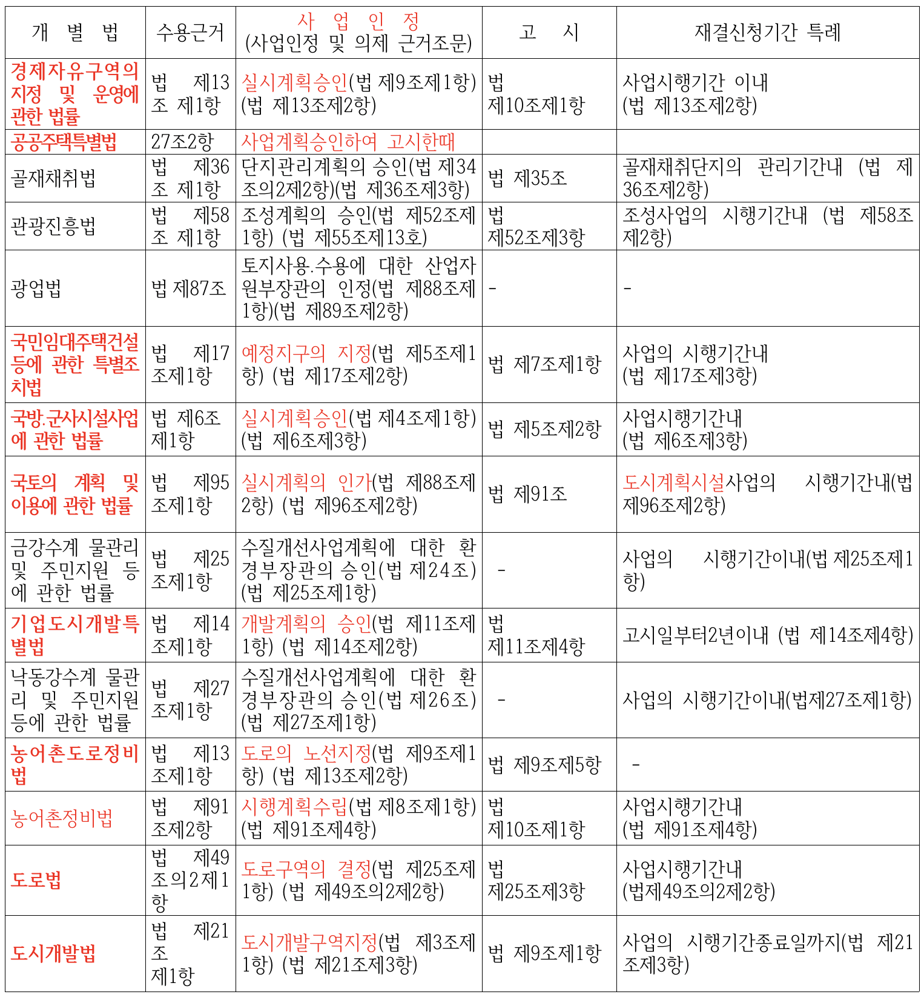
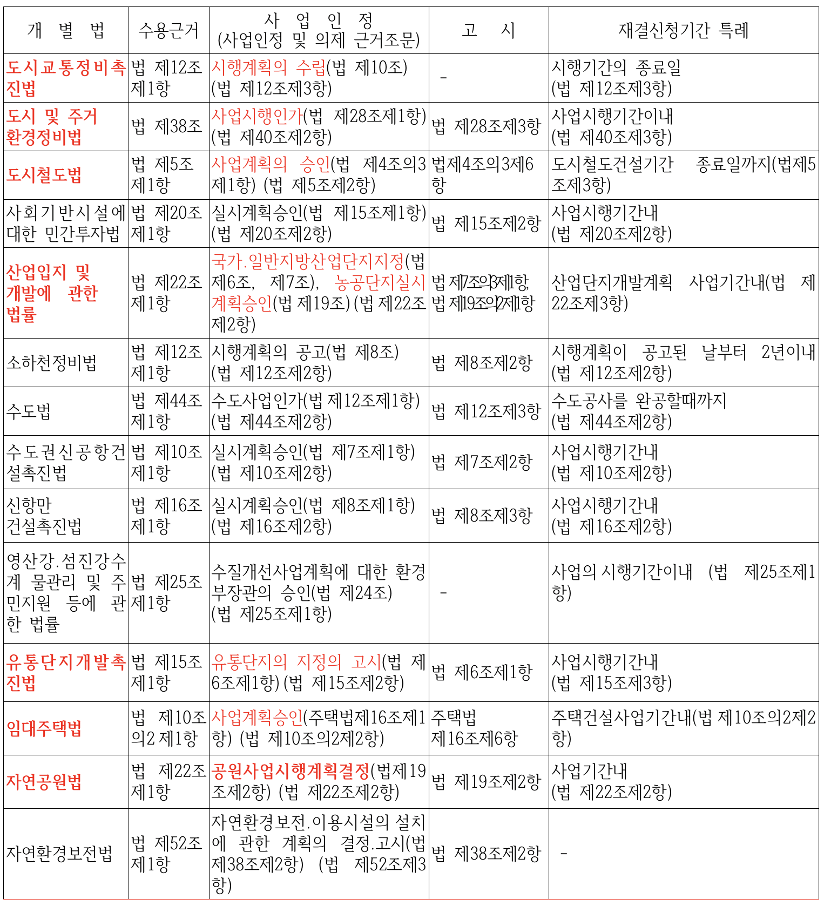
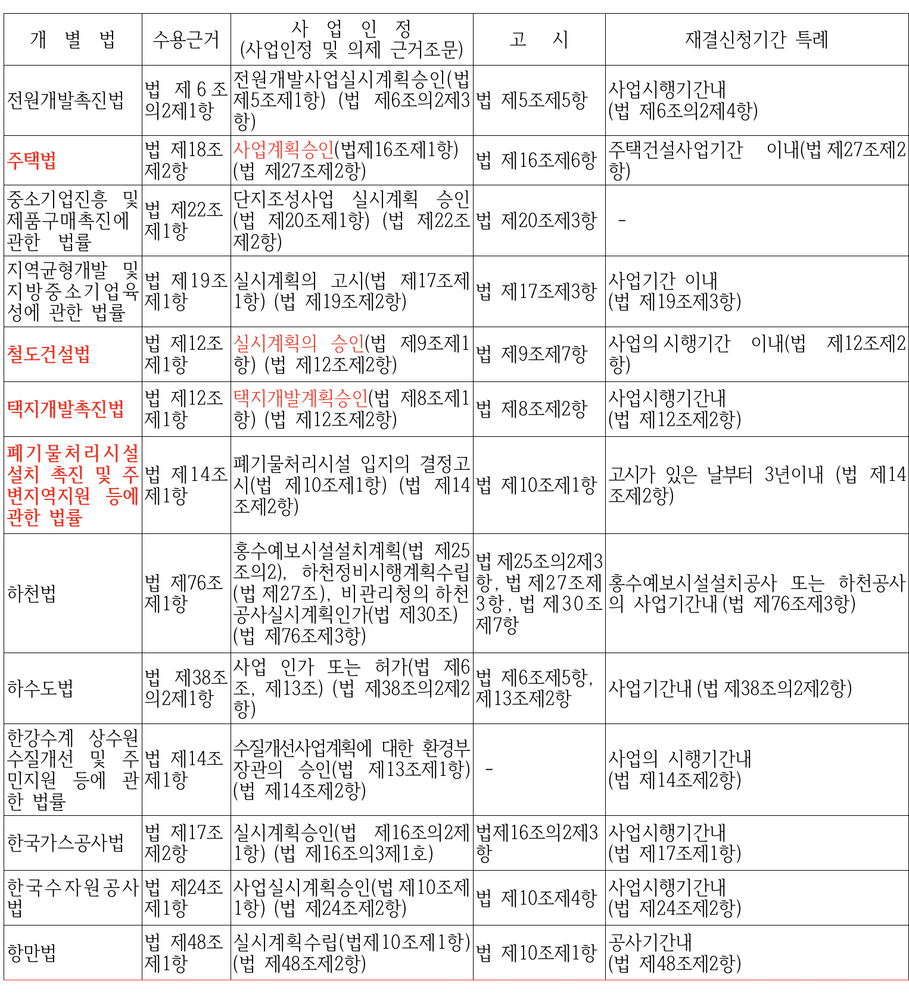

## 국토계획법 각종 용어 정의

> - 예) 지구단위계획구역 & 지구단위계획
> - 예) 성장관리계획구역 & 성장관리계획
> - 필지 & 획지
> - 가구계획 & 획지계획
> - 가로구역
> - 저촉 & 접합
> - 실시계획/결정·고시/설계도서/설계도면/필지별명세/세부목록을 고시한경우 -> **전부 같은 의미*
> - 사업인정고시---각각의 법마다 사업인정고시일이 다르다//수용시 수용가격의 결정기준일

> 지구단위계획구역 & 지구단위계획  (구역 지정 후 계획 )

* ① 지구단위계획구역의 지정에 관한 도시ㆍ군관리계획결정의 고시일부터 3년 이내에 그 지구단위계획구역에 관한 지구단위계획이 결정ㆍ고시되지 아니하면 그 *3년이 되는 날의 다음날에 그 지구단위계획구역의 지정에 관한 도시ㆍ군관리계획결정은 효력을 잃는다.*
  다만, 다른 법률에서 지구단위계획의 결정(결정된 것으로 보는 경우를 포함한다)에 관하여 따로 정한 경우에는 그 법률에 따라 지구단위계획을 결정할 때까지 지구단위계획구역의 지정은 그 효력을 유지한다. <개정 2011. 4. 14.>

> 성장관리계획구역 & 성장관리계획

* 제75조의2(성장관리계획구역의 지정 등)
  * ① 특별시장ㆍ광역시장ㆍ특별자치시장ㆍ특별자치도지사ㆍ시장 또는 군수는 녹지지역, 관리지역, 농림지역 및 자연환경보전지역 중 다음 각 호의 어느 하나에 해당하는 지역의 전부 또는 일부에 대하여 성장관리계획구역을 지정할 수 있다.
* 제75조의3(성장관리계획의 수립 등)---->>>제2의 지구단위계획이다!!!!!!
  * ① 특별시장ㆍ광역시장ㆍ특별자치시장ㆍ특별자치도지사ㆍ시장 또는 군수는 성장관리계획구역을 지정할 때에는 다음 각 호의 사항 중 그 성장관리계획구역의 지정목적을 이루는 데 필요한 사항을 포함하여 성장관리계획을 수립하여야 한다.

> 필지 & 획지 & 가구

> 저촉 & 접합

> 실시계획

* ***개발계획을 수립한 이후에 개발사업의 시행자가 작성하는 계획. 각 부문별 공사방법, 공사 진행과정, 설계도서, 자금계획, 시행기간 등 실질적인 공사 실행의 계획 따위를 명시하여 행정기관의 승인을 받아야 한다.***

> 사업인정고시

* 도시개발법 등 수용과 관련된 모든법조문에 나옴
*

> 도시개발법 제22조(토지등의 수용 또는 사용)

* 제2항에 따라 「공익사업을 위한 토지 등의 취득 및 보상에 관한 법률」을 준용할 때 제5조제1항제14호에 따른 수용 또는 사용의 대상이 되는 토지의 세부목록을 고시한 경우에는 「공익사업을 위한 토지 등의 취득 및 보상에 관한 법률」 제20조제1항과 제22조에 따른 사업인정 및 그 고시가 있었던 것으로 본다. 다만, 재결신청은 같은 법 제23조제1항과 제28조제1항에도 불구하고 개발계획에서 정한 도시개발사업의 시행 기간 종료일까지 하여야 한다.
* ==세부목록고시=실시계획(도면)
* =사업인정고시일이란?=지구지정이나 개발계획승인일
  * ***그렇다면 실시계획이 기준일인경우는??
* =세부목록을 고시한경우란?=실시계획(도면)

