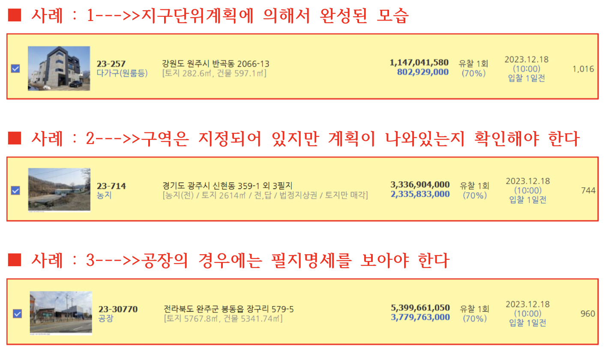
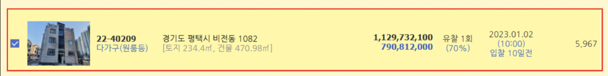
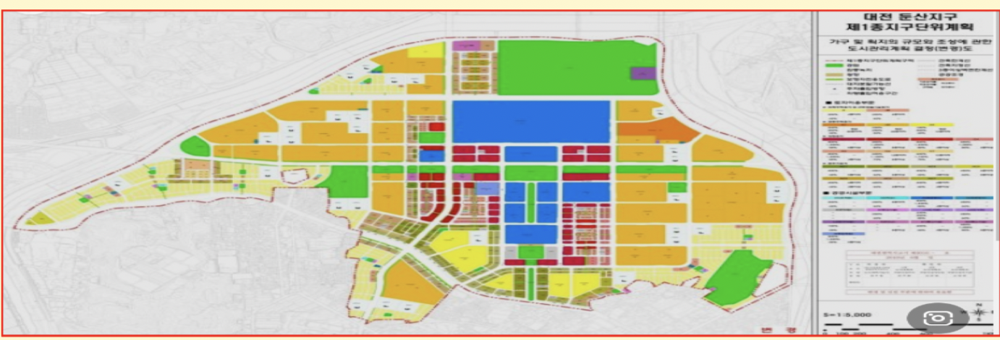
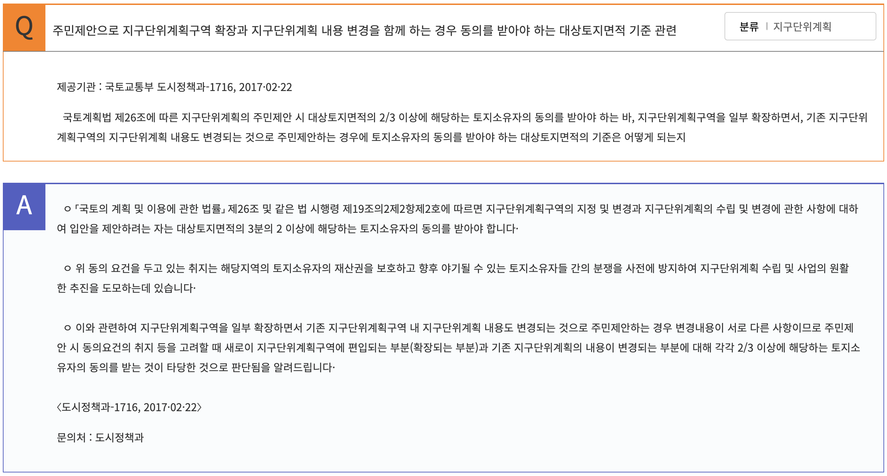
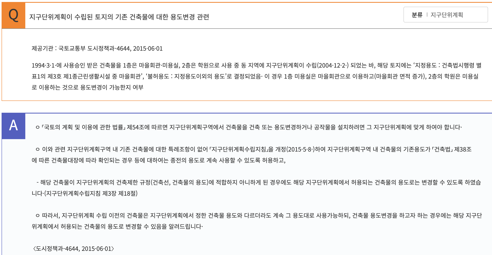

## 제4절 지구단위계획

**▶난개발방지목적**
**▶건폐율150%/용적률200% 완화**
**▶도시지역/도시외지역**
**▶토지이용계획/건축물계획**
**▶1종지구단위 / 2종지구단위 : 구분의실익이 없다**

> 제49조(지구단위계획의 수립)

* ① 지구단위계획은 다음 각 호의 사항을 고려하여 수립한다.

  1. 도시의 정비ㆍ관리ㆍ보전ㆍ개발 등 지구단위계획구역의 지정 목적
  2. 주거ㆍ산업ㆍ유통ㆍ관광휴양ㆍ복합 등 지구단위계획구역의 중심기능
  3. 해당 용도지역의 특성
  4. 그 밖에 대통령령으로 정하는 사항
* ②지구단위계획의 수립기준 등은 대통령령으로 정하는 바에 따라 국토교통부장관이 정한다.

> 제51조(지구단위계획구역의 지정 등)

* ① 국토교통부장관, 시ㆍ도지사, 시장 또는 군수는 다음 각 호의 어느 하나에 해당하는 지역의 전부 또는 일부에 대하여 지구단위계획구역을 지정할 수 있다.
  1. [제37조]에 따라 지정된 용도지구
  2. [「도시개발법」]  [제3조]에 따라 지정된 도시개발구역
  3. [「도시 및 주거환경정비법」]  [제8조]에 따라 지정된 정비구역
  4. [「택지개발촉진법」]  [제3조] 에 따라 지정된 택지개발지구
  5. [「주택법」]  [제15조] 에 따른 대지조성사업지구
  6. [「산업입지 및 개발에 관한 법률」]   [제2조] [제8호] 의 산업단지와 [같은 조]  [제12호]의 준산업단지
     * *산업단지가 지구단위계획구역으로 지정되어 조성되었다면 필지별로 입지 할수 있는 공장의 용도가 다를 수 있다.*
  7. [「관광진흥법」]  [제52조] 에 따라 지정된 관광단지와 [같은 법]  [제70조] 에 따라 지정된 관광특구
  8. *개발제한구역ㆍ도시자연공원구역ㆍ시가화조정구역 또는 공원에서 해제되는 구역, 녹지지역에서 주거ㆍ상업ㆍ공업지역으로 변경되는 구역과 새로 도시지역으로 편입되는 구역 중 계획적인 개발 또는 관리가 필요한 지역*
     * 8의2. 도시지역 내 주거ㆍ상업ㆍ업무 등의 기능을 결합하는 등 복합적인 토지 이용을 증진시킬 필요가 있는 지역으로서 [대통령령] 으로 정하는 요건에 해당하는 지역
     * 8의3. 도시지역 내 유휴토지를 효율적으로 개발하거나 교정시설, 군사시설, 그 밖에 [대통령령]으로 정하는 시설을 이전 또는 재배치하여 토지 이용을 합리화하고, 그 기능을 증진시키기 위하여 집중적으로 정비가 필요한 지역으로서 [대통령령] 으로 정하는 요건에 해당하는 지역
  9. 도시지역의 체계적ㆍ계획적인 관리 또는 개발이 필요한 지역
  10. 그 밖에 양호한 환경의 확보나 기능 및 미관의 증진 등을 위하여 필요한 지역으로서 [대통령령] 으로 정하는 지역
* ② 국토교통부장관, 시ㆍ도지사, 시장 또는 군수는 다음 각 호의 어느 하나에 해당하는 지역은 지구단위계획구역으로 지정하여야 한다. 다만, 관계 법률에 따라 그 지역에 토지 이용과 건축에 관한 계획이 수립되어 있는 경우에는 그러하지 아니하다. **<개정 2011. 4. 14., 2013. 3. 23., 2013. 7. 16.>**
  1. 제1항제3호 및 제4호의 지역에서 시행되는 사업이 끝난 후 10년이 지난 지역
  2. 제1항 각 호 중 체계적ㆍ계획적인 개발 또는 관리가 필요한 지역으로서 [대통령령]으로 정하는 지역
* ③ 도시지역 외의 지역을 지구단위계획구역으로 지정하려는 경우 다음 각 호의 어느 하나에 해당하여야 한다. **<개정 2011. 4. 14.>**
  1. 지정하려는 구역 면적의 100분의 50 이상이 [제36조]( "팝업으로 이동")에 따라 지정된 계획관리지역으로서 [대통령령]( "팝업으로 이동")으로 정하는 요건에 해당하는 지역
  2. [제37조]( "팝업으로 이동")에 따라 지정된 개발진흥지구로서 [대통령령]( "팝업으로 이동")으로 정하는 요건에 해당하는 지역
  3. [제37조]( "팝업으로 이동")에 따라 지정된 용도지구를 폐지하고 그 용도지구에서의 행위 제한 등을 지구단위계획으로 대체하려는 지역
* ④ 삭제 **<2011. 4. 14.>**

> 제53조((지구단위계획구역의 지정 및 지구단위계획에 관한 도시ㆍ군관리계획결정의 실효 등)

* ① 지구단위계획구역의 지정에 관한 도시ㆍ군관리계획결정의 *고시일부터 3년 이내*에 그 지구단위계획구역에 관한 지구단위계획이 결정ㆍ고시되지 아니하면 그 *3년이 되는 날의 다음날에 그 지구단위계획구역의 지정에 관한 도시ㆍ군관리계획결정은 효력을 잃는다*. 다만, 다른 법률에서 지구단위계획의 결정(결정된 것으로 보는 경우를 포함한다)에 관하여 따로 정한 경우에는 그 법률에 따라 지구단위계획을 결정할 때까지 지구단위계획구역의 지정은 그 효력을 유지한다. **<개정 2011. 4. 14.>**
* ② 지구단위계획([제26조]( "팝업으로 이동")[제1항]( "팝업으로 이동")에 따라 주*민이 입안을 제안한 것에 한정한*다)에 관한 *도시ㆍ군관리계획결정의 고시일부터 5년 이내에* 이 법 또는 다른 법률에 따라 허가ㆍ인가ㆍ승인 등을 받아 사업이나 *공사에 착수하지 아니하면 그 5년이 된 날의 다음날에 그 지구단위계획에 관한 도시ㆍ군관리계획결정은 효력을 잃는다.* 이 경우 지구단위계획과 관련한 도시ㆍ군관리계획결정에 관한 사항은 해당 지구단위계획구역 지정 당시의 도시ㆍ군관리계획으로 환원된 것으로 본다. **<신설 2015. 8. 11.>**
* ③ 국토교통부장관, 시ㆍ도지사, 시장 또는 군수는 제1항 및 제2항에 따른 지구단위계획구역 지정 및 지구단위계획 결정이 효력을 잃으면 [대통령령]( "팝업으로 이동")으로 정하는 바에 따라 지체 없이 그 사실을 고시하여야 한다.

***▶▶경매와의 연관성 : 도시관리계획결정으로 지구단위계획구역으로 고시후 3년이내에 지구단위계획이 결정.고시되지 않으면 실효(5년)***

> 제54조(지구단위계획구역에서의 건축 등)

* 지구단위계획구역에서 건축물(일정 기간 내 철거가 예상되는 경우 등 [대통령령]으로 정하는 가설건축물은 제외한다)을 건축 또는 용도변경하거나 공작물을 설치하려면 그 지구단위계획에 맞게 하여야 한다. 다만, 지구단위계획이 수립되어 있지 아니한 경우에는 그러하지 아니하다.

***▶▶경매와의 연관성 : 지구단위계획구역으로 도시관리계획에 의해서 고시되었다고 하더라도 지구단위계획이 결정고시되지 않았다면.......***

> **※※※ 지구단위계획  또는 관계 법률에 따른 개발계획이 수립되기 전에는 도시.군계획조례로 정하는 건축물을 건축할 수 있음**

---

> 지구단위계획구역에서 필수 체크사항 7가지

1. **지구단위계획구역의 지정·고시는 언제 되었는지?**

   * --->>>(실효와 관련)
   * 입찰자는 반드시 체크해야 한다(3년/5년)
2. **지구단위계획구역의 주체는?**

   * 민간이 입안제안 인지(5년)
   * 국가가 지정한것인지 (3년)
3. **실시계획이 언제쯤 나오는지?**

   * 입안중인지?/실시계획이 나왔는지?
   * ***실시계획이 나오기 전과 나온 후의 그 부동산에대한 행위제한은 다르다.***
     * 실시계획이 나오지 않았다면 즉, 개발계획이 수립되기 전에는 도시.군계획조례로 정하는 건축물을 건축할 수 있음
4. **지구단위계획의 변경은?**

   * 필지별로 정해져있는 토지의운명 또는 기존건축물의 운명도 바꿀 수 있다(전문가가 따로있다)
   * 가구/획지 등 소유자 동의 2/3
   * 기존건축물의 사용과 토지의 용도 변경
5. **지구단위계획의 실시계획이 나와있다면 ?**

   * 기존 사용하고(낙찰받은 또는 사용하고 있는 건축물의 용도도 바꾸어야 하는가??(아래자료)
   * 지구단위계획수립지침
     * 제18절 기존 건축물의 특례에 관한 사항
       * 3-18-1. 지구단위계획구역내 건축물의 기존용도가 「건축법」 제38조에 따른 건축물대장에 따라 확인되는 경우 등에 대하여는 종전의 용도로 계속 사용할 수 있도록 허용한다
       * 3-18-2. 기존 건축물의 대수선은 건폐율ㆍ용적률이 증가되지 않는 범위에서 허용한다.
       * 3-18-3. 해당 건축물이 지구단위계획의 건축제한 규정(건축선, 건축물의 용도)에 적합하지 아니하게 된 경우에도 해당 지구단위계획에서 허용되는 건축물의 용도로는 변경할 수 있다.
       * 3-18-4. 3-18-3.에도 불구하고 지구단위계획 수립 시 해당 지구단위계획구역 지정 목적을 훼손하지 않는 범위에서 기존 건축물 특례에 관한 사항을 별도로 정할 수 있다
6. **지구단위계힉구역의 실시계획이 나오지않아 3/5년이 지난 다음 실효되어도 또 다시 반드시 지정해야하는 곳에서의 경매!**

   * **지구단위계획구역은 계속해서 지구단위를 안고 살아야 한다**
   * 아래 경매 사례

    

* 지구단위계획수립지침
  * 2-2-7. 지구단위계획구역으로 반드시 지정하여야 하는 지역은 다음과 같다. 다만, 관계법률에 의하여 당해 지역에 토지이용 및 건축에 관한 계획이 수립되어 있는 경우에는 그러하지 아니하다.
  * (1) 2-2-4. (2)의 ②부터 ③까지의 지역(*정비구역ㆍ택지개발지구)*에서 시행되는 사업이 완료된 후 *10년이 경과된 지역.*
  * (2) 다음의 1에 해당하는 지역으로서 그 면적이 30만㎡ 이상인 지역
    * ① 시가화조정구역 또는 공원에서 해제되는 지역. 다만, 녹지지역으로 지정 또는 존치되거나 법 또는 다른 법령에 의하여 도시ㆍ군계획사업 등 개발계획이 수립되지 아니하는 경우를 제외한다.
    * ② 녹지지역에서 주거지역ㆍ상업지역 또는 공업지역으로 변경되는 지역

7. **7.지구단위계획구역에서 필지별 명세 반드시 확인!**
   * 개별개발/합필개발/색체,간판,높이제한등이 있다

* 

8. **사업이 지지부진 할수 있다는 걸 고려해라**
   * 과소토지의 경우 묶어서 개발 해라

## 질의회신

지구단위계획수립지침(제18절 기존 건축물의 특례에 관한 사항)

* 3-18-1. 지구단위계획구역내 건축물의 기존용도가 「건축법」 제38조에 따른 건축물대장에 따라 확인되는 경우 등에 대하여는 종전의 용도로 계속 사용할 수 있도록 허용한다.

> **토지이음 에서 42개 질의회신 볼수 있음 -> [바로가기**](https://https://www.eum.go.kr/web/in/cp/cpQnaDet.jsp?answ_no=249&theme_cd=00011&pageNo=2&searchType=&searchWord=)

## 지구단위계획수립지침

> * 기본적으로 수립지침 확인하고 중요한 부분은 아래(잘못하면 평생 지구단위랑 살아야함)
> * 2-2-7. 지구단위계획구역으로 반드시 지정하여야 하는 지역은 다음과 같다.
>
>   * 2-2-4. (2)의 ②부터 ③까지의 지역(정비구역·택지개발지구)에서 시행되는 사업이 완료된 후 10년이 경과된 지역.
>   * (2) 다음의 1에 해당하는 지역으로서 그 면적이 30만㎡ 이상인 지역
>     * ① 시가화조정구역 또는 공원에서 해제되는 지역. 다만, 녹지지역으로 지정 또는 존치되거나 법 또는 다른 법령에 의하여 도시ㆍ군계획사업 등 개발계획이 수립되지 아니하는 경우를 제외한다.
>     * ② 녹지지역에서 주거지역·상업지역 또는 공업지역으로 변경되는 지역
> * 2-2-8. 택지개발지구 등 개발사업이 실시되는 지역주변에 소규모 난개발이 예상되는 경우에는 당해 개발사업구역과 인근지역을 함께 지구단위계획구역으로 지정함으로써 계획적 개발이 되도록 유의한다.
> * 2-2-9. 수도권 과밀억제권역에서 대규모 공장의 이전 또는 폐지로 인하여 발생되는 부지와 그 주변지역의 경우 지자체의 산업정책을 고려하여 제조업 기반이 유지되도록 하되 기반시설 부담 등을 고려하여 수익성 있는 개발이 되도록 지구단위계획을 수립할 수 있다.
