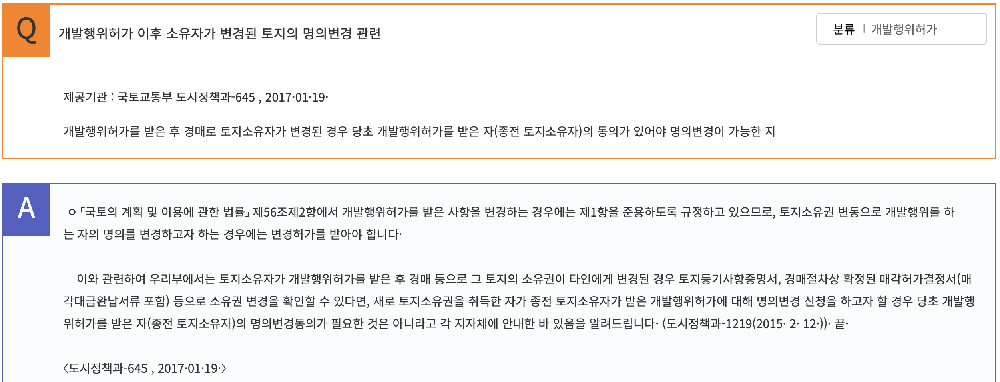

## 제5장 개발행위허가 등

> 제56조(개발행위의 허가)

* ① 다음 각 호의 어느 하나에 해당하는 행위로서 대통령령으로 정하는 행위(이하 “*개발행위*”라 한다)를 하려는 자는 *특별시장ㆍ광역시장ㆍ특별자치시장ㆍ특별자치도지사ㆍ시장 또는 군수의 허가(이하 “개발행위허가”라 한다)를 받아야 한다.* 다만, 도시ㆍ군계획사업(다른 법률에 따라 도시ㆍ군계획사업을 의제한 사업을 포함한다)에 의한 행위는 그러하지 아니하다. <개정 2011. 4. 14., 2018. 8. 14.>
  1. ***건축물의 건축 또는 공작물의 설치***
  2. ***토지의 형질 변경(경작을 위한 경우로서 대통령령으로 정하는 토지의 형질 변경은 제외한다)***
  3. 토석의 채취
  4. 토지 분할(건축물이 있는 대지의 분할은 제외한다)
  5. 녹지지역ㆍ관리지역 또는 자연환경보전지역에 물건을 1개월 이상 쌓아놓는 행위
* ② 개발행위허가를 받은 사항을 변경하는 경우에는 제1항을 준용한다. 다만, 대통령령으로 정하는 경미한 사항을 변경하는 경우에는 그러하지 아니하다.
* ③ 제1항에도 불구하고 제1항제2호 및 제3호의 개발행위 중 도시지역과 계획관리지역의 산림에서의 임도(林道) 설치와 사방사업에 관하여는 「산림자원의 조성 및 관리에 관한 법률」과 「사방사업법」에 따르고, 보전관리지역ㆍ생산관리지역ㆍ농림지역 및 자연환경보전지역의 산림에서의 제1항제2호(농업ㆍ임업ㆍ어업을 목적으로 하는 토지의 형질 변경만 해당한다) 및 제3호의 개발행위에 관하여는 「산지관리법」에 따른다.<개정 2011. 4. 14.>
* ④ 다음 각 호의 어느 하나에 해당하는 행위는 제1항에도 불구하고 *개발행위허가를 받지 아니하고 할 수 있다*. 다만, 제1호의 응급조치를 한 경우에는 1개월 이내에 특별시장ㆍ광역시장ㆍ특별자치시장ㆍ특별자치도지사ㆍ시장 또는 군수에게 신고하여야 한다.<개정 2011. 4. 14.>
  1. 재해복구나 재난수습을 위한 응급조치
  2. *「건축법」에 따라 신고하고 설치할 수 있는 건축물의 개축ㆍ증축 또는 재축과 이에 필요한 범위에서의 토지의 형질 변경*(도시ㆍ군계획시설사업이 시행되지 아니하고 있는 도시ㆍ군계획시설의 부지인 경우만 가능하다)
  3. 그 밖에 대통령령으로 정하는 *경미한 행위*

> 제57조 개발행위허가의 절차

* ① 개발행위를 하려는 자는 그 개발행위에 따른 기반시설의 설치나 그에 필요한 용지의 확보, 위해(危害) 방지, 환경오염 방지, 경관, 조경 등에 관한 *계획서를 첨부한 신청서를 개발행위허가권자에게 제출하여야 한다.* 이 경우 개발밀도관리구역 안에서는 기반시설의 설치나 그에 필요한 용지의 확보에 관한 계획서를 제출하지 아니한다. 다만, 제56조제1항제1호의 행위 중 「건축법」의 적용을 받는 건축물의 건축 또는 공작물의 설치를 하려는 자는 「건축법」에서 정하는 절차에 따라 신청서류를 제출하여야 한다. <개정 2011. 4. 14.>
* ② 특별시장ㆍ광역시장ㆍ특별자치시장ㆍ특별자치도지사ㆍ시장 또는 군수는 제1항에 따른 개발행위허가의 신청에 대하여 특별한 사유가 없으면 대통령령으로 정하는 기간 이내에 허가 또는 불허가의 처분을 하여야 한다.<개정 2011. 4. 14.>
* ③ 특별시장ㆍ광역시장ㆍ특별자치시장ㆍ특별자치도지사ㆍ시장 또는 군수는 제2항에 따라 허가 또는 불허가의 처분을 할 때에는 지체 없이 그 신청인에게 허가내용이나 불허가처분의 사유를 서면 또는 제128조에 따른 국토이용정보체계를 통하여 알려야 한다.<개정 2011. 4. 14., 2013. 7. 16., 2015. 8. 11.>
* ④ 특별시장ㆍ광역시장ㆍ특별자치시장ㆍ특별자치도지사ㆍ시장 또는 군수는 개발행위허가를 하는 경우에는 대통령령으로 정하는 바에 따라 그 개발행위에 따른 기반시설의 설치 또는 그에 필요한 용지의 확보, 위해 방지, 환경오염 방지, 경관, 조경 등에 관한 조치를 할 것을 조건으로 개발행위허가를 할 수 있다.<개정 2011. 4. 14.> [전문개정 2009. 2. 6.]

> 제58조 개발해위허가의 기준

* ① 특별시장ㆍ광역시장ㆍ특별자치시장ㆍ특별자치도지사ㆍ시장 또는 군수는 개발행위허가의 신청 내용이 다음 각 호의 기준에 맞는 경우에만 개발행위허가 또는 변경허가를 하여야 한다. <개정 2011. 4. 14., 2013. 7. 16., 2021. 1. 12.>
  1. 용도지역별 특성을 고려하여 대통령령으로 정하는 개발행위의 규모에 적합할 것. 다만, 개발행위가 「농어촌정비법」 제2조제4호에 따른 농어촌정비사업으로 이루어지는 경우 등 대통령령으로 정하는 경우에는 개발행위 규모의 제한을 받지 아니한다.
  2. 도시ㆍ군관리계획 및 성장관리계획의 내용에 어긋나지 아니할 것
  3. 도시ㆍ군계획사업의 시행에 지장이 없을 것
  4. 주변지역의 토지이용실태 또는 토지이용계획, 건축물의 높이, 토지의 경사도, 수목의 상태, 물의 배수, 하천ㆍ호소ㆍ습지의 배수 등 주변환경이나 경관과 조화를 이룰 것
  5. 해당 개발행위에 따른 기반시설의 설치나 그에 필요한 용지의 확보계획이 적절할 것
* ② 특별시장ㆍ광역시장ㆍ특별자치시장ㆍ특별자치도지사ㆍ시장 또는 군수는 개발행위허가 또는 변경허가를 하려면 그 개발행위가 도시ㆍ군계획사업의 시행에 지장을 주는지에 관하여 해당 지역에서 시행되는 도시ㆍ군계획사업의 시행자의 의견을 들어야 한다.<개정 2011. 4. 14., 2013. 7. 16.>
* ③ 제1항에 따라 허가할 수 있는 경우 그 허가의 기준은 지역의 특성, 지역의 개발상황, 기반시설의 현황 등을 고려하여 다음 각 호의 구분에 따라 대통령령으로 정한다.<개정 2011. 4. 14.>
  1. 시가화 용도: 토지의 이용 및 건축물의 용도ㆍ건폐율ㆍ용적률ㆍ높이 등에 대한 용도지역의 제한에 따라 개발행위허가의 기준을 적용하는 주거지역ㆍ상업지역 및 공업지역
  2. 유보 용도: 제59조에 따른 도시계획위원회의 심의를 통하여 개발행위허가의 기준을 강화 또는 완화하여 적용할 수 있는 계획관리지역ㆍ생산관리지역 및 녹지지역 중 대통령령으로 정하는 지역
  3. 보전 용도: 제59조에 따른 도시계획위원회의 심의를 통하여 개발행위허가의 기준을 강화하여 적용할 수 있는 보전관리지역ㆍ농림지역ㆍ자연환경보전지역 및 녹지지역 중 대통령령으로 정하는 지역
* ④ 삭제<2021. 1. 12.>
* ⑤ 삭제<2021. 1. 12.>
* ⑥ 삭제<2021. 1. 12.>

> **제61조(관련 인ㆍ허가등의 의제)**

* ① 개발행위허가 또는 변경허가를 할 때에 특별시장ㆍ광역시장ㆍ특별자치시장ㆍ특별자치도지사ㆍ시장 또는 군수가 그 개발행위에 대한 다음 각 호의 인가ㆍ허가ㆍ승인ㆍ면허ㆍ협의ㆍ해제ㆍ신고 또는 심사 등(이하 “인ㆍ허가등”이라 한다)에 관하여 제3항에 따라 미리 관계 행정기관의 장과 협의한 사항에 대하여는 그 인ㆍ허가등을 받은 것으로 본다. <개정 2009. 3. 25., 2009. 6. 9., 2010. 1. 27., 2010. 4. 15., 2010. 5. 31., 2011. 4. 14., 2013. 7. 16., 2014. 1. 14., 2014. 6. 3., 2015. 8. 11., 2016. 12. 27., 2021. 7. 20., 2022. 12. 27.>
  1. 「공유수면 관리 및 매립에 관한 법률」 제8조에 따른 공유수면의 점용ㆍ사용허가, 같은 법 제17조에 따른 점용ㆍ사용 실시계획의 승인 또는 신고, 같은 법 제28조에 따른 공유수면의 매립면허 및 같은 법 제38조에 따른 공유수면매립실시계획의 승인
  2. 삭제<2010. 4. 15.>
  3. 「광업법」 제42조에 따른 채굴계획의 인가
  4. 「농어촌정비법」 제23조에 따른 농업생산기반시설의 사용허가
  5. 「농지법」 제34조에 따른 농지전용의 허가 또는 협의, 같은 법 제35조에 따른 농지전용의 신고 및 같은 법 제36조에 따른 농지의 타용도 일시사용의 허가 또는 협의
  6. 「도로법」 제36조에 따른 도로관리청이 아닌 자에 대한 도로공사 시행의 허가, 같은 법 제52조에 따른 도로와 다른 시설의 연결허가 및 같은 법 제61조에 따른 도로의 점용 허가
  7. 「장사 등에 관한 법률」 제27조제1항에 따른 무연분묘(無緣墳墓)의 개장(改葬) 허가
  8. 「사도법」 제4조에 따른 사도(私道) 개설(開設)의 허가
  9. 「사방사업법」 제14조에 따른 토지의 형질 변경 등의 허가 및 같은 법 제20조에 따른 사방지 지정의 해제
     * 9의2. 「산업집적활성화 및 공장설립에 관한 법률」 제13조에 따른 공장설립등의 승인
  10. 「산지관리법」 제14조ㆍ제15조에 따른 산지전용허가 및 산지전용신고, 같은 법 제15조의2에 따른 산지일시사용허가ㆍ신고, 같은 법 제25조제1항에 따른 토석채취허가, 같은 법 제25조제2항에 따른 토사채취신고 및 「산림자원의 조성 및 관리에 관한 법률」 제36조제1항ㆍ제5항에 따른 입목벌채(立木伐採) 등의 허가ㆍ신고
  11. 「소하천정비법」 제10조에 따른 소하천공사 시행의 허가 및 같은 법 제14조에 따른 소하천의 점용 허가
  12. 「수도법」 제52조에 따른 전용상수도 설치 및 같은 법 제54조에 따른 전용공업용수도설치의 인가
  13. 「연안관리법」 제25조에 따른 연안정비사업실시계획의 승인
  14. 「체육시설의 설치ㆍ이용에 관한 법률」 제12조에 따른 사업계획의 승인
  15. 「초지법」 제23조에 따른 초지전용의 허가, 신고 또는 협의
  16. 「공간정보의 구축 및 관리 등에 관한 법률」 제15조제4항에 따른 지도등의 간행 심사
  17. 「하수도법」 제16조에 따른 공공하수도에 관한 공사시행의 허가 및 같은 법 제24조에 따른 공공하수도의 점용허가
  18. 「하천법」 제30조에 따른 하천공사 시행의 허가 및 같은 법 제33조에 따른 하천 점용의 허가
  19. 「도시공원 및 녹지 등에 관한 법률」 제24조에 따른 도시공원의 점용허가 및 같은 법 제38조에 따른 녹지의 점용허가
* ② 제1항에 따른 인ㆍ허가등의 의제를 받으려는 자는 개발행위허가 또는 변경허가를 신청할 때에 해당 법률에서 정하는 관련 서류를 함께 제출하여야 한다.<개정 2013. 7. 16.>
* ③ 특별시장ㆍ광역시장ㆍ특별자치시장ㆍ특별자치도지사ㆍ시장 또는 군수는 개발행위허가 또는 변경허가를 할 때에 그 내용에 제1항 각 호의 어느 하나에 해당하는 사항이 있으면 미리 관계 행정기관의 장과 협의하여야 한다.<개정 2011. 4. 14., 2013. 7. 16.>
* ④ 제3항에 따라 협의 요청을 받은 관계 행정기관의 장은 요청을 받은 날부터 20일 이내에 의견을 제출하여야 하며, 그 기간 내에 의견을 제출하지 아니하면 협의가 이루어진 것으로 본다.<신설 2012. 2. 1.>
* ⑤ 국토교통부장관은 제1항에 따라 의제되는 인ㆍ허가등의 처리기준을 관계 중앙행정기관으로부터 제출받아 통합하여 고시하여야 한다.<개정 2012. 2. 1., 2013. 3. 23.>

> 건축법과 국토계획법의 각 의제사항(공통 11개 법률)

> 건축법 의제사항

* ⑤ 제1항에 따른 건축허가를 받으면 다음 각 호의 허가 등을 받거나 신고를 한 것으로 보며, 공장건축물의 경우에는 「산업집적활성화 및 공장설립에 관한 법률」 제13조의2와 제14조에 따라 관련 법률의 인ㆍ허가등이나 허가등을 받은 것으로 본다.
  1. 제20조제3항에 따른 공사용 가설건축물의 축조신고
  2. 제83조에 따른 공작물의 축조신고
  3. 「국토의 계획 및 이용에 관한 법률」 제56조에 따른 개발행위허가
  4. 「국토의 계획 및 이용에 관한 법률」 제86조제5항에 따른 시행자의 지정과 같은 법 제88조제2항에 따른 실시계획의 인가
  5. 「산지관리법」 제14조와 제15조에 따른 산지전용허가와 산지전용신고, 같은 법 제15조의2에 따른 산지일시사용허가ㆍ신고. 다만, 보전산지인 경우에는 도시지역만 해당된다.
  6. 「사도법」 제4조에 따른 사도(私道)개설허가
  7. 「농지법」 제34조, 제35조 및 제43조에 따른 농지전용허가ㆍ신고 및 협의
  8. 「도로법」 제36조에 따른 도로관리청이 아닌 자에 대한 도로공사 시행의 허가, 같은 법 제52조제1항에 따른 도로와 다른 시설의 연결 허가
  9. 「도로법」 제61조에 따른 도로의 점용 허가
  10. 「하천법」 제33조에 따른 하천점용 등의 허가
  11. 「하수도법」 제27조에 따른 배수설비(配水設備)의 설치신고
  12. 「하수도법」 제34조제2항에 따른 개인하수처리시설의 설치신고
  13. 「수도법」 제38조에 따라 수도사업자가 지방자치단체인 경우 그 지방자치단체가 정한 조례에 따른 상수도 공급신청
  14. 「전기안전관리법」 제8조에 따른 자가용전기설비 공사계획의 인가 또는 신고
  15. 「물환경보전법」 제33조에 따른 수질오염물질 배출시설 설치의 허가나 신고
  16. 「대기환경보전법」 제23조에 따른 대기오염물질 배출시설설치의 허가나 신고
  17. 「소음ㆍ진동관리법」 제8조에 따른 소음ㆍ진동 배출시설 설치의 허가나 신고
  18. 「가축분뇨의 관리 및 이용에 관한 법률」 제11조에 따른 배출시설 설치허가나 신고
  19. 「자연공원법」 제23조에 따른 행위허가
  20. 「도시공원 및 녹지 등에 관한 법률」 제24조에 따른 도시공원의 점용허가
  21. 「토양환경보전법」 제12조에 따른 특정토양오염관리대상시설의 신고
  22. 「수산자원관리법」 제52조제2항에 따른 행위의 허가
  23. 「초지법」 제23조에 따른 초지전용의 허가 및 신고

> 국토계획법 제 61조 의제사항

* ① 개발행위허가 또는 변경허가를 할 때에 특별시장ㆍ광역시장ㆍ특별자치시장ㆍ특별자치도지사ㆍ시장 또는 군수가 그 개발행위에 대한 다음 각 호의 인가ㆍ허가ㆍ승인ㆍ면허ㆍ협의ㆍ해제ㆍ신고 또는 심사 등(이하 “인ㆍ허가등”이라 한다)에 관하여 제3항에 따라 미리 관계 행정기관의 장과 협의한 사항에 대하여는 그 인ㆍ허가등을 받은 것으로 본다. <개정 2009. 3. 25., 2009. 6. 9., 2010. 1. 27., 2010. 4. 15., 2010. 5. 31., 2011. 4. 14., 2013. 7. 16., 2014. 1. 14., 2014. 6. 3., 2015. 8. 11., 2016. 12. 27., 2021. 7. 20., 2022. 12. 27.>
  1. 「공유수면 관리 및 매립에 관한 법률」 제8조에 따른 공유수면의 점용ㆍ사용허가, 같은 법 제17조에 따른 점용ㆍ사용 실시계획의 승인 또는 신고, 같은 법 제28조에 따른 공유수면의 매립면허 및 같은 법 제38조에 따른 공유수면매립실시계획의 승인
  2. 삭제<2010. 4. 15.>
  3. 「광업법」 제42조에 따른 채굴계획의 인가
  4. 「농어촌정비법」 제23조에 따른 농업생산기반시설의 사용허가
  5. 「농지법」 제34조에 따른 농지전용의 허가 또는 협의, 같은 법 제35조에 따른 농지전용의 신고 및 같은 법 제36조에 따른 농지의 타용도 일시사용의 허가 또는 협의
  6. 도로법」 제36조에 따른 도로관리청이 아닌 자에 대한 도로공사 시행의 허가, 같은 법 제52조에 따른 도로와 다른 시설의 연결허가 및 같은 법 제61조에 따른 도로의 점용 허가
  7. 「장사 등에 관한 법률」 제27조제1항에 따른 무연분묘(無緣墳墓)의 개장(改葬) 허가
  8. 「사도법」 제4조에 따른 사도(私道) 개설(開設)의 허가
  9. 「사방사업법」 제14조에 따른 토지의 형질 변경 등의 허가 및 같은 법 제20조에 따른 사방지 지정의 해제
     * 9의2. 「산업집적활성화 및 공장설립에 관한 법률」 제13조에 따른 공장설립등의 승인
  10. 「산지관리법」 제14조ㆍ제15조에 따른 산지전용허가 및 산지전용신고, 같은 법 제15조의2에 따른 산지일시사용허가ㆍ신고, 같은 법 제25조제1항에 따른 토석채취허가, 같은 법 제25조제2항에 따른 토사채취신고 및 「산림자원의 조성 및 관리에 관한 법률」 제36조제1항ㆍ제5항에 따른 입목벌채(立木伐採) 등의 허가ㆍ신
  11. 「소하천정비법」 제10조에 따른 소하천공사 시행의 허가 및 같은 법 제14조에 따른 소하천의 점용 허가
  12. 「수도법」 제52조에 따른 전용상수도 설치 및 같은 법 제54조에 따른 전용공업용수도설치의 인가
  13. 「연안관리법」 제25조에 따른 연안정비사업실시계획의 승인
  14. 「체육시설의 설치ㆍ이용에 관한 법률」 제12조에 따른 사업계획의 승인
  15. 「초지법」 제23조에 따른 초지전용의 허가, 신고 또는 협의
  16. 「공간정보의 구축 및 관리 등에 관한 법률」 제15조제4항에 따른 지도등의 간행 심사
  17. 「하수도법」 제16조에 따른 공공하수도에 관한 공사시행의 허가 및 같은 법 제24조에 따른 공공하수도의 점용허가
  18. 「하천법」 제30조에 따른 하천공사 시행의 허가 및 같은 법 제33조에 따른 하천 점용의 허가
  19. 「도시공원 및 녹지 등에 관한 법률」 제24조에 따른 도시공원의 점용허가 및 같은 법 제38조에 따른 녹지의 점용허가
* ② 제1항에 따른 인ㆍ허가등의 의제를 받으려는 자는 개발행위허가 또는 변경허가를 신청할 때에 해당 법률에서 정하는 관련 서류를 함께 제출하여야 한다.<개정 2013. 7. 16.>
* ③ 특별시장ㆍ광역시장ㆍ특별자치시장ㆍ특별자치도지사ㆍ시장 또는 군수는 개발행위허가 또는 변경허가를 할 때에 그 내용에 제1항 각 호의 어느 하나에 해당하는 사항이 있으면 미리 관계 행정기관의 장과 협의하여야 한다.<개정 2011. 4. 14., 2013. 7. 16.>
* ④ 제3항에 따라 협의 요청을 받은 관계 행정기관의 장은 요청을 받은 날부터 20일 이내에 의견을 제출하여야 하며, 그 기간 내에 의견을 제출하지 아니하면 협의가 이루어진 것으로 본다.<신설 2012. 2. 1.>
* ⑤ 국토교통부장관은 제1항에 따라 의제되는 인ㆍ허가등의 처리기준을 관계 중앙행정기관으로부터 제출받아 통합하여 고시하여야 한다.<개정 2012. 2. 1., 2013. 3. 23.>

---

## 질의회신

☞도로,토지,건물 소유자등 어느하나라도 변경시에는 사용승락 또는 처음허가시와 동일해야 준공검사 난다
☞보완명령 등

---
