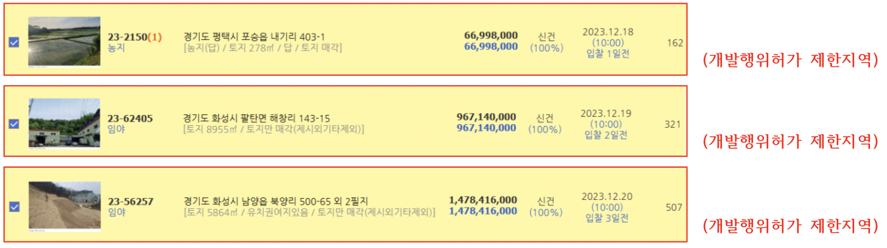
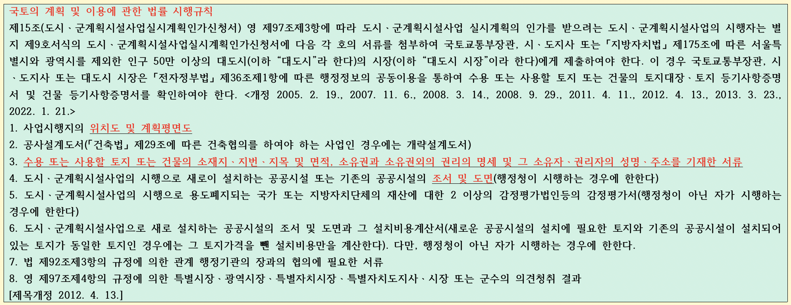

## 개발행위제한

#### **건축허가 및 착공을 제한하는것이 과연 나쁜것일까? 뭔가 개발을 해야하기 때문에 미리 막은 건 아닐런지**

#### 반드시 주변 상황 탐문 필요

> ▶개발제한구역
> ▶개발행위허가 제한지역(국토법63조)--->> 3년+2년(최대5년까지만)
> ▶건축허가 · 착공제한지역(건축법18조)--->> 2년+1년(최대3년까지만)

> 제63조(개발행위허가의 제한)

* ① 국토교통부장관, 시ㆍ도지사, 시장 또는 군수는 다음 각 호의 어느 하나에 해당되는 지역으로서 도시ㆍ군관리계획상 특히 필요하다고 인정되는 지역에 대해서는 대통령령으로 정하는 바에 따라 중앙도시계획위원회나 지방도시계획위원회의 심의를 거쳐 한 차례만 *3년 이내의 기간 동안 개발행위허가를 제한할 수 있다.* 다만, 제3호부터 제5호까지에 해당하는 지역에 대해서는 중앙도시계획위원회나 지방도시계획위원회의 심의를 거치지 아니하고 *한 차례만 2년 이내의 기간 동안 개발행위허가의 제한을 연장할 수 있다.* <개정 2011. 4. 14., 2013. 3. 23., 2013. 7. 16., 2023. 5. 16.>
  1. 녹지지역이나 계획관리지역으로서 수목이 집단적으로 자라고 있거나 조수류 등이 집단적으로 서식하고 있는 지역 또는 우량 농지 등으로 보전할 필요가 있는 지역
  2. 개발행위로 인하여 주변의 환경ㆍ경관ㆍ미관 및 「국가유산기본법」 제3조에 따른 국가유산 등이 크게 오염되거나 손상될 우려가 있는 지역
  3. 도시ㆍ군기본계획이나 도시ㆍ군관리계획을 수립하고 있는 지역으로서 그 도시ㆍ군기본계획이나 도시ㆍ군관리계획이 결정될 경우 용도지역ㆍ용도지구 또는 용도구역의 변경이 예상되고 그에 따라 개발행위허가의 기준이 크게 달라질 것으로 예상되는 지역
  4. 지구단위계획구역으로 지정된 지역
  5. 기반시설부담구역으로 지정된 지역
* ② 국토교통부장관, 시ㆍ도지사, 시장 또는 군수는 제1항에 따라 개발행위허가를 제한하려면 대통령령으로 정하는 바에 따라 제한지역ㆍ제한사유ㆍ제한대상행위 및 제한기간을 미리 고시하여야 한다.<개정 2013. 3. 23.>
* ③ 개발행위허가를 제한하기 위하여 제2항에 따라 개발행위허가 제한지역 등을 고시한 국토교통부장관, 시ㆍ도지사, 시장 또는 군수는 해당 지역에서 개발행위를 제한할 사유가 없어진 경우에는 그 제한기간이 끝나기 전이라도 지체 없이 개발행위허가의 제한을 해제하여야 한다. 이 경우 국토교통부장관, 시ㆍ도지사, 시장 또는 군수는 대통령령으로 정하는 바에 따라 해제지역 및 해제시기를 고시하여야 한다.<신설 2013. 7. 16.>
* ④ 국토교통부장관, 시ㆍ도지사, 시장 또는 군수가 개발행위허가를 제한하거나 개발행위허가 제한을 연장 또는 해제하는 경우 그 지역의 지형도면 고시, 지정의 효력, 주민 의견 청취 등에 관하여는 「토지이용규제 기본법」 제8조에 따른다.<신설 2019. 8. 20.>

> 건축법제18조(건축허가 제한 등)

* ① 국토교통부장관은 국토관리를 위하여 특히 필요하다고 인정하거나 주무부장관이 국방, 「국가유산기본법」 제3조에 따른 국가유산의 보존, 환경보전 또는 국민경제를 위하여 특히 필요하다고 인정하여 요청하면 *허가권자의 건축허가나 허가를 받은 건축물의 착공을 제한할 수 있다.* <개정 2013. 3. 23., 2023. 5. 16.>
* ② 특별시장ㆍ광역시장ㆍ도지사는 지역계획이나 도시ㆍ군계획에 특히 필요하다고 인정하면 시장ㆍ군수ㆍ구청장의 건축허가나 허가를 받은 건축물의 착공을 제한할 수 있다.<개정 2011. 4. 14., 2014. 1. 14.>
* ③ 국토교통부장관이나 시ㆍ도지사는 제1항이나 제2항에 따라 건축허가나 건축허가를 받은 건축물의 착공을 제한하려는 경우에는 「토지이용규제 기본법」 제8조에 따라 주민의견을 청취한 후 건축위원회의 심의를 거쳐야 한다.<신설 2014. 5. 28.>
* ④ 제1항이나 제2항에 따라 건축허가나 ***건축물의 착공을 제한하는 경우 제한기간은 2년 이내로 한다**. 다만, 1회에 한하여 1년 이내의 범위에서 제한기간을 연장할 수 있다.<개정 2014. 5. 28.>*
* ⑤ 국토교통부장관이나 특별시장ㆍ광역시장ㆍ도지사는 제1항이나 제2항에 따라 건축허가나 건축물의 착공을 제한하는 경우 제한 목적ㆍ기간, 대상 건축물의 용도와 대상 구역의 위치ㆍ면적ㆍ경계 등을 상세하게 정하여 허가권자에게 통보하여야 하며, 통보를 받은 허가권자는 지체 없이 이를 공고하여야 한다.<개정 2013. 3. 23., 2014. 1. 14., 2014. 5. 28.>
* ⑥ 특별시장ㆍ광역시장ㆍ도지사는 제2항에 따라 시장ㆍ군수ㆍ구청장의 건축허가나 건축물의 착공을 제한한 경우 즉시 국토교통부장관에게 보고하여야 하며, 보고를 받은 국토교통부장관은 제한 내용이 지나치다고 인정하면 해제를 명할 수 있다.<개정 2013. 3. 23., 2014. 1. 14., 2014. 5. 28.>

> **제88조(실시계획의 작성 및 인가 등)**

* ▶실시계획/결정·고시/설계도서/설계도면/필지별명세/세부목록을 고시한경우

  > * 실시계획이란?
  >   개발계획을 수립한 이후에 개발사업의 시행자가 작성하는 계획. 각 부문별 공사방법, 공사 진행과정, 설계도서, 자금계획, 시행기간 등 실질적인 공사 실행의 계획 따위를 명시하여 행정기관의 승인을 받아야 한다.
  >
* ① 도시ㆍ군계획시설사업의 시행자는 대통령령으로 정하는 바에 따라 그 도시ㆍ군계획시설사업에 관한 실시계획(이하 “실시계획”이라 한다)을 작성하여야 한다. <개정 2011. 4. 14.>

  * 국토의 계획 및 이용에 관한 법률 시행령
  * 제97조(실시계획의 인가)

    * ①[법]( "팝업으로 이동") [제88조]( "팝업으로 이동")[제1항]( "팝업으로 이동")의 규정에 의한 실시계획(이하 “실시계획”이라 한다)에는 다음 각호의 사항이 포함되어야 한다
      1. 사업의 종류 및 명칭
      2. 사업의 면적 또는 규모
      3. 사업시행자의 성명 및 주소(법인인 경우에는 법인의 명칭 및 소재지와 대표자의 성명 및 주소)
      4. 사업의 착수예정일 및 준공예정일
    * ③도시ㆍ군계획시설사업의 시행자로 지정된 자는 특별한 사유가 없는 한 시행자지정시에 정한 기일까지 국토교통부장관, 시ㆍ도지사 또는 대도시 시장에게 [국토교통부령]( "팝업으로 이동")이 정하는 실시계획인가신청서를 제출하여야 한다.
    * 
* ② 도시ㆍ군계획시설사업의 시행자(국토교통부장관, 시ㆍ도지사와 대도시 시장은 제외한다. 이하 제3항에서 같다)는 제1항에 따라 실시계획을 작성하면 대통령령으로 정하는 바에 따라 국토교통부장관, 시ㆍ도지사 또는 대도시 시장의 인가를 받아야 한다. 다만, 제98조에 따른 준공검사를 받은 후에 해당 도시ㆍ군계획시설사업에 대하여 국토교통부령으로 정하는 경미한 사항을 변경하기 위하여 실시계획을 작성하는 경우에는 국토교통부장관, 시ㆍ도지사 또는 대도시 시장의 인가를 받지 아니한다.<개정 2011. 4. 14., 2013. 3. 23., 2013. 7. 16.>
* ③ 국토교통부장관, 시ㆍ도지사 또는 대도시 시장은 도시ㆍ군계획시설사업의 시행자가 작성한 실시계획이 제43조제2항 및 제3항에 따른 도시ㆍ군계획시설의 결정ㆍ구조 및 설치의 기준 등에 맞다고 인정하는 경우에는 실시계획을 인가하여야 한다. 이 경우 국토교통부장관, 시ㆍ도지사 또는 대도시 시장은 기반시설의 설치나 그에 필요한 용지의 확보, 위해 방지, 환경오염 방지, 경관 조성, 조경 등의 조치를 할 것을 조건으로 실시계획을 인가할 수 있다.<개정 2011. 4. 14., 2013. 3. 23., 2024. 2. 6.>
* ④ 인가받은 실시계획을 변경하거나 폐지하는 경우에는 제2항 본문을 준용한다. 다만, 국토교통부령으로 정하는 경미한 사항을 변경하는 경우에는 그러하지 아니하다.<개정 2013. 3. 23., 2013. 7. 16.>
* ***⑤ 실시계획에는 사업시행에 필요한 설계도서, 자금계획, 시행기간, 그 밖에 대통령령으로 정하는 사항(제4항에 따라 실시계획을 변경하는 경우에는 변경되는 사항에 한정한다)을 자세히 밝히거나 첨부하여야 한다.<개정 2015. 12. 29.>***
* ⑥ 제1항ㆍ제2항 및 제4항에 따라 실시계획이 작성(도시ㆍ군계획시설사업의 시행자가 국토교통부장관, 시ㆍ도지사 또는 대도시 시장인 경우를 말한다) 또는 인가된 때에는 그 실시계획에 반영된 제30조제5항 단서에 따른 경미한 사항의 범위에서 도시ㆍ군관리계획이 변경된 것으로 본다. 이 경우 제30조제6항 및 제32조에 따라 도시ㆍ군관리계획의 변경사항 및 이를 반영한 지형도면을 고시하여야 한다.<신설 2011. 4. 14., 2013. 3. 23.>
* ⑦ 도시ㆍ군계획시설결정의 고시일부터 10년 이후에 제1항 또는 제2항에 따라 실시계획을 작성하거나 인가(다른 법률에 따라 의제된 경우는 제외한다) 받은 도시ㆍ군계획시설사업의 시행자(이하 이 조에서 “장기미집행 도시ㆍ군계획시설사업의 시행자”라 한다)가 제91조에 따른 실시계획 고시일부터 5년 이내에 「공익사업을 위한 토지 등의 취득 및 보상에 관한 법률」 제28조제1항에 따른 재결신청(이하 이 조에서 “재결신청”이라 한다)을 하지 아니한 경우에는 실시계획 고시일부터 5년이 지난 다음 날에 그 실시계획은 효력을 잃는다. 다만, 장기미집행 도시ㆍ군계획시설사업의 시행자가 재결신청을 하지 아니하고 실시계획 고시일부터 5년이 지나기 전에 해당 도시ㆍ군계획시설사업에 필요한 토지 면적의 3분의 2 이상을 소유하거나 사용할 수 있는 권원을 확보하고 실시계획 고시일부터 7년 이내에 재결신청을 하지 아니한 경우 실시계획 고시일부터 7년이 지난 다음 날에 그 실시계획은 효력을 잃는다.<신설 2019. 8. 20.>
* ⑧ 제7항에도 불구하고 장기미집행 도시ㆍ군계획시설사업의 시행자가 재결신청 없이 도시ㆍ군계획시설사업에 필요한 모든 토지ㆍ건축물 또는 그 토지에 정착된 물건을 소유하거나 사용할 수 있는 권원을 확보한 경우 그 실시계획은 효력을 유지한다.<신설 2019. 8. 20.>
* ⑨ 실시계획이 폐지되거나 효력을 잃은 경우 해당 도시ㆍ군계획시설결정은 제48조제1항에도 불구하고 다음 각 호에서 정한 날 효력을 잃는다. 이 경우 시ㆍ도지사 또는 대도시 시장은 대통령령으로 정하는 바에 따라 지체 없이 그 사실을 고시하여야 한다.<신설 2019. 8. 20.>

  1. 제48조제1항에 따른 도시ㆍ군계획시설결정의 고시일부터 20년이 되기 전에 실시계획이 폐지되거나 효력을 잃고 다른 도시ㆍ군계획시설사업이 시행되지 아니하는 경우: 도시ㆍ군계획시설결정의 고시일부터 20년이 되는 날의 다음 날
  2. 제48조제1항에 따른 도시ㆍ군계획시설결정의 고시일부터 20년이 되는 날의 다음 날 이후 실시계획이 폐지되거나 효력을 잃은 경우: 실시계획이 폐지되거나 효력을 잃은 날

> **제96조(「공익사업을 위한 토지 등의 취득 및 보상에 관한 법률」의 준용)**

* ① 제95조에 따른 수용 및 사용에 관하여는 이 법에 특별한 규정이 있는 경우 외에는 「공익사업을 위한 토지 등의 취득 및 보상에 관한 법률」을 준용한다.
* ② 제1항에 따라 「공익사업을 위한 토지 등의 취득 및 보상에 관한 법률」을 준용할 때에 제91조에 따른 실시계획을 고시한 경우에는 같은 법 제20조제1항과 제22조에 따른 *사업인정 및 그 고시가 있었던 것으로 본다*. 다만, 재결 신청은 같은 법 제23조제1항과 제28조제1항에도 불구하고 실시계획에서 정한 도시ㆍ군계획시설사업의 시행기간에 하여야 한다.<개정 2011. 4. 14.>

> **제105조(취락지구에 대한 지원)**

* 국가나 지방자치단체는 대통령령으로 정하는 바에 따라 취락지구 주민의 생활 편익과 복지 증진 등을 위한 사업을 시행하거나 그 사업을 지원할 수 있다.
* 국토계획법 시행령 제107조(취락지구에 대한 지원)

  * 법 제105조의 규정에 의하여 국가 또는 지방자치단체가 취락지구안의 주민의 생활편익과 복지증진 등을 위하여 시행하거나 지원할 수 있는 사업은 다음 각호와 같다.
    1. 집단취락지구 : 개발제한구역의지정및관리에관한특별조치법령에서 정하는 바에 의한다.
    2. 자연취락지구
       * 가. 자연취락지구안에 있거나 자연취락지구에 연결되는 도로ㆍ수도공급설비ㆍ하수도 등의 정비
       * 나. 어린이놀이터ㆍ공원ㆍ녹지ㆍ주차장ㆍ학교ㆍ마을회관 등의 설치ㆍ정비
       * 다. 쓰레기처리장ㆍ하수처리시설 등의 설치ㆍ개량
       * 라. 하천정비 등 재해방지를 위한 시설의 설치ㆍ개량
       * 마. 주택의 신축ㆍ개량
