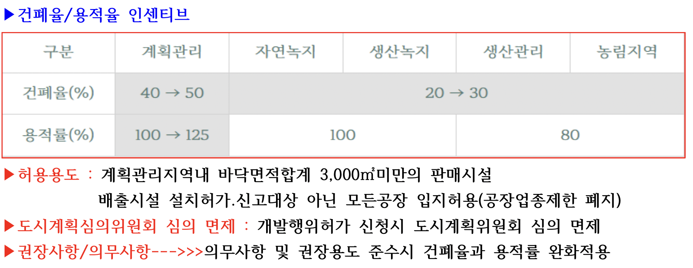
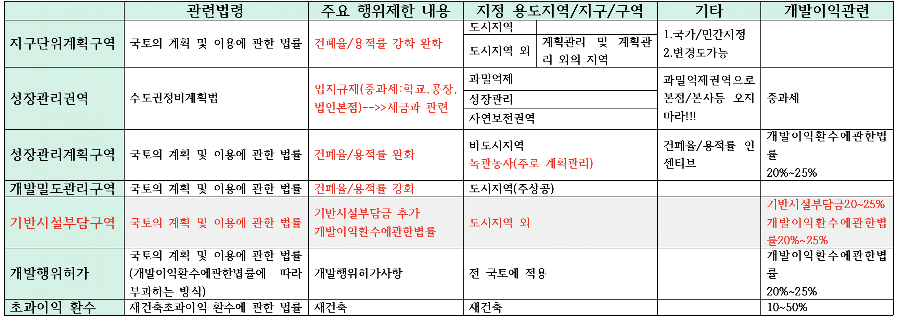
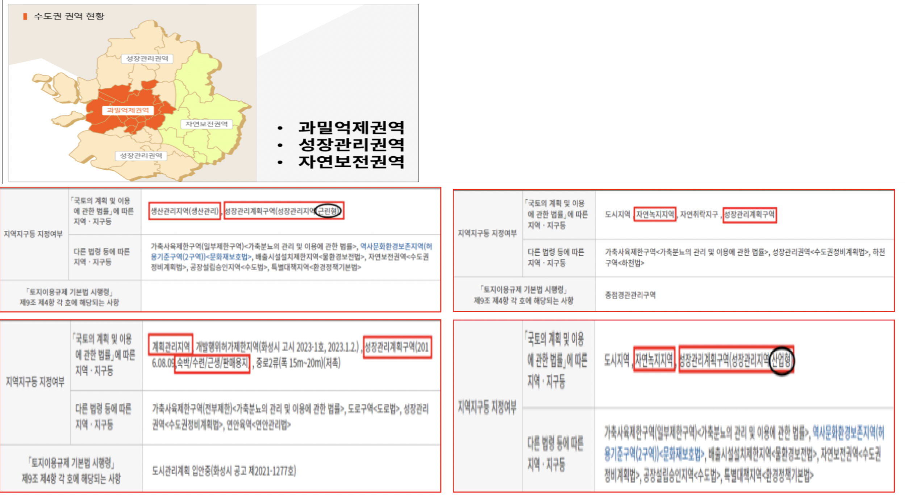

## 제3절 성장관리계획

> 제75조의2(성장관리계획구역의 지정 등)

* ① 특별시장ㆍ광역시장ㆍ특별자치시장ㆍ특별자치도지사ㆍ시장 또는 군수는 *녹지지역, 관리지역, 농림지역 및 자연환경보전지역 중 다음 각 호의 어느 하나에 해당하는 지역의 전부 또는 일부에 대하여 성장관리계획구역을 지정할 수 있다.*
  1. 개발수요가 많아 무질서한 개발이 진행되고 있거나 진행될 것으로 예상되는 지역
  2. 주변의 토지이용이나 교통여건 변화 등으로 향후 시가화가 예상되는 지역
  3. 주변지역과 연계하여 체계적인 관리가 필요한 지역
  4. [「토지이용규제 기본법」]( "팝업으로 이동") [제2조]( "팝업으로 이동")[제1호]( "팝업으로 이동")에 따른 지역ㆍ지구등의 변경으로 토지이용에 대한 행위제한이 완화되는 지역
  5. 그 밖에 *난개발의 방지와 체계적인 관리가 필요한 지역으로서* [대통령령]( "팝업으로 이동")으로 정하는 지역
* ② 특별시장ㆍ광역시장ㆍ특별자치시장ㆍ특별자치도지사ㆍ시장 또는 군수는 성장관리계획구역을 지정하거나 이를 변경하려면 [대통령령]( "팝업으로 이동")으로 정하는 바에 따라 미리 주민과 해당 지방의회의 의견을 들어야 하며, 관계 행정기관과의 협의 및 지방도시계획위원회의 심의를 거쳐야 한다. 다만, [대통령령]( "팝업으로 이동")으로 정하는 경미한 사항을 변경하는 경우에는 그러하지 아니하다.
* ③ 특별시ㆍ광역시ㆍ특별자치시ㆍ특별자치도ㆍ시 또는 군의 의회는 특별한 사유가 없으면 60일 이내에 특별시장ㆍ광역시장ㆍ특별자치시장ㆍ특별자치도지사ㆍ시장 또는 군수에게 의견을 제시하여야 하며, 그 기한까지 의견을 제시하지 아니하면 의견이 없는 것으로 본다.
* ④ 제2항에 따라 협의 요청을 받은 관계 행정기관의 장은 특별한 사유가 없으면 요청을 받은 날부터 30일 이내에 특별시장ㆍ광역시장ㆍ특별자치시장ㆍ특별자치도지사ㆍ시장 또는 군수에게 의견을 제시하여야 한다.
* ⑤ 특별시장ㆍ광역시장ㆍ특별자치시장ㆍ특별자치도지사ㆍ시장 또는 군수가 성장관리계획구역을 지정하거나 이를 변경한 경우에는 관계 행정기관의 장에게 관계 서류를 송부하여야 하며, [대통령령]( "팝업으로 이동")으로 정하는 바에 따라 이를 고시하고 일반인이 열람할 수 있도록 하여야 한다. 이 경우 지형도면의 고시 등에 관하여는 [「토지이용규제 기본법」]( "팝업으로 이동") [제8조]( "팝업으로 이동")에 따른다.
* ⑥ 그 밖에 성장관리계획구역의 지정 기준 및 절차 등에 관하여 필요한 사항은 [대통령령]( "팝업으로 이동")으로 정한다.

> 제75조의3(성장관리계획의 수립 등)

* ① 특별시장ㆍ광역시장ㆍ특별자치시장ㆍ특별자치도지사ㆍ시장 또는 군수는 성장관리계획구역을 지정할 때에는 다음 각 호의 사항 중 그 성장관리계획구역의 지정목적을 이루는 데 필요한 사항을 포함하여 성장관리계획을 수립하여야 한다.
  1. 도로, 공원 등 기반시설의 배치와 규모에 관한 사항
  2. 건축물의 용도제한, 건축물의 건폐율 또는 용적률
  3. 건축물의 배치, 형태, 색채 및 높이
  4. 환경관리 및 경관계획
  5. 그 밖에 난개발의 방지와 체계적인 관리에 필요한 사항으로서 [대통령령]( "팝업으로 이동")으로 정하는 사항
* ② 성장관리계획구역에서는 [제77조]( "팝업으로 이동")[제1항]( "팝업으로 이동")에도 불구하고 다음 각 호의 구분에 따른 범위에서 성장관리계획으로 정하는 바에 따라 특별시ㆍ광역시ㆍ특별자치시ㆍ특별자치도ㆍ시 또는 군의 [조례](https://www.law.go.kr/LSW/lsSc.do?section=&menuId=1&subMenuId=15&tabMenuId=81&eventGubun=060101&query=%EA%B5%AD%ED%86%A0%EC%9D%98+%EA%B3%84%ED%9A%8D+%EB%B0%8F+%EC%9D%B4%EC%9A%A9%EC%97%90+%EA%B4%80%ED%95%9C+%EB%B2%95%EB%A5%A0#AJAX "팝업으로 이동")로 정하는 비율까지 *건폐율을 완화하여 적용할 수 있다.*
  1. *계획관리지역: 50퍼센트 이하*
  2. *생산관리지역ㆍ농림지역 및 [대통령령]( "팝업으로 이동")으로 정하는 녹지지역: 30퍼센트 이하*
* ③ 성장관리계획구역 내 *계획관리지역에서는* [제78조]( "팝업으로 이동")[제1항]( "팝업으로 이동")에도 불구하고 *125퍼센트 이하*의 범위에서 성장관리계획으로 정하는 바에 따라 특별시ㆍ광역시ㆍ특별자치시ㆍ특별자치도ㆍ시 또는 군의 [조례](https://www.law.go.kr/LSW/lsSc.do?section=&menuId=1&subMenuId=15&tabMenuId=81&eventGubun=060101&query=%EA%B5%AD%ED%86%A0%EC%9D%98+%EA%B3%84%ED%9A%8D+%EB%B0%8F+%EC%9D%B4%EC%9A%A9%EC%97%90+%EA%B4%80%ED%95%9C+%EB%B2%95%EB%A5%A0#AJAX "팝업으로 이동")로 정하는 비율까지 용적률을 완화하여 적용할 수 있다.
* ④ 성장관리계획의 수립 및 변경에 관한 절차는 [제75조의2]( "팝업으로 이동")[제2항부터 제5항]( "팝업으로 이동")까지의 규정을 준용한다. 이 경우 “성장관리계획구역”은 “성장관리계획”으로 본다.
* ⑤ 특별시장ㆍ광역시장ㆍ특별자치시장ㆍ특별자치도지사ㆍ시장 또는 군수는 5년마다 관할 구역 내 수립된 성장관리계획에 대하여 [대통령령]( "팝업으로 이동")으로 정하는 바에 따라 그 타당성 여부를 전반적으로 재검토하여 정비하여야 한다.
* ⑥ 그 밖에 성장관리계획의 수립기준 및 절차 등에 관하여 필요한 사항은 [대통령령]( "팝업으로 이동")으로 정한다.

| 지구단위계획구역            | 성장관리권역                         | 성장관리계획구역                           |
| ---------------------------- | ------------------------------------ | ------------------------------------------ |
| 국토계획법                   | 수도권정비계획법                     | 국토계획법                                 |
| 건폐율/용적율 강화 및 완화   | 입지규제(중과세:학교, 공장,법인본점) | 건폐율/용적율 완화                         |
| 계획관리지역에 주로 지정개발 | 수도권(3개의 권역)                   | 녹관농자(주로 계획관리) 수도권(3개의 권역) |

### **수도권정비계획법**

> 제6조(권역의 구분과 지정)

* ① 수도권의 인구와 산업을 적정하게 배치하기 위하여 수도권을 다음과 같이 구분한다.
  1. 과밀억제권역: 인구와 산업이 지나치게 집중되었거나 집중될 우려가 있어 이전하거나 정비할 필요가 있는 지역
  2. 성장관리권역: 과밀억제권역으로부터 이전하는 인구와 산업을 계획적으로 유치하고 산업의 입지와 도시의 개발을 적정하게 관리할 필요가 있는 지역
  3. 자연보전권역: 한강 수계의 수질과 녹지 등 자연환경을 보전할 필요가 있는 지역
* ② 과밀억제권역, 성장관리권역 및 자연보전권역의 범위는 대통령령으로 정한다.

> 수도권정비계획법 시행령

제10조(과밀억제권역의 행위 제한) 

* 법 제7조제1항제1호에서 “대통령령으로 정하는 학교, 공공 청사, 연수 시설, 그 밖의 인구집중유발시설”이란 다음 각 호의 어느 하나에 해당하는 것을 말한다.

제11조(과밀억제권역의 행위 제한 완화) 

* 관계 행정기관의 장은 법 제7조제2항에 따라 과밀억제권역에서 다음 각 호의 구분에 따라 해당 행위나 그 행위의 허가ㆍ인가ㆍ승인 또는 협의 등(이하 “허가등”이라 한다)을 할 수 있다

제12조(성장관리권역의 행위 제한)

* ① 법 제8조제1항에서 “대통령령으로 정하는 학교, 공공 청사, 연수 시설, 그 밖의 인구집중유발시설의 신설ㆍ증설”이란 다음 각 호의 어느 하나에 해당하는 것을 제외한 학교, 공공 청사 또는 연수 시설의 신설ㆍ증설을 말한다

제13조(자연보전권역의 행위 제한)

* ① 법 제9조제1호에서 “대통령령으로 정하는 종류 및 규모 이상의 개발사업”이란 다음 각 호의 어느 하나에 해당하는 사업을 말한다. 이 경우 같은 목적으로 여러 번에 걸쳐 부분적으로 개발하거나 연접하여 개발(이하 “연접개발”이라 한다)함으로써 사업의 전체 면적이 다음 각 호의 어느 하나에서 정하는 규모 이상으로 되는 사업(「국토의 계획 및 이용에 관한 법률」 제36조 및 제37조에 따른 도시지역 중 주거지역, 상업지역, 공업지역 및 개발진흥지구에서 시행하는 사업은 제외한다)을 포함한다

제14조(자연보전권역의 행위 제한 완화) 

* ① 관계 행정기관의 장은 법 제9조 각 호 외의 부분 단서에 따라 자연보전권역에서 다음 각 호의 어느 하나에 해당하는 행위나 그 행위의 허가등을 할 수 있다.

