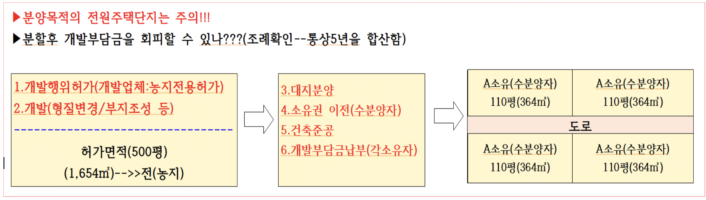

## 개발밀도관리구역 및 기반시설부담구역

* 개발부담금(개발행위허가)
  * 개발이익분담금, 대체산림자원조성비 감면대상 및 감면비율(제23조제1항 관련)
* 초과이익환수제
  * 재건축초과이익 환수에 관한 법률
* 기반시설부담금(국토계획법제67조)
* 개발밀도관리구역

> 제66조(개발밀도관리구역)

* ① 특별시장ㆍ광역시장ㆍ특별자치시장ㆍ특별자치도지사ㆍ시장 또는 군수는 *주거ㆍ상업 또는 공업지역에서의 개발행위로 기반시설(도시ㆍ군계획시설을 포함한다)의 처리ㆍ공급 또는 수용능력이 부족할 것으로 예상되는 지역 중 기반시설의 설치가 곤란한 지역을 개발밀도관리구역으로 지정할 수 있다.* **<개정 2011. 4. 14.>**
* ② 특별시장ㆍ광역시장ㆍ특별자치시장ㆍ특별자치도지사ㆍ시장 또는 군수는 개발밀도관리구역에서는 [대통령령]( "팝업으로 이동")으로 정하는 범위에서 [제77조]( "팝업으로 이동")나 [제78조]( "팝업으로 이동")에 따른 ***건폐율 또는 용적률을 강화***하여 적용한다. **<개정 2011. 4. 14.>**
  * ***■■-개발밀도관리구역에서는 용도지역에 적용되는 용적율의 최대한도 50%의 범위 안에서 건폐율 또는 용적률을 강화하여 적용***
* ③ 특별시장ㆍ광역시장ㆍ특별자치시장ㆍ특별자치도지사ㆍ시장 또는 군수는 제1항에 따라 개발밀도관리구역을 지정하거나 변경하려면 다음 각 호의 사항을 포함하여 해당 지방자치단체에 설치된 지방도시계획위원회의 심의를 거쳐야 한다. **<개정 2011. 4. 14.>**
  1. 개발밀도관리구역의 명칭
  2. 개발밀도관리구역의 범위
  3. [제77조]( "팝업으로 이동")나 [제78조]( "팝업으로 이동")에 따른 건폐율 또는 용적률의 강화 범위
* ④ 특별시장ㆍ광역시장ㆍ특별자치시장ㆍ특별자치도지사ㆍ시장 또는 군수는 제1항에 따라 개발밀도관리구역을 지정하거나 변경한 경우에는 그 사실을 [대통령령]( "팝업으로 이동")으로 정하는 바에 따라 고시하여야 한다. **<개정 2011. 4. 14.>**
* ⑤ 개발밀도관리구역의 지정기준, 개발밀도관리구역의 관리 등에 관하여 필요한 사항은 [대통령령]( "팝업으로 이동")으로 정하는 바에 따라 국토교통부장관이 정한다.

> 국계법 시행령 제64조 ~ 제70조

* 건축물을 신ㆍ증축할 때 도로나 공원 등을 확충하기 위해 건축주에게 부과하는 일종의 준조세를 말한다. 개발지와 주변지의 개발이익을 부담금 형태로 환수하는 형태를 취한다. ***전국을 대상으로 건축 연면적 200㎡를 초과하는 건축물의 건축행위에 대해 기반시설부담금이 부과된다. 2006년 7월부터 시행되고 있다.***

> 국계법 제67조((기반시설부담구역의 지정)

* ① 특별시장ㆍ광역시장ㆍ특별자치시장ㆍ특별자치도지사ㆍ시장 또는 군수는 다음 각 호의 어느 하나에 해당하는 지역에 대하여는 기반시설부담구역으로 지정하여야 한다. 다만, 개발행위가 집중되어 특별시장ㆍ광역시장ㆍ특별자치시장ㆍ특별자치도지사ㆍ시장 또는 군수가 해당 지역의 계획적 관리를 위하여 필요하다고 인정하면 다음 각 호에 해당하지 아니하는 경우라도 기반시설부담구역으로 지정할 수 있다. **<개정 2011. 4. 14.>**
  1. 이 법 또는 다른 법령의 제정ㆍ개정으로 인하여 행위 제한이 완화되거나 해제되는 지역
  2. 이 법 또는 다른 법령에 따라 지정된 용도지역 등이 변경되거나 해제되어 행위 제한이 완화되는 지역
  3. 개발행위허가 현황 및 인구증가율 등을 고려하여 [대통령령]( "팝업으로 이동")으로 정하는 지역
* ② 특별시장ㆍ광역시장ㆍ특별자치시장ㆍ특별자치도지사ㆍ시장 또는 군수는 기반시설부담구역을 지정 또는 변경하려면 주민의 의견을 들어야 하며, 해당 지방자치단체에 설치된 지방도시계획위원회의 심의를 거쳐 [대통령령]( "팝업으로 이동")으로 정하는 바에 따라 이를 고시하여야 한다. **<개정 2011. 4. 14.>**
* ③ 삭제 **<2011. 4. 14.>**
* ④ 특별시장ㆍ광역시장ㆍ특별자치시장ㆍ특별자치도지사ㆍ시장 또는 군수는 제2항에 따라 기반시설부담구역이 지정되면 [대통령령]( "팝업으로 이동")으로 정하는 바에 따라 기반시설설치계획을 수립하여야 하며, 이를 도시ㆍ군관리계획에 반영하여야 한다. **<개정 2011. 4. 14.>**
* ⑤ 기반시설부담구역의 지정기준 등에 관하여 필요한 사항은 [대통령령]( "팝업으로 이동")으로 정하는 바에 따라 국토교통부장관이 정한다.

> 제68조(기반시설설치비용의 부과대상 및 산정기준)

* ① 기반시설부담구역에서 기반시설설치비용의 부과대상인 건축행위는 [제2조]( "팝업으로 이동")[제20호]( "팝업으로 이동")에 따른 시설로서 ***200제곱미터(기존 건축물의 연면적을 포함한다)를 초과하는 건축물의 신축ㆍ증축 행위로 한다. 다만, 기존 건축물을 철거하고 신축하는 경우에는 기존 건축물의 건축연면적을 초과하는 건축행위만 부과대상으로 한다.***
* ② 기반시설설치비용은 기반시설을 설치하는 데 필요한 기반시설 표준시설비용과 용지비용을 합산한 금액에 제1항에 따른 부과대상 건축연면적과 기반시설 설치를 위하여 사용되는 총 비용 중 국가ㆍ지방자치단체의 부담분을 제외하고 민간 개발사업자가 부담하는 부담률을 곱한 금액으로 한다. 다만, 특별시장ㆍ광역시장ㆍ특별자치시장ㆍ특별자치도지사ㆍ시장 또는 군수가 해당 지역의 기반시설 소요량 등을 고려하여 [대통령령]( "팝업으로 이동")으로 정하는 바에 따라 기반시설부담계획을 수립한 경우에는 그 부담계획에 따른다.
* ③ 제2항에 따른 기반시설 표준시설비용은 기반시설 조성을 위하여 사용되는 단위당 시설비로서 해당 연도의 생산자물가상승률 등을 고려하여 [대통령령]( "팝업으로 이동")으로 정하는 바에 따라 국토교통부장관이 고시한다. **<개정 2013. 3. 23.>**
* ④ 제2항에 따른 용지비용은 부과대상이 되는 건축행위가 이루어지는 토지를 대상으로 다음 각 호의 기준을 곱하여 산정한 가액(價額)으로 한다
  1. 지역별 기반시설의 설치 정도를 고려하여 0.4 범위에서 지방자치단체의 [조례](https://www.law.go.kr/LSW/lsSc.do?section=&menuId=1&subMenuId=15&tabMenuId=81&eventGubun=060101&query=%EA%B5%AD%ED%86%A0%EC%9D%98+%EA%B3%84%ED%9A%8D+%EB%B0%8F+%EC%9D%B4%EC%9A%A9%EC%97%90+%EA%B4%80%ED%95%9C+%EB%B2%95%EB%A5%A0#AJAX "팝업으로 이동")로 정하는 용지환산계수
  2. 기반시설부담구역의 개별공시지가 평균 및 [대통령령]( "팝업으로 이동")으로 정하는 건축물별 기반시설유발계수
* ⑤ 제2항에 따른 민간 개발사업자가 부담하는 부담률은 100분의 20으로 하며, 특별시장ㆍ광역시장ㆍ특별자치시장ㆍ특별자치도지사ㆍ시장 또는 군수가 건물의 규모, 지역 특성 등을 고려하여 100분의 25의 범위에서 부담률을 가감할 수 있다. **<개정 2011. 4. 14.>**
* ⑥ [제69조]( "팝업으로 이동")[제1항]( "팝업으로 이동")에 따른 납부의무자가 다음 각 호의 어느 하나에 해당하는 경우에는 이 법에 따른 기반시설설치비용에서 감면한다. **<개정 2014. 1. 14.>**
  1. [제2조]( "팝업으로 이동")[제19호]( "팝업으로 이동")에 따른 기반시설을 설치하거나 그에 필요한 용지를 확보한 경우
  2. [「도로법」]( "팝업으로 이동") [제91조]( "팝업으로 이동")에 따른 원인자 부담금 등 [대통령령]( "팝업으로 이동")으로 정하는 비용을 납부한 경우
* ⑦ 제6항에 따른 감면기준 및 감면절차와 그 밖에 필요한 사항은 [대통령령]( "팝업으로 이동")으로 정한다.

> 최종 정리

■ 개발부담금—개발이익환수에관한 법률(20~25%이내에서 부과)

* 개발부담금이 납부되는 사업--택지개발/주택단지조성/관광단지 등
* 개발부담금 납부시기---준공후 지목이 변경된 시점(이때당시의 소유자)
* 납부의무자

  * 원칙 : 개발사업자
  * 예외 : 완공전이라면
    * 사업시행자
    * 위탁도급자
    * 토지소유자의 지위승계자
* 납부비용—개발이익*20~25%(조례마다 다름)
* 분양목적의 전원주택단지는 주의!!!
* 최초의 개발행위허가시의 가격을 취득시기로 본다!!!!(개발행위로인한 지가상승 후 상승된 가격으로 매수자도 최초의 허가당시)
* ```
  ※ 주 의 ※
  ▶분양목적의 전원주택단지는 주의!!!
  ▶최초의 개발행위허가시의 가격을 취득시기로 본다!!!!(개발행위로인한 지가상승 후 상승된 가격으로 매수자도 최초의 허가당시)
   ☞임야의 공시지가도 참고—개발부담금과 관련이 있으므로 알아야 한다
    개발부담금(25%)=[완료시점가격-개시시점가격(매입가)-공사소요비]*25% 납부
  ```
* 초과이익환수제-재건축 단지(10~50% 이내에서 부과)
* 
