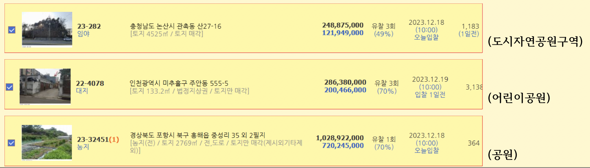
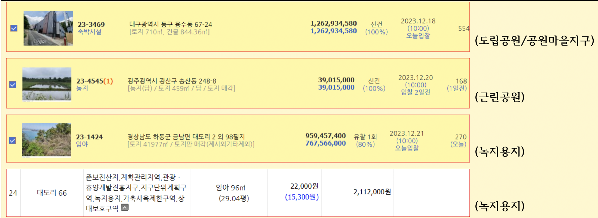
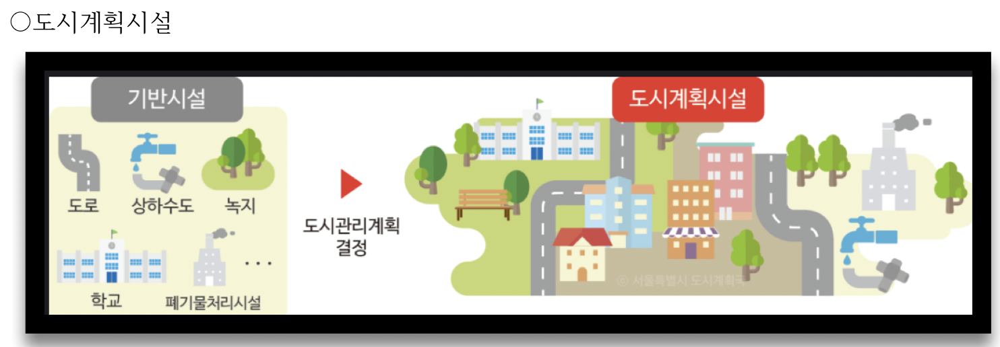
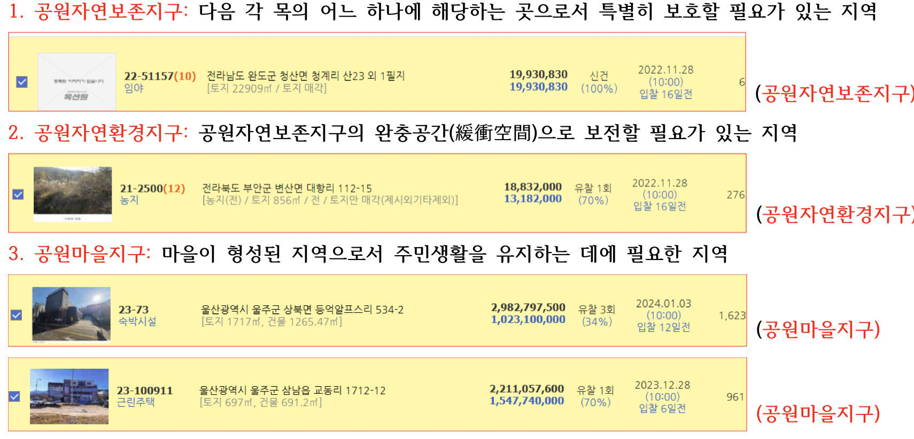

도시공원 및 녹지 등에 관한 법률

> **제38조의2(도시자연공원구역의 지정)**

* ① 시ㆍ도지사 또는 대도시 시장은 도시의 자연환경 및 경관을 보호하고 도시민에게 건전한 여가ㆍ휴식공간을 제공하기 위하여 도시지역 안에서 식생(植生)이 양호한 산지(山地)의 개발을 제한할 필요가 있다고 인정하면 도시자연공원구역의 지정 또는 변경을 도시ㆍ군관리계획으로 결정할 수 있다. <개정 2011. 4. 14.>
* ② 도시자연공원구역의 지정 또는 변경에 필요한 사항은 따로 법률로 정한다. [전문개정 2009. 2. 6.]

■■■도시ㆍ군관리계획으로 결정된 공원인지 아닌지 필히체크 하자!!!!!!!!!
■■■공원의 경우 도시.군계획시설인지 확인후 지정 고시일등 확인하여 해제여부 및 보상여부도 체크해야 한다
■■■도시자연공원구역이라 할지라도 도시.군계획시설로 결정된 것이 있을 수 있다!!!!

> 국토계획법 제2조(정의)

* 6.“기반시설”이란 다음 각 목의 시설로서 대통령령으로 정하는 시설을 말한다.
  * 나. 광장, 공원, 녹지 등 공간시설
  * 
  * 

> 도시공원 및 녹지 등에 관한 법률
>
> 제27조(도시자연공원구역에서의 행위 제한)

* ① 도시자연공원구역에서는 건축물의 건축 및 용도변경, 공작물의 설치, 토지의 형질변경, 흙과 돌의 채취, 토지의 분할, 죽목의 벌채, 물건의 적치 또는 [「국토의 계획 및 이용에 관한 법률」]( "팝업으로 이동") [제2조]( "팝업으로 이동")[제11호]( "팝업으로 이동")에 따른 도시ㆍ군계획사업(이하 “도시ㆍ군계획사업”이라 한다)의 시행을 할 수 없다. 다만, 다음 각 호의 어느 하나에 해당하는 행위는 특별시장ㆍ광역시장ㆍ특별자치시장ㆍ특별자치도지사ㆍ시장 또는 군수의 허가를 받아 할 수 있다. **<개정 2011. 4. 14., 2016. 5. 29., 2018. 6. 12.>**
  1. 다음 각 목의 어느 하나에 해당하는 건축물 또는 공작물로서 [대통령령]( "팝업으로 이동")으로 정하는 건축물의 건축 또는 공작물의 설치와 이에 따르는 토지의 형질변경
     * 가. 도로, 철도 등 공공용 시설
     * 나. 임시 건축물 또는 임시 공작물
     * 다. 휴양림, 수목원 등 도시민의 여가활용시설
     * 라. 등산로, 철봉 등 체력단련시설
     * 마. 전기ㆍ가스 관련 시설 등 공익시설
     * 바. 주택ㆍ근린생활시설
     * 사. 다음의 어느 하나에 해당하는 시설 중 도시자연공원구역에 입지할 필요성이 큰 시설로서 자연환경을 훼손하지 아니하는 시설
       * 1)「노인복지법」] [제31조]에 따른 노인복지시설
       * 2)[「영유아보육법」]( "팝업으로 이동") [제10조]( "팝업으로 이동")에 따른 어린이 집
       * 3)[「장사 등에 관한 법률」]( "팝업으로 이동") [제2조]( "팝업으로 이동")에 따른 수목장림(국가, 지방자치단체, [「공공기관의 운영에 관한 법률」]( "팝업으로 이동")에 따른 공공기관, [「장사 등에 관한 법률」]( "팝업으로 이동") [제16조]( "팝업으로 이동")[제5항]( "팝업으로 이동")[제2호]( "팝업으로 이동")에 따른 공공법인 또는 [대통령령]( "팝업으로 이동")으로 정하는 종교단체가 건축 또는 설치하는 경우에 한정한다)
     * 아. 삭제 **<2016. 5. 29.>**
  2. 기존 건축물 또는 공작물의 개축ㆍ재축ㆍ증축 또는 대수선(大修繕)
  3. 건축물의 건축을 수반하지 아니하는 토지의 형질변경
  4. 흙과 돌을 채취하거나 죽목을 베거나 물건을 쌓아놓는 행위로서 [대통령령]( "팝업으로 이동")으로 정하는 행위
  5. 다음 각 목의 어느 하나에 해당하는 범위의 토지 분할
     * 가. 분할된 후 각 필지의 면적이 200제곱미터 이상[지목이 대(垈)인 토지를 주택 또는 근린생활시설을 건축하기 위하여 분할하는 경우에는 330제곱미터 이상]인 경우
     * 나. 분할된 후 각 필지의 면적이 200제곱미터 미만인 경우로서 공익사업의 시행 및 인접 토지와의 합병 등을 위하여 [대통령령]( "팝업으로 이동")으로 정하는 경우
* ② 제1항 단서에도 불구하고 산림의 솎아베기 등 [대통령령]( "팝업으로 이동")으로 정하는 경미한 행위는 허가 없이 할 수 있다.
* ③ 제1항제1호 및 제2호에 따른 허가대상 건축물 또는 공작물의 규모ㆍ높이ㆍ건폐율ㆍ용적률과 제1항 각 호에 따른 허가대상 행위에 대한 허가기준은 [대통령령]( "팝업으로 이동")으로 정한다.
* ④ 제1항 단서에 따른 행위허가에 관하여는 [「국토의 계획 및 이용에 관한 법률」]( "팝업으로 이동") [제60조]( "팝업으로 이동"), [제64조]( "팝업으로 이동")[제3항]( "팝업으로 이동")ㆍ제4항에 따른 이행 보증, 원상회복 및 [같은 법]( "팝업으로 이동") [제62조]( "팝업으로 이동")에 따른 준공검사에 관한 규정을 준용한다.
* ⑤ 제1항 각 호에 규정된 행위에 관하여 도시자연공원구역의 지정 당시 이미 관계 법령에 따라 허가 등(관계 법령에 따라 허가 등을 받을 필요가 없는 경우를 포함한다)을 받아 공사 또는 사업에 착수한 자는 제1항 단서에 따른 허가를 받은 것으로 본다. **<개정 2016. 5. 29.>** **[전문개정 2011. 9. 16.]**

> 제29조(토지매수의 청구)

* ① 도시자연공원구역의 지정으로 인하여 도시자연공원구역의 토지를 종래의 용도로 사용할 수 없어 그 효용이 현저하게 감소된 토지 또는 해당 토지의 사용 및 수익이 사실상 불가능한 토지(이하 “매수대상토지”라 한다)의 소유자로서 다음 각 호의 어느 하나에 해당하는 자는 그 도시자연공원구역을 관할하는 특별시장ㆍ광역시장ㆍ특별자치시장ㆍ특별자치도지사ㆍ시장 또는 군수에게 해당 토지의 매수를 청구할 수 있다. -> ***낙찰자 매수청구 X***
  1. **도시자연공원구역의 지정 당시부터 해당 토지를 계속 소유한 자** -> 지정이 언제 되었는지 확인
  2. **토지의 사용ㆍ수익이 사실상 불가능하게 되기 전에 그 토지를 취득하여 계속 소유한 자**
  3. **제1호 또는 제2호의 자로부터 해당 토지를 상속받아 계속 소유한 자**
* ② 특별시장ㆍ광역시장ㆍ특별자치시장ㆍ특별자치도지사ㆍ시장 또는 군수는 제1항에 따라 매수 청구를 받은 토지가 제3항에 따른 기준에 해당되는 경우에는 이를 매수하여야 한다.
* ③ 매수대상토지의 구체적인 판정기준은 [대통령령]( "팝업으로 이동")으로 정한다.**[전문개정 2011. 9. 16.]**

> 도시계획시설 투자(경매/매매) 체크사항

* 지정, 공고일 반드시 확인
* 예정도로를 지금은 해제하는 추세이므로 경매시 계획도로가 있었지만 해제되어 없어질 수 있으므로 잘못하면 맹지가 될수 있음
* 도로개설계획이 언제인지 확인 후 투자
* 도로인 경우 사업의 주체를 확인(국가 / 도 /시, 군)
* 대로, 중로,소로 인지 확인하고 주,상,공,녹지 지역도 확인(크고 중요도가 높은 사업일수록 실효가능성이 적다)
* 도시계획시설 중 공원의 경우 용도구역으로 샹항 지정될 수 있음

> 공원일몰제와 경매

* 공원일몰제
  * 10년이상 미집행딘 도시계획시설 중 지목 '대'인 토지만 매수 청구 대상이었음
  * 20년이상 장기 미집행된 도시계획시설 국가에서 매수해라(헌법재판소)

> 헌법재판소 1999. 10. 21.자 97헌바26 전원합의체 결정 [도시계획법제조위헌소원]

결정사항

1. 도시계획시설의 결정으로 인한 토지재산권 제한의 내용
2. 보상에 관한 기본원칙
3. 도시계획시설결정의 집행지연으로 인한 보상의 필요성
4. ‘언제 보상을 요구할 수 있는가’의 문제
5. 보상규정을 두어야 할 입법자의 의무
6. 보상규정에 관한 입법형성권의 한계
7. 잠정적용을 명하는 불합치결정을 하는 이유

결정요지

1. 수용적 효과를 인정하여 국가나 지방자치단체는 이에 대한 보상을 해야 한다.

도시계획으로 결정된 다음의 계획에 의해 설치되는 시설을 말한다.

* ① 도로·광장·주차장·자동차정류장·철도·궤도·삭도·하천·운하·항만·공항·녹지·공원·운동장·유원지·관망탑·공공공지·공용의 청사·학교·도서관·시장·수도·하수도·공동구·도살장·공동묘지·화장장·폐기물처리시설·수질오염방지시설·전기공급설비·저수지·방풍설비·가스공급설비·유류저장 및 송유설비·유통업무설비·방수설비·방화설비·사방설비·방조설비·열공급설비의 시설 기타 대통령령으로 정하는 시설의 설치·정비·개량에 관한 계획
* ② 토지구획정리사업, 일단의 주택지조성사업, 시가지조성사업, 일단의 공업용지조성사업 또는 재개발사업에 관한 계획

> 자연공원법(국립공원,도립공원,시립,  .....등)

* 공원자연보존지구
* 공연자연환경지구
* ***공원마을지구---->>>할수있는 일들이 제일 많음(대출도 잘됨)****
* 공원문화유산지구

> 제18조(용도지구)

* 공원관리청은 자연공원을 효과적으로 보전하고 이용할 수 있도록 하기 위하여 다음 각 호의 용도지구를 공원계획으로 결정한다.
* 
* 4.공원문화유산지구: 「문화재보호법」 제2조제3항에 따른 지정문화재를 보유한 사찰(寺刹)과 전통사찰보존지 중 문화재의 보전에 필요하거나 불사(佛事)에 필요한 시설을 설치하고자 하는 지역
