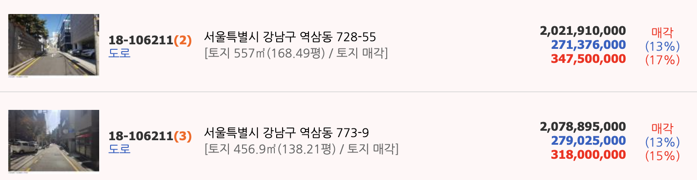

#개발행위허가시 도로소유자의 토지사용승락 여부 #개발행위허가 #도로경매 #공인중개사 필수시청

#분양목적의 단지내 도로가 1/n로 소유시 개발행위허가.
#분양목적의 단지내도로 경매.
#개발행위허가
□개발행위허가 진입로 1

☞준공이 안되고 포장된 너비 4M도로(지목 전)--도로로 안본다???

-포장은 되어있지만 준공이 안된 현황도로를 이용하여 건축허가를 받을 수 있는지?-대법원 판례:분양목적으로 분양된 토지의 도로는 사용승락이 필요없다

☞비포장된 너비 4M도로(지목:도로)--사용승락여부??

-화살표에 따라서 차례로 허가받음.그러다가 맨위다가 허가를 받으려는데 도로가 도로관리대장에 등재가 안되어 있다
-30채 이상이 건축법허가를 통해서 만들어진 도로임에도 불구하고 맨 위쪽의 허가신청자에게 사용승락을 받아오라는건 무슨 개소리???(현행기준에 안맞다고)
-당연히 허가를 내주어야 한다.마을길이다

☞현황도로 5M인데 지적도는 3.8M

-당연히 해주어야 한다

☞자연취락지구 내 아스콘 포장된 전

-자연취락지구는 지자체가 도로를 정비할 책임이 있다.지자체 비용으로 포장했다.당연히 사용승락 필요없음,

☞개발행위허가의 대체도로가 일부 폐쇄

-현재상태는 나무가 심어져있는 임야임.지적도로만 분할되어 있음
-분할은 되었는데 건축허가시 허가불허!!특히 50여 필지중에 소유권이 바뀌거나 경매로 취득해서 몽리를 부리는 사람이 있다면,큰일
☞개발행위허가에서 미지정된 현황도로

#분양목적의 도로와 사용승락여부 #개발행위허가 #토지사용승락서

# 경매사례

* 판례 : 배타적 사용수익의 포기로 본다
* 도로 낙찰자에게 불리한 판결:상속(경락)이라도 배타적사용수익권을 포기한 것이다
* 미불용지인 경우에는 받아도 된다 → 정보공개/보상금지급 여부는 시청에 확인해라

대법원 2014. 3. 27. 선고 2011다107184 판결[소유권이전등기][공2014상,921]

택지를 조성한 후 분할하여 분양하는 사업을 하는 경우, 명시적 약정이 없더라도 분양사업자가 수분양자에게 주택 건축 및 통행이 가능하도록 인접 부지에 도로를 개설하여 제공하고 수분양자에 대하여 도로를 이용할 수 있는 권한을 부여하는 것을 전제로 분양계약이 이루어졌다고 추정되는지 여부(원칙적 적극)

【판결요지】
택지를 조성한 후 분할하여 분양하는 사업을 하는 경우에, 그 택지를 맹지로 분양하기로 약정하였다는 등의 특별한 사정이 없다면, 분양계약에 명시적인 약정이 없더라도 분양사업자로서는 수분양 택지에서의 주택 건축 및 수분양자의 통행이 가능하도록 조성·분양된 택지들의 현황에 적합하게 인접 부지에 건축법 등 관계 법령의 기준에 맞는 도로를 개설하여 제공하고 수분양자에 대하여 도로를 이용할 수 있는 권한을 부여하는 것을 전제로 하여 분양계약이 이루어졌다고 추정하는 것이 거래상 관념에 부합되고 분양계약 당사자의 의사에도 합치된다.

---

> 도로의 소유자가 바뀐 경우 어떻게 하지??/도로 사용료를 받을 수 있을까?

* 도로의 원소유자의 독점적.베타적인 사용.수익권의 행사가 제한되는 토지의 소유권을 경매,매매,대물변제 등 기타의 사유로 특정승계한자는 베타적인 사용.수익권을 행사할 수 없다
* 대법원94다20013. 2006다32552.2016다264556.전원합의체판결
* 지적재조사사업이 진행중 or 지적재조사사업완료지역(환지/재개발/지구단위계획구역 등...)
  * 22타경 598, 22타경 32465
* 지구단위구역 지정이나 실시계획 도중에 기존도로가 없어질 수 있음
  * 22타경 2002
* 택지를 분양하면서 분할 된 내부도로 or 스스로 공로로 제공한 현황도로(마을길/새마을도로)--무상통행권 있음
  * 대법원 2009다8802. 2016다264556 대법 전원합의체)-택지분양
