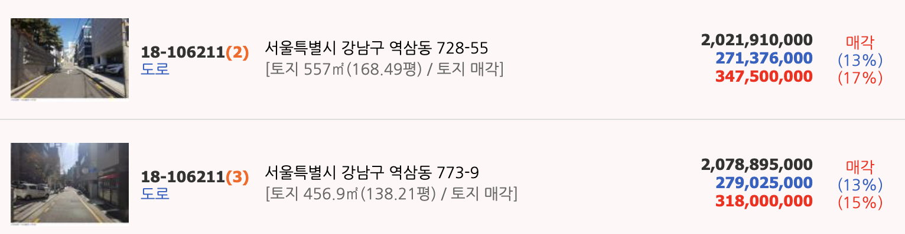

# 도로

> ## 부동산 가치파악시 제일 중요한 부분

* 도로와 접했는지
* 현황도로인지(건축후퇴선/신축시 동의여부)
* 매매시 도로접한것 보다 30% 정도 감감
* 골목안길의 현황도로인지(건축후퇴선/신축시 동의여부)
* 지형/지세/위치/현황 등 종합적인 판단

> ## 도로와 관련된 건축법 조문 변천사

* 1976.2.1
  * “도로”라 함은 보행 및 자동차통행이 가능한 폭 4미터이상의 도로
    * 가. 도시계획법ㆍ도로법ㆍ사도법 기타 관계법령의 규정에 의하여 신설 또는 변경에 관한 고시가 된 것
    * 나. 건축허가시 시장ㆍ군수가 그 위치를 지정한 도로-현황도로
* 1981.10.8.
  * “도로”라 함은 보행 및 자동차통행이 가능한 폭 4미터이상의 도로
    * 가. 도시계획법ㆍ도로법ㆍ사도법 기타 관계법령의 규정에 의하여 신설 또는 변경에 관한 고시가 된 것
    * 나. 건축허가시 시장 또는 군수가 그 위치를 지정한 도로-현황도로
* 1992.6.1
  * “도로”라 함은 보행 및 자동차 통행이 가능한 너비 4미터이상의 도로로서 다음 각목의 1에 해당하는 도로 또는 그 예정도로
    * 도시계획법ㆍ도로법ㆍ사도법 기타 관계법령에 의하여 신설 또는 변경에 관한 고시가 된 도로
    * 건축허가 또는 신고시 시장ㆍ군수ㆍ구청장이 그 위치를 지정한 도로-현황도로

> #### 도로에 
>
> 1.현황도로란? 건축법 2로 11항 '나'목
>
> * 건축허가 또는 신고 시에 특별시장ㆍ광역시장ㆍ특별자치시장ㆍ도지사ㆍ특별자치도지사(이하 “시ㆍ도지사”라 한다)
>   또는 시장ㆍ군수ㆍ구청장(자치구의 구청장을 말한다. 이하 같다)이 위치를 지정하여 공고한 도로--현황도로
> * 현황도로란 -> [지적도에는 없지만 실제는 도로가 있는 것]
> * 현황도로란 -> [분할이 안되고 지목이 ”도“가 아니어도 실제이용 상황이 자동차통행과 보행이 가능]
>
> 2.도시지역/비도시지역
>
> 3.현황도로/법정도로
>
> 4.도로연결허가
>
> 5.도로법/사도법
>
> 6.농어촌정비법에 의한 도로
>
> 7.도로와 다른시설에 연결에 관한 규칙(삼거리/사거리/입체교차료/가감속차선 등)

> 국토계획법 개발행위허가 운영지침 도로

* 3-3-2-1 도로
  * 건축물을 건축하거나 공작물을 설치하는 부지는 도시·군계획도로 또는 시·군도, 농어촌도로에 접속하는 것을 원칙
  * 위 도로에 접속되지 아니한 경우 아래 기준에 따라 진입도로를 개설해야 한다.
    * *5천㎡ 미만은 4m 이상*
    * *5천㎡ 이상 3만㎡ 미만은 6m 이상*
    * *3만㎡이상은 8m 이상으로서 개발행위규모에 따른 교통량을 고려하여 적정 폭을 확보*
  * 도로확보기준을 적용하지 아니할 수 있다.
    * 차량진출입이 가능한 기존 마을안길, 농로 등에 접속하거나 차량통행이 가능한 도로를 개설하는 경우로서 농업·어업·임업용 시설(가공, 유통, 판매 및 이와 유사한 시설은 제외하되) [
    * *부지면적 1천㎡ 미만으로서 제1종 근린생활시설 및 단독주택의 건축인 경우*
    * 증축 등을 위해 기존 대지 면적을 10%이하로 확장하는 경우
    * 부지확장 없이 기존 대지에서 건축물 증축·개축·재축(신축 제외)하는 경우
    * 광고탑, 철탑, 태양광발전시설 등 교통유발 효과가 없거나 미미한 공작물을 설치하는 경우

> 건축법( 2조  11항) 도로(조례확인)

* “[도로]()”란 보행과 자동차 통행이 가능한 너비 4미터 이상의 도로로서 다음 각 목의 어느 하나에 해당하는 도로나 그 예정도로를 말한다.

  * 가. 「국토의 계획 및 이용에 관한 법률」, 「도로법」, 「사도법」 그 밖의 관계 법령에 따라  신설 또는 변경에 관한 고시가 된 도로
  * 나. 건축허가 또는 신고 시에 특별시장ㆍ광역시장ㆍ특별자치시장ㆍ도지사ㆍ특별자치도지사(이하 “시ㆍ도지사”라 한다) 또는 시장ㆍ군수ㆍ구청장 이 위치를 지정하여 공고한 도로
* 도로점용허가, 44조(접도의무), 45조(도로지정폐지), 46조(건축선), 47조(건축후퇴선)

> 도로법 52조

* 도로와 다른시설의 연결에 관한 규칙

~~  ~~

> ■ 개발행위허가 도로 정리

* 개발행위 허가로 만들어진 진입로는 다음과 같은 이유로 공공성이 확보된 토지이므로 배타적 사용권이 제한된 공로라고 해석함이 옳다

> ■ 비도시 면지역의 도로(개발행위허가운영지침/도시계획조례/농지(산지)전용의 의제 등)

* 현황도로를 이용하여 건축허가가 될 수 있는지에 대한 판단은 *지자체장의 재량임*

`비도시지역(보전관리)·면지역의 1종근생 건축물 및 토지(지목 대)를 경매로 취득하였는데 그 진입로의 너비가 6m이고 사유인데 토지이용계획확인서에 건축법 도로로 표시되지 않았다. 이용하려면 사용승낙이 필요하다고 함

[답변]

건축물의 진입로가 건축법 도로로 지정되지 않은 *사유(私有)인 경우에는 그 현황도로 소유자의 사용승낙이 필요한 것이 원칙이다*

그러나 그 소유자의 배타적사용권이 제한되었다고 허가권자가 판단하면 필요 없을 수 있다.

그러므로 이 현황도로가 배타적사용권이 제한된 공도임을 다음과 같은 순서로 찾아가야 할 것이다.

1. 이 집입로가 건축법 제2조1항11호나목의 도로인지 확인해보아야 한다
   * 비도시·면지역이라도 건축법 도로지정이 되었을 수도 있음
   * 소유자가 자신의 목적사업을 위해 스스로 지정을 요청
   * 행정지도를 했을 수 있음
   * 개발행위허가에서 도시계획조례에 의하여 지정되었을 수 있음
   * 건축법 (지정)도로란 건축허가(신고) 때마다 허가권자가 진입로 소유자의 사용승낙을 받아 공도(=건축법 도로)로 지정하고 그 근거를 도로관리대장으로 관리(대장 등은 건축과에서 보관, 건축법 지정도로의 연결도면 및 총괄대장은 세움터를 통하여 확인)
2. 도시계획조례에 의하여  건축법 도로로 지정되었을 수 있다.
   * 비도시·면지역은 건축법으로 도로지정을 할 수 없다(건축법 제3조)
   * 개발행위허가에서 지목이 대 등 6가지 지목이 형질변경이 되어있다면 개발행위허가 대상이 아닐 수 있지만 기반시설이 없으면 개발행위허가 대상이 될 수 있는데(대법원 2009두19960) 이때 건축법 도로의 지정을 개발행위허가 조건으로 하여 건축법 도로가 지정되고 있다.
3. 개발행위허가 운영지침에서 건축법 도로로 지정되었을 수도 있다.
   * 지자체가 도시계획조례에 명확한 규정을 가지고 있지 않으면 개발행위허가운영지침 및 국토계획법 시행령 [별표1의2]에 따라 건축법 도로를 지정하여야 한다.
   * 개정지침이 시행된 이후 개발행위허가를 받아서 개설된 도로는 배타적사용권이 제한되었다고 해석하여야 하는데
     법제처 유권해석(13-0363)으로 사용승낙이 필요하다고 한다.
   * 개발행위허가에서 목적사업을 위하여 스스로 배타적사용권의 포기 조건으로 만들어진 현황도로는 당시 건축법 도로로 지정하지 않았더라도 일반 공중의 통행로로 보아서 타인의 건축허가에서 접도의무가 충족되었다고 해석할 수 있을 것이다.
   * 그러므로 이때는 법령 및 판례로 담당자를 설득하여야 할 것이다.
4. 대법원 판례에 의해서 배타적사용수익권이 포기 또는 제한되었을 수 있다
   * 분양사업자가 수분양자를 위하여 스스로 공도로 제공한 것이라면 배타적사용권이 제한된다는 대법원 전원합의체 판례(2016다264556)가 있다. 다만 대법원은 허가권자가 사유인 현황도로의 배타적사용권이 제한되었다고 판단하여 배타적사용권을 박탈하려면 소유자가 그 토지를 취득하여 분할한 목적과 본인 토지의 가치상승 등을 종합적으로 판단하여 신중하게 결정할 것을 요구하고 있다.
5. 현황도로 소유자가 바뀌면 사용승낙이 필요하다는 지자체도 있다
   * 배타적사용권이 포기 또는 제한된 경우에는 그 현황도로의 상속인은 피상속인의 권리와 의무를 그대로 승계받은 것이고, 매매·경매 등의 특별승계인도 외관상 현황도로인 것을 알고 취득한 것이므로 배타적사용권을 주장할 수 없다고 대법원은 유권해석하고 있다.
6. 지하에 대한 사용승낙이 필요하다고 잘못 해석하는 지자체도 있다
   * 허가권자가 지상의 배타적사용권이 포기 또는 제한되었다고 판단하면 그 효력은 지하에도 미치고, 도로가 아닌 가스·수도관 등의 기반시설의 매설에도 마찬가지라고 유권해석하고 있다.(대법원 전원합의체 판결 2016다264556 등)

> ■ 사도(私道)인 현황도로로 건축허가 가능한지

* 현황도로를 이용하여 건축허가가 될 수 있는지에 대한 판단은 지자체장의 재량
*

# 경매사례

* 판례 : 배타적 사용수익의 포기로 본다
* 도로 낙찰자에게 불리한 판결:상속(경락)이라도 배타적사용수익권을 포기한 것이다
* 미불용지인 경우에는 받아도 된다 → 정보공개/보상금지급 여부는 시청에 확인해라

대법원 2014. 3. 27. 선고 2011다107184 판결[소유권이전등기][공2014상,921]

택지를 조성한 후 분할하여 분양하는 사업을 하는 경우, 명시적 약정이 없더라도 분양사업자가 수분양자에게 주택 건축 및 통행이 가능하도록 인접 부지에 도로를 개설하여 제공하고 수분양자에 대하여 도로를 이용할 수 있는 권한을 부여하는 것을 전제로 분양계약이 이루어졌다고 추정되는지 여부(원칙적 적극)

【판결요지】
택지를 조성한 후 분할하여 분양하는 사업을 하는 경우에, 그 택지를 맹지로 분양하기로 약정하였다는 등의 특별한 사정이 없다면, 분양계약에 명시적인 약정이 없더라도 분양사업자로서는 수분양 택지에서의 주택 건축 및 수분양자의 통행이 가능하도록 조성·분양된 택지들의 현황에 적합하게 인접 부지에 건축법 등 관계 법령의 기준에 맞는 도로를 개설하여 제공하고 수분양자에 대하여 도로를 이용할 수 있는 권한을 부여하는 것을 전제로 하여 분양계약이 이루어졌다고 추정하는 것이 거래상 관념에 부합되고 분양계약 당사자의 의사에도 합치된다.
