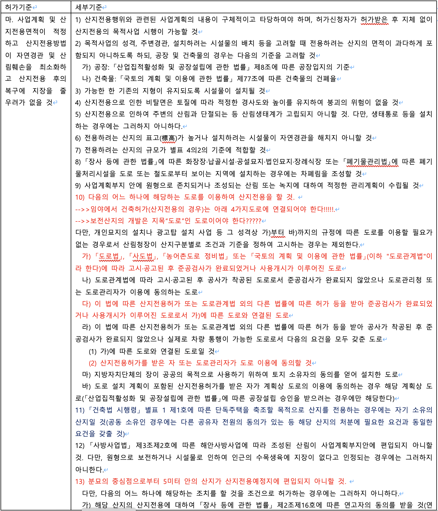

## 임도 및 현황도로

> 임도를 통해서 건축허가 가능

> 임도 != 도로 (즉 임야임)

* 산지관리법 제2조(정의)
  * “산지”란 다음 각 목의 어느 하나에 해당하는 토지를 말한다. 다만, 주택지[주택지조성사업이 완료되어 지목이 대(垈)로 변경된 토지를 말한다] 및 대통령령으로 정하는 농지, 초지(草地), 도로, 그 밖의 토지는 제외한다.
    * 가. 「공간정보의 구축 및 관리 등에 관한 법률」 제67조제1항에 따른 지목이 임야인 토지
    * 나. 입목(立木)ㆍ대나무가 집단적으로 생육(生育)하고 있는 토지
    * 다. 집단적으로 생육한 입목ㆍ대나무가 일시 상실된 토지
    * 라. 입목ㆍ대나무의 집단적 생육에 사용하게 된 토지
    * ***마. 임도(林道), 작업로 등 산길***
    * 바. 나목부터 라목까지의 토지에 있는 암석지(巖石地) 및 소택지(沼澤地)

* 건축행위나 산지전용허가를 하는 경우 필요한 도로는 지목이 ‘도로’인 법정도로 또는 현황도로 등이 필요한데 임도는 해당사항이 없음.
  즉, 임도를 활용해서 건축허가나 산지전용허가는 불가능합니다.
* **그러나 일부 지자체의 경우 가능한경우도 있다고 하니 확인바랍니다**
* 임도인지 현황도로인지 구분이 안되는 경우 도로 끝에 건축물이 있는지 없는지를 확인하는것도 하나의 방법임.
* 건축물이 있다면 현황도로일 확률이 높음
* 물론 임도가 다른 도로등과 연결되어 있을 수도 있기 때문에 확실하지 않으면 지자체에 문의!

> 산지관리법 시행령 [별표 4] 산지전용허가기준의 적용범위와 사업별·규모별 세부기준(제20조제6항 관련)

* 산지전용 시 공통으로 적용되는 허가기준
  * 마. 사업계획 및 산지전용면적이 적정하고 산지전용방법이 자연경관 및 산림훼손을 최소화하고 산지전용 후의 복구에 지장을 줄 우려가 없을 것

ㅁㅁㅁ
