## 임야 경사도 낮추기

> 경사도 낮추기

* 사용승낙서를 옆토지와 받고 내땅부터 파헤친후 변경허가 처리(변경)
* 변경허가
* 경사도가 높은 격자크기를 빼서 낮추기 -> 경사도 높은 곳은 제외하고 개발

> 화성시 도시계획조례 사례

* **제18조(개발행위허가의 기준)**

  * ① 영 별표 1의2제1호가목(3)에 따라 시장은 다음 각 호의 요건을 모두 갖춘 토지에 한하여 개발행위를 허가할 수 있다. 다만, 주ㆍ상ㆍ공업지역, 지구단위계획 수립 지역, 자연취락지구안에서는 제1호부터 제3호까지의 규정을 적용하지 아니한다.
    1. 입목축적의 적용은「산지관리법」을 준용한다.
    2. **평균경사도가 15도 미만인 토지.** 다만, 지목이 임야인 토지가 포함된 경우에는 임야인 토지와 임야가 아닌 토지의 평균경사도를 각각 산정하며, 토지이용계획확인서에 사고지(법령 등을 위반하여 임목을 훼손하거나 지형을 변경한 후 원상회복을 하지 않은 토지를 말한다. 이하 같다)로 등재된 토지는 훼손 또는 변경 전 평균경사도를 기준으로 산정한다.
    3. 아래의 지역별 기준 **지반고를 기준으로 50미터 미만에 위치한 토지**. 이 경우, **기준 지반고는 지형도 기준**으로 한다.
* 경사도-->>개발행위기준이나 산지전용기준에 맞아야 한다
* 지반고(표고)는 지형도를 기준 ▶입목축척 ▶도로조건 ▶대인조건—농림어업인 여부
* 경사도는 수치지형도를 기준으로 판단하므로 불법으로 미리 산을 깍아내고 그 후에 전용은 안됨

> 합법으로 하는 방법

* 복구대상 비탈면(사면)이 산지전용면적의 50%를 초과하면 안됨
  * 그렇다면 옹벽/보강토로 보강을 해서 비율을 다운시킨다
* 보전산지<<-->>준보전산지의 행위제한
* 평균경사도 측정방법
  * 수치지형도를 이용하여 측정
  * 불규칙 삼각형 생성
  * 환경성지도와 전문가의 분석은 차이가 있으므로-->>따라서 전문가에게 반드시 의뢰를 해야 한다
  * 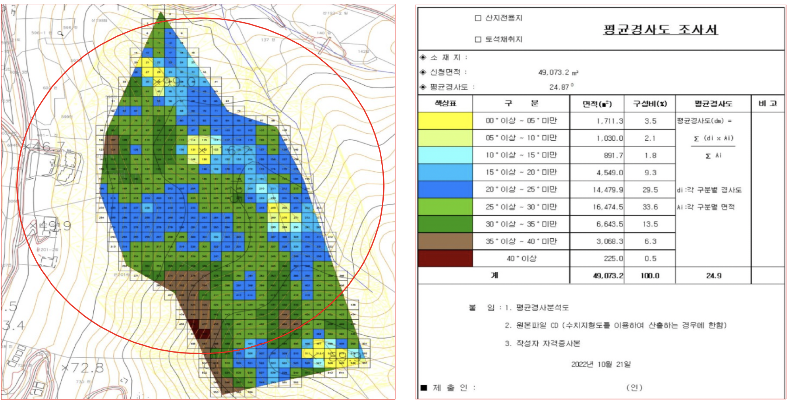

> 산지관리법 시행규칙 [별포 1의3]

* 산지전용허가기준의 세부사항(제10조의2 관련)
  * 복구대상 비탈면(사면)이 산지전용면적의 50%를 초과하면 안됨
    * 그렇다면 옹벽/보강토로 보강을 해서 비율을 다운시킨다
  * 표고분석도상 50%이내 임야 개발
  * 평균입목축척 150%이내(조례마다 차이있음)
    * 75%와 150%가 있음(자치법규정보시스템)
  * 평균경사도(사면) 15도~25도미만(조례마다 차이있음)
    * 예외있음(체육시설)
  * 산지정보 다드림(표고/경사도/토질/경사도 등) / 국토환경성평가(경사도의 비율) / 국토지리정보원(수치정보 지형도)
* ※참고 : 전문가에 반드시 문의해야 합니다.구 사이트의 정보는 참고만하고,전문가에 의뢰해야함

> 산지관리법 제 18조(산지전용허가기준 등) 1항, 8호

* 8.사업계획 및 산지전용면적이 적정하고 산지전용방법이 산지경관 및 산림 훼손을 최소화하며 산지전용 후의 복구에 지장을 줄 우려가 없을 것
  * 3)가능한 한 기존의 지형이 유지되도록 시설물이 설치될 것

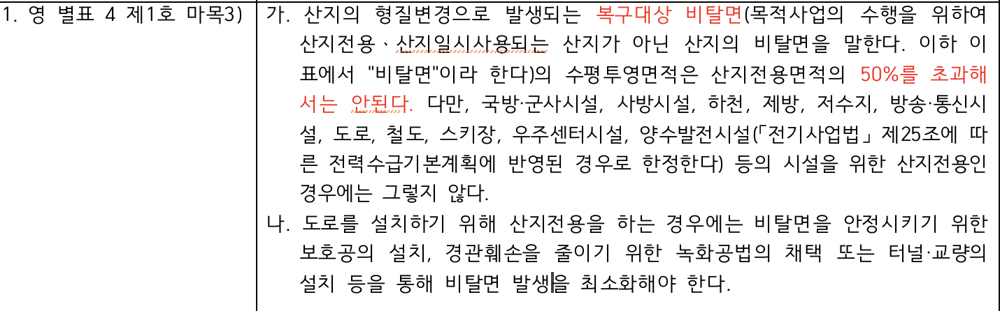

* 그렇다면 옹벽/보강토로 보강을 해서 비율을 다운시킨다
* 경사도가 높은 토지는 비탈면이 많이 나온다

4)산지전용으로 인한 비탈면은 토질에 따라 적정한 경사도와 높이를 유지하여 붕괴의 위험이 없을것

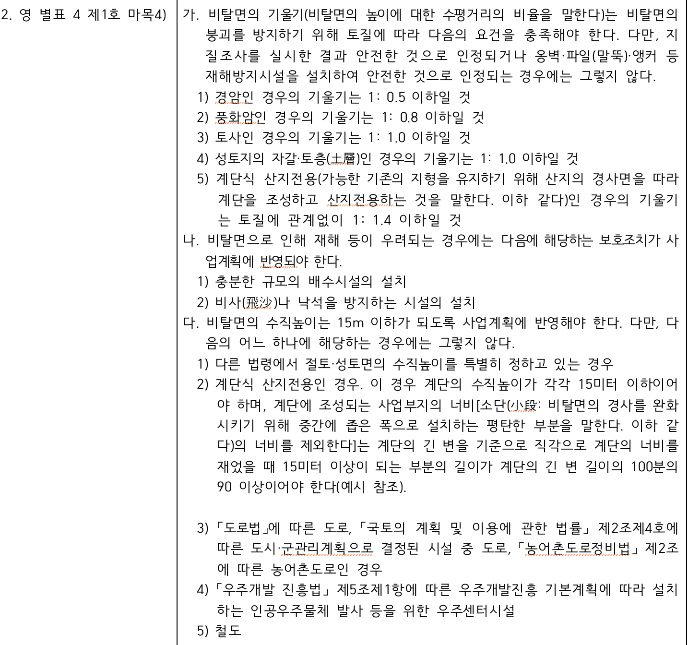

* 비탈면의 기울기(토목측량설계사무소의 영역임)

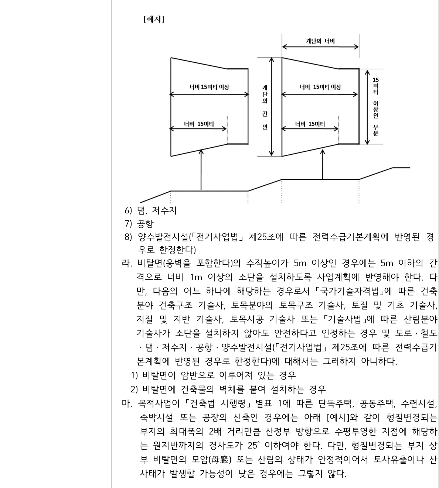

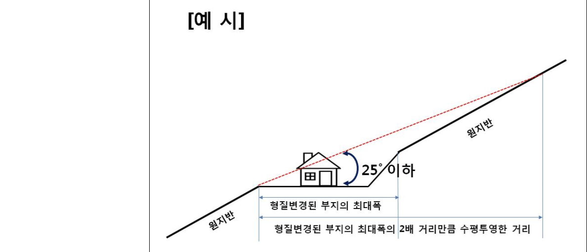

6)전용하려는 산지의 표고가 높거나 설치하려는 시설물이 자연경관을 해치지 아니할 것

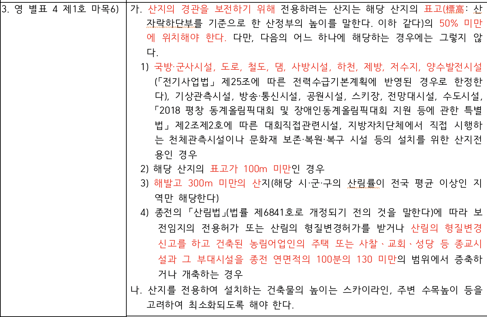

* ***내가 개발하고자하는 임야와 반경 1km이내의 임야를 둥근 원으로 그려서 두 정상부의 높이값의 나누기를 했을 때 50% 아래쪽에 있는 부분만 가능함***
* 조심해야 될 임야
  * 높은 위치의 임야
  * 등고선이 조밀한곳(급경사지임)
    * 급경사지를 깍아야 되므로 토공량이 많이 나올 수밖에 없다.
    * 사토처리계획서 제출 하라고 함(반출처확인 등 미리 조치)-->>인감증명서 제출
    * 토석정보공유시스템 활용-->>국토교통부 토석정보공유시스템(토취장/사토장 등의 정보)

산지관리법 제18조(산지전용허가기준 등) 1항 3목

* 집단적인 조림성공지 등 우량한 산림이 많이 포함되지 아니할 것
  * 30만제곱미터 이상의 산지전용에 적용(조례)
* 집단으로 조성되어 있는 조림성공지 또는 우량한 입목·대나무가 집단적으로 생육하는 천연림의 편입을 최소화할 것

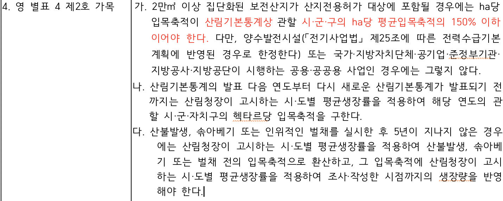

* 보전산지가 평균입목축적의 150%이하

산지관리법 제18조(산지전용허가기준 등) 1항 5목

* 토사의 유출·붕괴 등 재해발생이 우려되지 아니할 것
  * 2만제곱미터이상의 산지 전용에 적용
* 산지전용을 하려는 산지 및 그 주변 지역에 산사태가 발생할 가능성이 높지 않을 것. 다만, 산림청장은 산지전용을 하려는 자에게 재해방지시설을 설치할 것을 조건으로 산지전용허가를 할 수 있다.

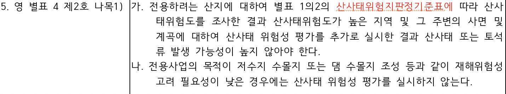

* 재해방지시설

산지관리법 제18조(산지전용허가기준 등) 1항 8목

* 사업계획 및 산지전용면적이 적정하고 산지전용방법이 산지경관 및 산림 훼손을 최소화하며 산지전용 후의 복구에 지장을 줄 우려가 없을 것 -> 30만제곱미터 이상의 산지전용에 적용
* 사업계획에 편입되는 보전산지의 면적이 해당 목적사업을 고려할 때 과다하지 아니할 것. 다만, 법 제8조에 따른 산지에서의 구역 등의 지정 협의를 거친 경우로서 사업계획면적에 대한 보전산지의 면적비율이 이미 검토된 경우에는 해당 산지의 보전산지 면적비율에 대한 검토를 생략할 수 있다.

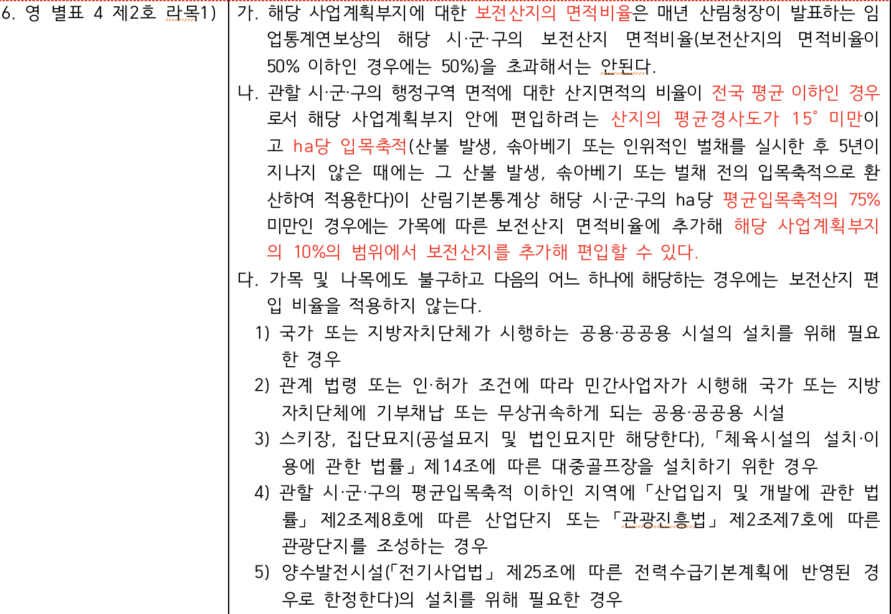

2)시설물이 설치되거나 산지의 형질이 변경되는 부분 사이에 적정면적의 산림을 존치하고 수림(樹林)을 조성할 것

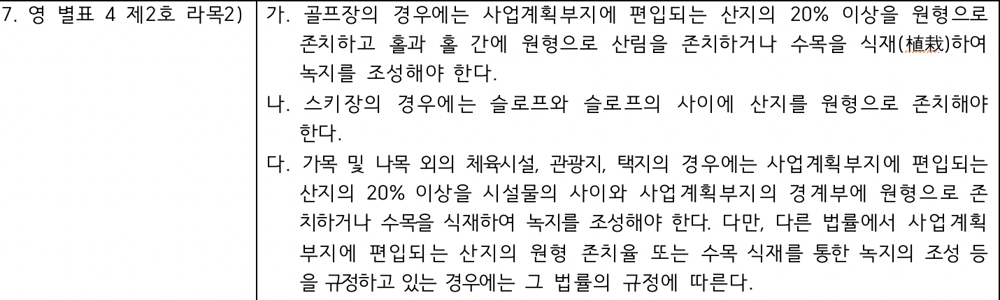

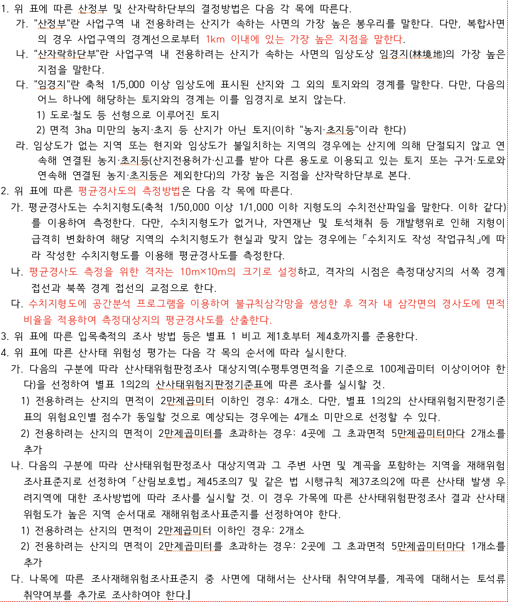

> 경사지가 25도를 넘을 시 사업부지내 급경사 제척방법--->>설계용역사의 영역임

* 등고선이 조밀하게 형성돤 급경사지 제척
* 사전재해로 인한 제척
* 지질조사를 통한 경암부(단단한암석)(암석의 강도)파악후 제척
  * 개발시 문제가 될수 있음(비용이 약간 듬)-->>암반이 있으면 애로가 있을 수 았음--->>경암부도 제척하면 공사비 등도 절약된다!!
* 과도한 토공양(흙을파내는 양)을 줄이기 위한 세밀한 제척(흙을 너무많이 파가면 경사도가 늘어날 수 있음)
  * 예외 : 토석채취 (추가비용이 있거나 오히려 팔수도 있다)
* 일부 급경사지를 제척하면 평균경사도를 다운시킬 수 있다
  * (10m×10m의 격자크기를 제척)-->>급경사지는 어디를 어떻게 빼느냐가 중요하다
* 일정면적 이상(5000㎡이상)이면 사전 환경성검토 대상임(의무)
  * 급경사지를 모두 제척하고 서류를 제출하면 보완(지방환경청)이 떨어질 수 있음(백두대간/수종이 유량한 곳/울창한산림 등을 추가로 제척하라고 보완이 떨어지면 실제로 개발가능한 임야는 줄어들 수 있음)
* 급경사지 제척/지방환경청(수종 등 제척)
* ※참고※토림-->>임야인 토지(토지대장)

ㅁ
