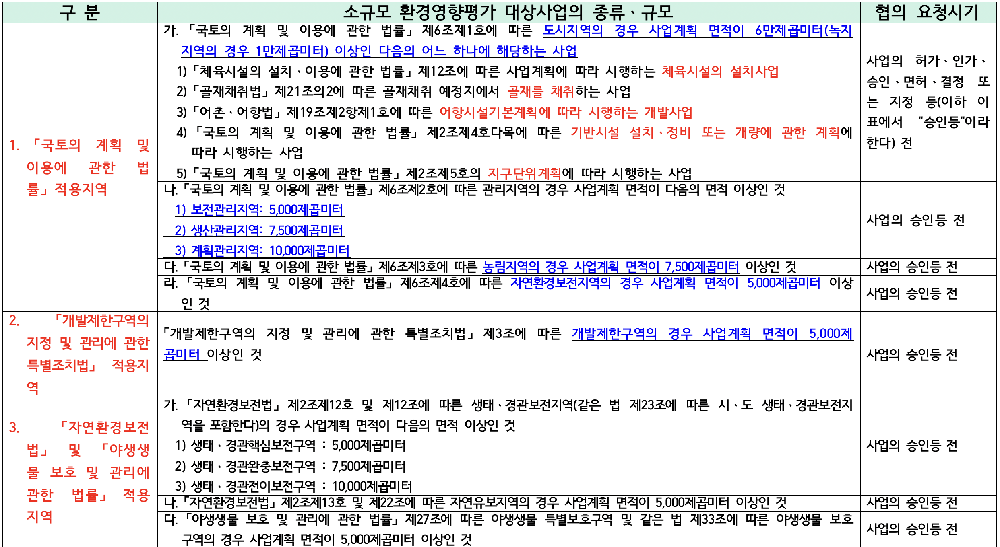
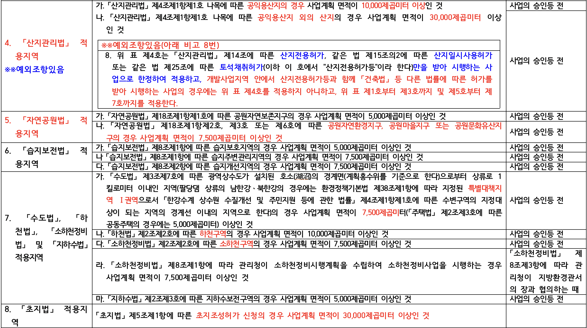
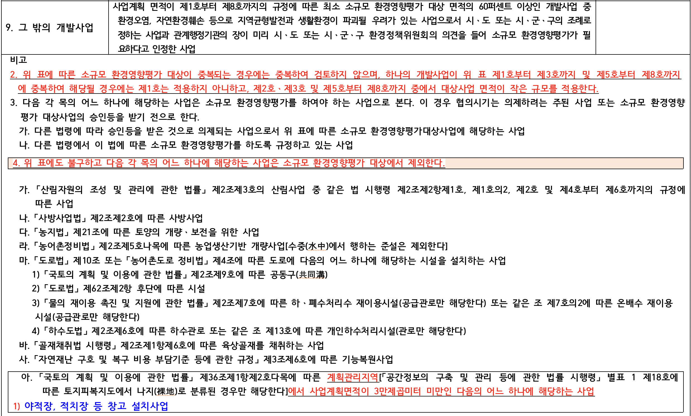
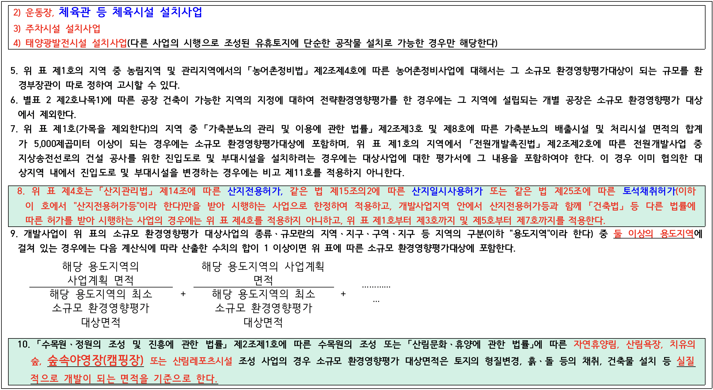
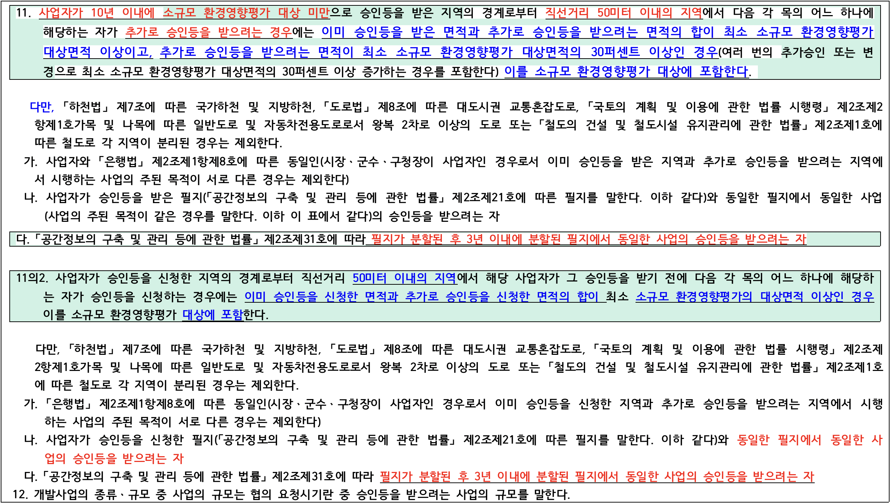

## 환경영향평가 받지 않아도 되는 경우(예외)

> 환경영향평가법 제2조(정의)

1. “전략환경영향평가”란 환경에 영향을 미치는 계획을 수립할 때에 환경보전계획과의 부합 여부 확인 및 대안의 설정ㆍ분석 등을 통하여 환경적 측면에서 해당 계획의 적정성 및 입지의 타당성 등을 검토하여 국토의 지속가능한 발전을 도모하는 것을 말한다.
2. “환경영향평가”란 환경에 영향을 미치는 실시계획ㆍ시행계획 등의 허가ㆍ인가ㆍ승인ㆍ면허 또는 결정 등(이하 “승인등”이라 한다)을 할 때에 해당 사업이 환경에 미치는 영향을 미리 조사ㆍ예측ㆍ평가하여 해로운 환경영향을 피하거나 제거 또는 감소시킬 수 있는 방안을 마련하는 것을 말한다
3. ***“소규모 환경영향평가”란 환경보전이 필요한 지역이나 난개발(亂開發)이 우려되어 계획적 개발이 필요한 지역에서 개발사업을 시행할 때에 입지의 타당성과 환경에 미치는 영향을 미리 조사ㆍ예측ㆍ평가하여 환경보전방안을 마련하는 것을 말한다***
4. “환경영향평가등”이란 전략환경영향평가, 환경영향평가 및 소규모 환경영향평가를 말한다.

-> 1, 2번은 대규모 사업으로 경매와 맞지 않으며, 3번 소규모 환경영향평가만 보면됨

> 환경영향평가법 제43조 (소규모 환경영향평가의 대상)

* ① 다음 각 호 모두에 해당하는 개발사업(이하 “소규모 환경영향평가 대상사업”이라 한다)을 하려는 자(이하 이 장에서 “사업자”라 한다)는 소규모 환경영향평가를 실시하여야 한다.
  1. 보전이 필요한 지역과 난개발이 우려되어 환경보전을 고려한 계획적 개발이 필요한 지역으로서 *대통령령으로 정하는 지역(이하 “보전용도지역”이라 한다)에서 시행되는 개발사업*
     * 환경영향평가법 시행령 제59조(소규모 환경영향평가 대상사업 및 범위)
       * 법 제43조제1항에 따른 소규모 환경영향평가를 실시하여야 하는 지역, 개발사업의 종류 및 범위는 ***별표 4와*** 같다.
  2. 환경영향평가 대상사업의 종류 및 범위에 해당하지 아니하는 개발사업으로서 대통령령*(별표 4)*으로 정하는 개발사업
* ② 제1항에도 불구하고 다음 각 호의 어느 하나에 해당하는 개발사업은 *소규모 환경영향평가 대상에서 제외한다*. **<개정 2024. 2. 20.>**
  1. 「재난 및 안전관리 기본법」 제37조에 따른 응급조치를 위한 사업
  2. 국방부장관이 군사상 고도의 기밀보호가 필요하거나 군사작전의 긴급한 수행을 위하여 필요하다고 인정하여 환경부장관과 협의한 개발사업
  3. 국가정보원장이 국가안보를 위하여 고도의 기밀보호가 필요하다고 인정하여 환경부장관과 협의한 개발사업
  4. 「재난 및 안전관리 기본법」 제60조에 따른 특별재난지역으로 선포된 지역에서 「자연재해대책법」 제46조에 따른 재해복구계획 및 「재난 및 안전관리 기본법」 제59조에 따른 재난복구계획에 따라 시행하는 사업으로서 행정안전부장관이 긴급한 복구를 위하여 필요하다고 인정하여 환경부장관과 협의한 사업. 이 경우 행정안전부장관은 환경보전방안 등 대통령령으로 정하는 서류를 첨부하여 협의를 요청하여야 한다.

> 환경영향평가법 시행령 [별표 4] 소규모 환경영향평가 대상사업의 종류, 범위 및 협의 요청시기(제59조 및 제61조제2항관련)

* 도시지역 : 60,000㎡ (녹지지역 : 10,000㎡)
* 관리지역
  * 보전관리 : 5,000㎡(개발제한구역)
  * 생산관리 : 7,000㎡
  * 계획관리 : 10,000㎡ -> 예외조항있음
* 농림지역 : 7,500㎡
* 자연환경보전지역 : 5,000㎡
* 기타
  * 공원자연환경지구, 공원마을지구 또는 공원문화유산지구의 경우 사업계획 면적 : 7,500㎡
  * 공익용산지 : 10,000㎡
  * 공익용산지 외 산지  : 30,000㎡
  * 특별대책지역 1권역 : 7,500㎡
  * 하천구역 : 10,000㎡
  * 소하천구역 : 7,500㎡
  * 초지조성허가 신청의 경우 사업계획 면적이 30,000 ㎡ 이상

