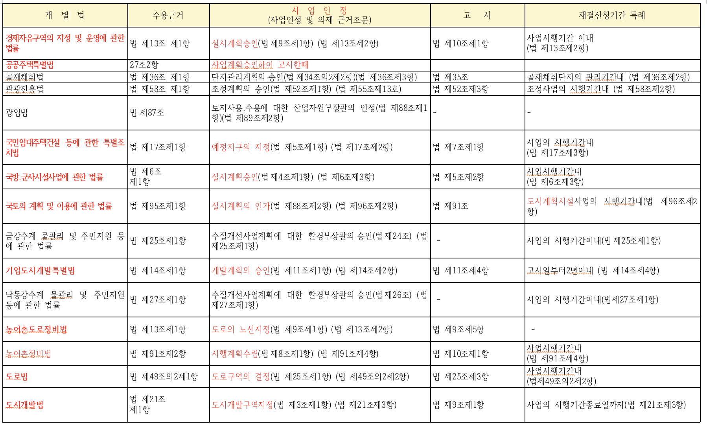
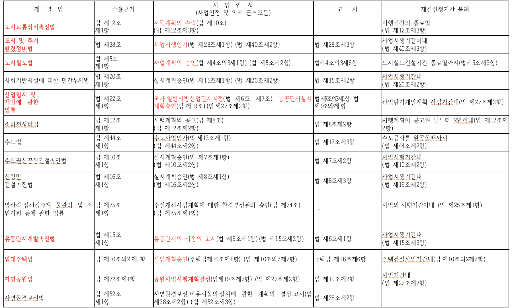
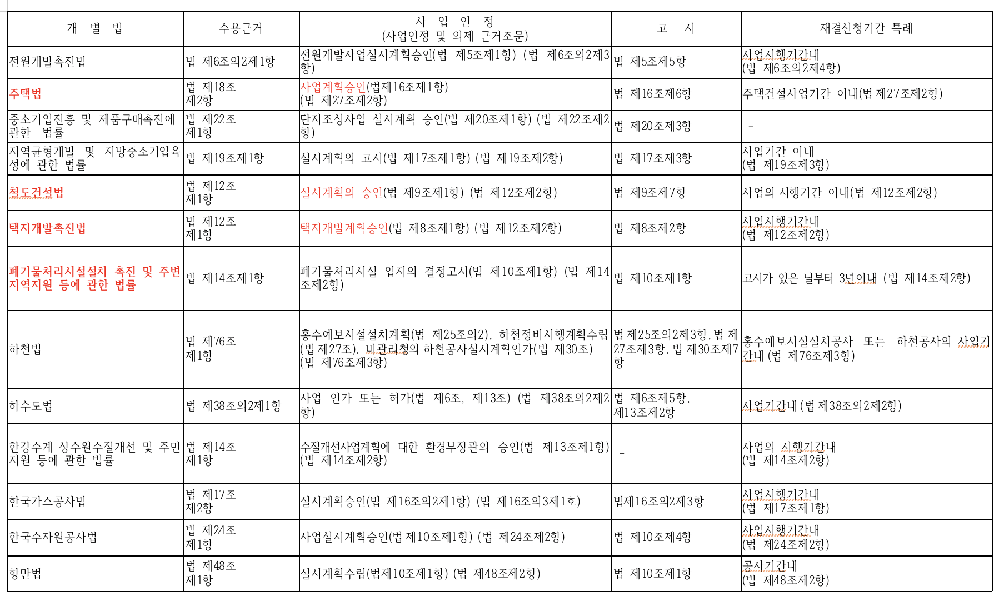
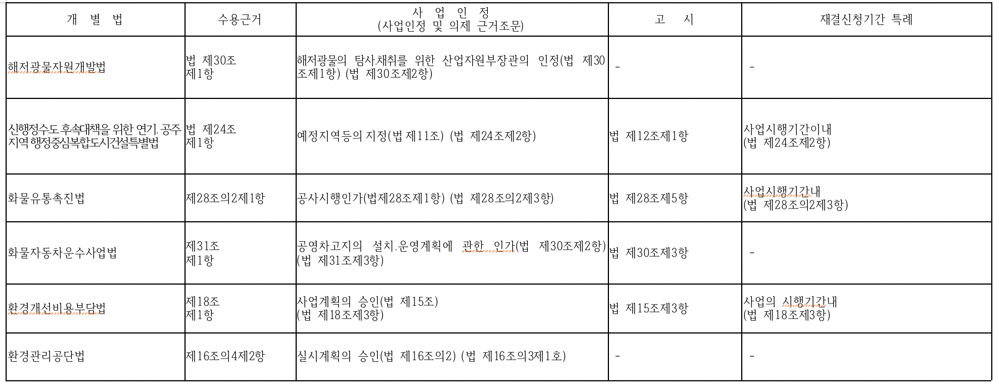

## 토지수용

> ### 토지수용 ***실무/사업인정고시일*** 총정리

> * **사용인정고시일 기준일에 가격이 정해짐**
> * 감평평기 수용시 대략적 평가금액
>   * **임야 : 1.2배**
>   * **1종일반 : 1.25배**
>   * **2종일반 : 1.3배**
>   * **3종일반 : 1.5배**
>   * **준주거지역 : 2.0배**
>   * **지목 대 : 2.0배**
>   * **농지 : 1.2 ~ 1.5배**

> 위 개밥법들중에서 수용으로 사업이 진행될 경우 사례

* **토지수용의 기준일이 되는 사업인정고시나 실시계획 확인**
